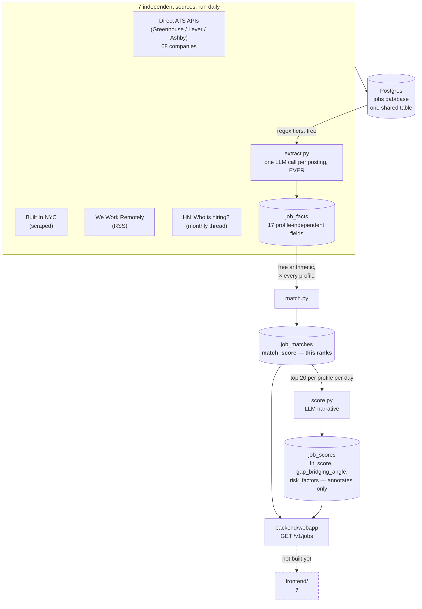
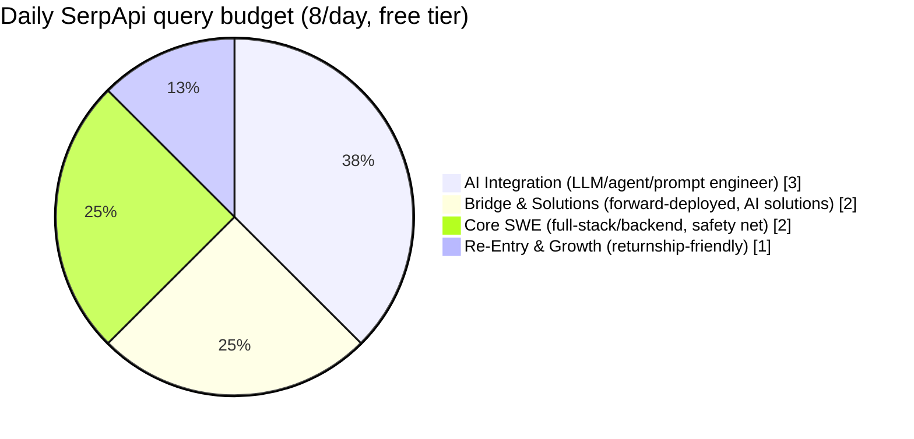
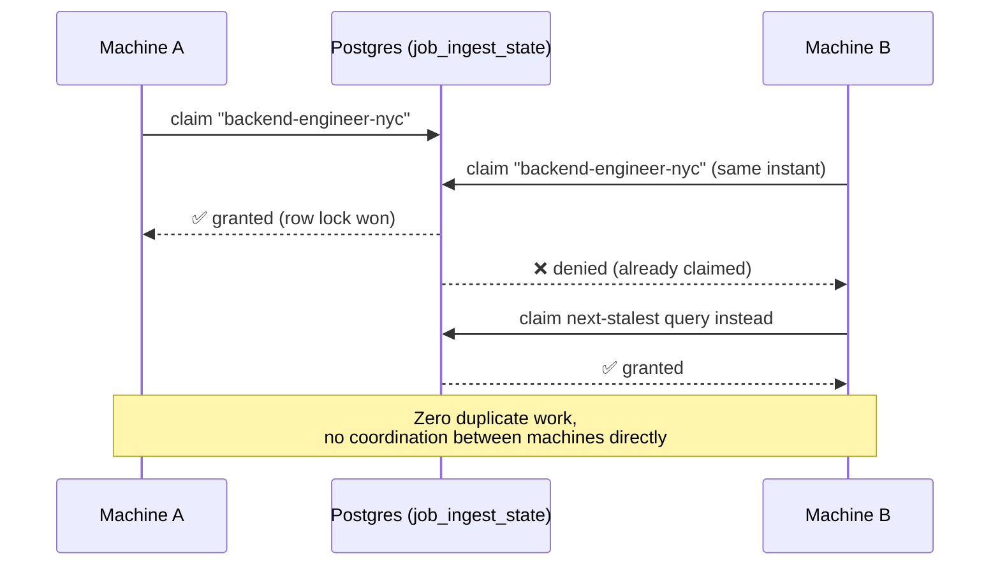

# Building a Job-Discovery Pipeline That Actually Covers the Ground

*A personal automation project — how it's built, why it's built that way, and what went wrong along the way.*

---

## What this is, in one paragraph

Every day at midnight, seven independent processes wake up, pull job postings from seven different corners of the internet, dedupe and merge them into one table, and — as of the newest piece — have an LLM read each one and score how well it actually fits a specific person's background. No applications get submitted, nothing gets automated beyond *finding* the postings. The point is coverage: catching roles that a single job board, a single search engine, or a single company list would each miss on their own.

As of today: **11,085 jobs tracked, across 834 distinct companies, from 7 sources.**

---

## The shape of it

*Redrawn 2026-07-27.* This diagram used to show one `score.py` box writing
`fit_score` straight onto `jobs`. That predates the `job_facts` /
`job_matches` / `job_scores` split — see
[`docs/scoring.md`](../../docs/scoring.md).

Everything lands in one table regardless of source, deduped by a hash of `platform + company + posting-id`. Nothing gets deleted — postings get marked `closed` when a source stops seeing them, using either an exact diff (for the ATS APIs, which return their *full* current listing every time) or a staleness timeout (for every other source, which only ever returns a sample).

---

## How the Google Jobs piece decides what to search for

This is the part with the most moving pieces, so it gets its own diagram. Instead of running the same 8 searches every day (which mostly just re-fetches yesterday's top results), the query list is split into 4 buckets, weighted toward the strongest-fit roles for this specific candidate:

Each day, whichever queries in a bucket have gone longest without running get picked — not a fixed list, not a round-robin counter, just "what's stalest." That alone solves half the problem. The other half is Google's own ranking: without telling it otherwise, a search for "backend engineer" returns *relevant* results, not *new* ones, so running the same query daily mostly shows the same top 10 postings over and over. The fix was a recency filter matched to how long it's actually been since that specific query last ran — a query that's never been run gets no filter at all (grab whatever's there), a query run yesterday only asks for what's new since yesterday.

---

## Running it from more than one machine

Later in the build, the idea came up to run the same script from multiple home devices, each with its own SerpApi account, to multiply the effective free quota. That only works safely if two machines can never grab the same query at the same moment — otherwise they'd waste their separate quotas re-fetching identical results.

This was tested for real, not just reasoned about — two copies of the script were launched at the exact same instant against the same database, and the claims were verified to never overlap. If a machine crashes mid-claim, the lock expires after 15 minutes so the query doesn't get stuck forever; if a query genuinely fails (bad account, network blip), the claim releases immediately so a different machine's account can pick it up right away instead of waiting.

---

## The build story

*This part reads more like a log than a spec — the shape of the system above is the end state, but it didn't arrive that way. A few of the turns along the way are worth telling honestly, including the ones that cost real money.*

### Starting simple, on purpose

The first version of this didn't touch Google Jobs, LinkedIn, or anything requiring a paid API at all. It hit each company's own applicant-tracking-system API directly — Greenhouse, Lever, Ashby all expose a public, unauthenticated JSON endpoint that's literally the same one their own careers page uses. No login wall, no bot detection, nothing adversarial about it. 68 companies, one JSON file mapping names to API tokens, one script that loops through all of them daily. This became the foundation everything else sits on top of, and it's still the most reliable, zero-maintenance piece of the whole thing.

LinkedIn got ruled out from day one and never revisited — no public API, and scraping it risks the one asset that isn't worth risking: a real personal account.

### Widening the net

Once the ATS pull was solid, the obvious gap was that it only covers companies already on the list — it's a monitoring tool, not a discovery tool. Three more sources got added to widen the net without adding real risk: Built In NYC (confirmed, by actually opening dev tools and watching network traffic, that the listings render server-side with no JS needed — a plain regex scrape, not adversarial), We Work Remotely's own category RSS feeds (a real, if messy, syndication mechanism — the site's own tagging turned out to be self-reported by posting companies and unreliable, so a noise filter had to be layered on top), and Hacker News's monthly "Who is hiring?" thread, pulled through HN's official Firebase API.

### The Google Jobs question

The real gap left was that all of the above only ever surfaces jobs at companies already known about, or companies that chose to post in one of a handful of specific places. A huge amount of tech hiring happens at companies that aren't "tech companies" at all — a bank hiring a backend engineer, a hospital hiring a data engineer — and none of the sources so far would ever catch that. Google Jobs aggregates across essentially everything, which is exactly the blind spot that needed filling.

Getting there wasn't free, though — quite literally. Two paid services offer programmatic access, SerpApi and Apify, and the free tiers of each needed to actually be tested rather than assumed. The alternative — scraping Google directly with browser automation instead of paying for either — got ruled out on paper first: Google shipped dedicated anti-scraping tech in early 2025 and was, by the time this was researched, actively suing one of those same paid vendors over how well their evasion worked. If a company with real infrastructure is getting sued over it, a home-built scraper isn't going to fare better.

That reasoning held up in practice, dramatically. Testing a third-party Apify tool that scrapes Google Jobs via full browser automation — the same category of approach that had just been ruled out — got an actual CAPTCHA wall on the very first live test. Not a hypothetical, not "this might happen": the tool's own logs showed it hitting Google's real "unusual traffic" interstitial page, twice in a row, on two different queries, burning real (if small) money each time for zero results.

### An expensive lesson

Switching to a different Apify tool — one that hits Google through a different method than full browser rendering — actually worked, and worked well: clean results, identical underlying job IDs to what the paid SerpApi service returned for the same posting, confirming it was hitting equivalent real data through a path that wasn't (yet) blocked.

Except the very first test of it, run without checking its default settings first, quietly defaulted to fetching up to 100 results with unlimited pagination — and burned $1.50 in a single call. That's 30% of an entire month's free credit, gone on one unchecked default. It's a small amount of real money, but the actual lesson mattered more than the dollar figure: every single call to that tool afterward hardcodes explicit result limits, and nothing about a third-party tool's defaults gets trusted again without checking first.

### Getting a second opinion, and being wrong about something

Partway through, a second AI system was asked to independently design the same kind of pipeline from scratch, as a sanity check. The two designs converged on almost everything — same core sources, same free-tier query budget, same "only fetch page 1" logic — which was reassuring on its own. But the second plan also revealed a real bug: it filtered searches to recent postings by literally typing the phrase "posted last 3 days" into the search box, rather than using the search engine's actual documented filter parameter for that. Testing it directly showed that trick *does* partially work, almost by accident — but comparing it side-by-side against the real filter parameter surfaced something else entirely: without explicitly pinning the response to English, the search results occasionally came back in other languages, silently breaking the code that was trying to read "3 days ago" out of the response. A bug hiding in a bug.

### Learning who this is actually for

For a while, the query list was just a flat set of generic tech role titles — "software engineer," "data engineer," and so on — split between NYC and remote. It worked, but it wasn't really *aimed* at anyone specific. That changed once the real background came into focus: several years of real production software engineering experience, a multi-year career break, and — right now — several months into hands-on training in prompt and agent engineering. That's a specific, coherent story, not a generic one, and the query strategy got rebuilt around it: one bucket for safety-net roles that don't need any special framing, one for the roles that most directly match the in-progress AI training, one for the specific niche where "real production engineer who's also hands-on with agents" is exactly the ask, and one that explicitly targets postings that welcome a career gap rather than penalizing it.

### Teaching it to judge, not just collect

Up to this point, everything the pipeline did was collection — pull postings, tag them with rough heuristics (a regex guessing at seniority level, a flag for whether "remote" appears in the text), and store them. Nothing ever looked at a posting and asked "is this actually worth someone's time?" That's the piece that got added last: every new posting gets read by an LLM alongside a written profile of the candidate's actual background, and comes back with a fit score, a suggested way to frame the application, and a plainly-stated list of anything in the posting that works against the candidate.

The design constraint that mattered most here wasn't the scoring logic — it was making sure the model doing the scoring isn't locked in. The first version leaned on the local AI assistant infrastructure already running on this machine to handle that swapping, on the theory that it already solved the "talk to any provider" problem so there was no reason to solve it twice. That held up right up until the plan turned to running this same script on other, lighter-weight machines that only exist to make search-engine queries — machines that shouldn't need a full local AI assistant installed and configured just to score a job posting. So the scoring call got rebuilt to talk to a plain, standard chat-completion API endpoint directly — the same basic wire format that a large majority of AI providers, free and paid, cloud and local, all happen to speak. Three settings — which endpoint, which key, which model name — are now the entire surface for switching between a big cloud model, a small free one, or something running entirely on a local machine.

That change surfaced its own small mystery. The model the local assistant infrastructure had been using successfully the entire time turned out to fail immediately when called directly with what looked like the exact same credentials — an account-balance error, on an account that same assistant was clearly still drawing on for real, working responses. Swapping to a smaller, free-tier sibling model on the same provider worked cleanly on the first try. The discrepancy between those two never got fully run to ground — worth revisiting, but not a blocker, since the smaller model does the job.

The first real results, regardless of which specific model produced them, were a good sign: the top-scored posting the system found on its own was an "Applied AI Engineer — Encore Program" role at a large consulting firm — "Encore" being that company's own name for a corporate return-to-work program. Nothing in the prompt told it to look for that phrase specifically; it read the posting, connected it to the career-break part of the profile, and scored it accordingly.

---

## Where it stands, honestly

The collection side is in good shape — seven sources, real deduping, real staleness handling, real cost discipline after a couple of expensive lessons. The scoring side is new and promising but unproven at scale — it's been run against a small handful of jobs so far, with the actual "which AI model should do this scoring" question still open. And the piece that doesn't exist yet at all is the one that would make this genuinely useful day-to-day: nothing currently takes the highest-scored postings and actually puts them in front of a person. Right now this system is very good at *finding and judging* jobs, and does nothing yet with that judgment except store it in a database. That's the next thing to build.

---

## Update — July 24, 2026: a design review before going multi-machine

A review pass over the whole pipeline, prompted by the plan to actually start running it from more machines, settled several questions and made two concrete changes.

**The directory got restructured.** What was a flat pile of similarly-named `*-ingest.py` files is now three tiers: the pipeline itself at the top (`run-daily.py`, `score.py`), one script per source under `ingest/`, and everything meant to be hand-edited under `config/`. Same code, same behavior — the daily cron job was repointed and re-verified — just navigable now.

**Machines stopped being able to waste each other's quota.** The claim system already prevented two machines from running the same query *at the same moment*, but nothing stopped a second machine from re-running a query the first had finished an hour earlier — re-buying a "posted today" search whose results were already in the database. Now a query that succeeded within the last ~20 hours is simply skipped, and since machines always work stalest-first, a machine that shows up after the day's work is done claims nothing and exits. The daily budget is now genuinely shared across every machine, instead of multiplied by them.

**Failure recovery turned out to already be built — worth stating plainly.** The watermark that drives the date filter only advances on *success*. So a query (or a whole machine, or a whole week of runs) failing doesn't lose anything: the next successful run sees the true gap since the last success and widens its "posted since" filter to cover it. The system heals by requerying the missed window, which is exactly the property you'd want and easy to assume without verifying. It was verified.

**One tempting idea got ruled out for good:** "keep paging through results until we hit the last posting we've already seen." That strategy assumes results arrive newest-first — and Google Jobs ranks by *relevance*, not date, so the last-seen posting isn't a frontier at all. The date-filter approach already in place gives the guarantee that idea was reaching for; the only real upgrade available is paginating deeper *within* the date-filtered window, which is just a question of quota, not design.

**And two bigger directions got shaped but parked.** Quota pacing — spending the month's API budget evenly, spending *more* as an unused allocation approaches its refresh — collapses into one formula (remaining quota ÷ days left, recomputed daily) that will replace the static daily budget when it's built. And the multi-user version of this — other people running workers on their machines, feeding one shared postings pool — is architecturally sound *only* if workers talk to an API service rather than the database directly; that's a real (auth, abuse-handling) project that waits until there are real users. For one person's server and two laptops, none of it is needed: the scripts will live in a git repo, and each machine's job is just "pull, then run."
