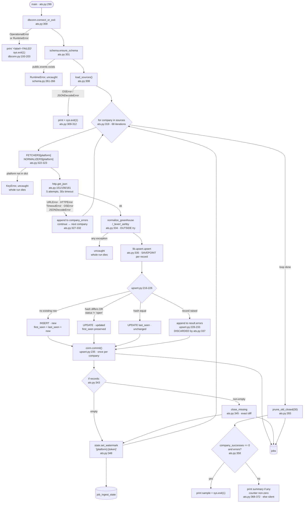

## Purpose

Pulls open job postings from the public job-board API of each company listed
in `backend/config/companies.json`, across three ATS vendors — Greenhouse,
Lever and Ashby (`backend/ingest/ats.py:150-165`). Each posting is normalized
into the 18 columns of `schema.COLUMNS` (`backend/schema.py:121-128`) and
written to the `jobs` table in Postgres (`backend/schema.py:270-294`).

Postings that were open but absent from this run are set to `status='closed'`
per company (`backend/ingest/ats.py:345`); rows closed more than 30 days ago
are deleted (`backend/ingest/ats.py:141`, `:355`). A per-company row is written
to `job_ingest_state` (`backend/ingest/ats.py:348`), which this script never
reads back (`backend/ingest/ats.py:79-83`).

---

## Invocation

**Scheduled.** `run-daily.py` is the only automated caller. `ingest/ats.py` is
the first of nine steps (`backend/run-daily.py:104-119`), invoked as a
subprocess — `[sys.executable, path]` with `cwd=SCRIPT_DIR` and
`env=os.environ.copy()`, output captured (`backend/run-daily.py:122-133`).

`run-daily.py` runs under a systemd user timer, `OnCalendar=*-*-* 00:00:00`
local, `Persistent=true`
(`~/.config/systemd/user/jobs-ingest.timer`). The service is
`Type=oneshot`, `WorkingDirectory=/home/eric/apps/jobs/backend`,
`TimeoutStartSec=10800`, `OnFailure=jobs-failure@%n.service`
(`~/.config/systemd/user/jobs-ingest.service`).

**Manual.** The script has a `if __name__ == "__main__"` guard
(`backend/ingest/ats.py:375`) and runs standalone. Its docstring gives
`python3 ingest/ats.py` and `DEBUG_PRINT_KEYS=1 python3 ingest/ats.py`
(`backend/ingest/ats.py:53-56`).

### CLI arguments

**None.** The file contains no `argparse` import and no `sys.argv` read; `main()`
takes no parameters (`backend/ingest/ats.py:299`). Any argument passed is
ignored.

### Environment variables

| Variable | Required | Default | Read at |
|---|---|---|---|
| `DATABASE_URL` | yes | none — `database_url()` raises `RuntimeError` if unset | `backend/lib/dbconn.py:77-91` |
| `JOB_SOURCES_FILE` | no | `<repo>/backend/config/companies.json` | `backend/ingest/ats.py:136-139` |
| `DEBUG_PRINT_KEYS` | no | unset; `"1"` enables stderr diagnostics | `backend/ingest/ats.py:140` |

No API keys, tokens or other secrets are read by this script. The three
endpoints it calls take no credentials (`backend/ingest/ats.py:150-162`).

`DATABASE_URL` is also checked by the parent before any step runs —
`REQUIRED_ENV = ("DATABASE_URL",)`, exit 1 on missing
(`backend/run-daily.py:98`, `:144-149`). Values reach the process from
`backend/.env` twice over: systemd's `EnvironmentFile=` and
`envfile.load(ENV_FILE)` at `backend/run-daily.py:142`. `load()` uses
`override=False`, so an already-exported value wins
(`backend/lib/envfile.py:85`).

`JOB_SOURCES_FILE` resolves against the script's own location, not the process
CWD (`backend/ingest/ats.py:136-139`).

### Expected runtime

Not separately measured — see Open Questions. The whole nine-step
`run-daily.py` run took 4m16s, 6m38s, 7m20s and 7m21s wall clock on the four
most recent runs (`journalctl --user -u jobs-ingest.service`, entries
2026-07-26T16:12:35 through 2026-07-27T00:06:54).

The script issues 68 sequential HTTP requests with no delay between them
(`backend/ingest/ats.py:319-326`) at a 30-second timeout each
(`backend/lib/http.py:28`, used as the default in `get_text`
`backend/lib/http.py:47-49`).

### Concurrent runs

**The script itself takes no lock.** There is no `flock`, no advisory lock and
no claim in `ingest/ats.py`; the docstring states this outright and argues no
coordination is needed because `run-daily.py` is the only automatic trigger
(`backend/ingest/ats.py:97-103`).

Serialization is imposed one level up, in the unit file:

```
ExecStart=/usr/bin/flock -n -E 0 /home/eric/apps/jobs/backend/.run.lock \
          /usr/bin/python3 /home/eric/apps/jobs/backend/run-daily.py
```

`-n` is non-blocking and `-E 0` makes "already running" exit 0
(`~/.config/systemd/user/jobs-ingest.service`). This guards
`run-daily.py`, not `ingest/ats.py` — a direct `python3 ingest/ats.py`
bypasses it, and the unit's comment says that is the intent.

Two concurrent `ingest/ats.py` processes are therefore possible. What happens
then is only partly determinable from the code: `insert_sql()` emits a plain
`INSERT` with **no `ON CONFLICT` clause** (`backend/lib/upsert.py:118-126`)
against a table whose `id` is `TEXT PRIMARY KEY` (`backend/schema.py:271`), and
the read-then-write is not atomic — the `SELECT` at
`backend/lib/upsert.py:204` and the `INSERT` at `:217` are separate statements
in one transaction. See Open Questions.

---

## Data Flow



---

## Field Mapping

Canonical column nullability is from the `jobs` DDL
(`backend/schema.py:270-294`) plus the two columns added afterward,
`posted_at_ts TIMESTAMPTZ` and `salary_text TEXT`
(`backend/schema.py:436-439`).

Fields marked **dropped** were enumerated from stored `raw_json` over a live
sample (300 greenhouse rows, 9 lever, 300 ashby, `SELECT raw_json FROM jobs
WHERE platform = %s LIMIT 300`), **not** from the code — the normalizers only
name the fields they read, so the code alone cannot list what is discarded.
The code gives no reason for any individual omission.

### Greenhouse — `normalize_greenhouse`, `backend/ingest/ats.py:196-226`

| raw field | canonical field | transformation | nullable? | notes |
|---|---|---|---|---|
| `id` | `source_id` | `str()` | NOT NULL | feeds the primary key |
| `title` | `title` | none | nullable | feeds `content_hash` |
| `location.name` | `location_raw` | `(job.get("location") or {}).get("name")` (`:198`) | nullable | feeds `content_hash` |
| `departments[0].name` | `department` | first element only; `None` if list empty (`:200-201`) | nullable | feeds `content_hash`. Additional departments are dropped |
| `absolute_url` | `job_url` | none | nullable | feeds `content_hash` |
| `updated_at` | `posted_at` | `updated_at or first_published` (`:211`) | nullable | feeds `content_hash`. Comment at `:212-215` states `updated_at` is kept first for hash compatibility and that Greenhouse bumps it on edits, making 6,096 rows look July-fresh |
| `first_published` | `posted_at_ts` | `posted_at_timestamp(first_published or updated_at)` (`:216-217`) | nullable | **different precedence from `posted_at` on the same row.** Not hashed |
| `content` | `description_text` | `strip_html(html.unescape(content))` (`:193`) — two unescape passes | nullable | feeds `content_hash`, via `blank_if_falsy` so absence hashes as `""` (`backend/lib/ids.py:68-69`) |
| — | `platform` | literal `"greenhouse"` (`:203`) | NOT NULL | feeds the primary key |
| — | `company_token` | `company["token"]`, from config not API (`:204`) | NOT NULL | feeds the primary key |
| — | `company_name` | `company["name"]`, from config (`:205`) | NOT NULL | |
| — | `seniority_guess` | `text.guess_seniority(title)` (`:219`) | nullable | regex over the title; `"unknown"` if title falsy (`backend/lib/text.py:129-137`) |
| — | `location_is_nyc`, `location_is_remote` | `text.classify_location(location)` (`:199`) | nullable | two regexes (`backend/lib/text.py:139-143`) |
| — | `company_is_nyc_hq`, `company_is_ai_focused` | `bool(company.get(...))` from config (`:222-223`) | nullable | company-level, not posting-level (`:73-78`) |
| — | `salary_text` | hardcoded `None` (`:218`) | nullable | |
| `metadata` | — | **dropped** | | |
| `offices` | — | **dropped** | | |
| `requisition_id` | — | **dropped** | | |
| `internal_job_id` | — | **dropped** | | |
| `application_deadline` | — | **dropped** | | |
| `data_compliance` | — | **dropped** | | |
| `language` | — | **dropped** | | |
| `company_name` (API's own) | — | **dropped** | | config `name` is used instead (`:205`) |
| `ai_disclaimer`, `include_ai_disclaimer`, `ai_opt_out_request_url` | — | **dropped** | | |
| `education` (14/300), `employment` (4/300) | — | **dropped** | | present on a minority of postings |
| *(whole object)* | `raw_json` | `json.dumps(job)` (`:225`) | nullable | unbounded — no size cap applied here |

### Lever — `normalize_lever`, `backend/ingest/ats.py:229-263`

| raw field | canonical field | transformation | nullable? | notes |
|---|---|---|---|---|
| `id` | `source_id` | `str()` | NOT NULL | feeds the primary key |
| `text` | `title` | none (`:230`) | nullable | Lever's title key is `text`, not `title` |
| `categories.location` | `location_raw` | falls back to `", ".join(categories.allLocations)` (`:232`) | nullable | |
| `categories.department` | `department` | none (`:248`) | nullable | |
| `hostedUrl` | `job_url` | none (`:249`) | nullable | |
| `createdAt` | `posted_at` | epoch ms → `datetime.fromtimestamp(created/1000, tz=utc).isoformat()`; `None` on `ValueError`/`OSError`/`OverflowError` (`:234-240`) | nullable | the only source needing epoch conversion |
| `createdAt` | `posted_at_ts` | `posted_at_timestamp(posted_at)` — same value (`:251`) | nullable | |
| `description` | `description_text` | `strip_html(description or descriptionBody)`, default `unescape=True` (`:261`) | nullable | comment `:258-260` records that Lever serves real HTML so one unescape is correct |
| — | `platform` | literal `"lever"` (`:242`) | NOT NULL | |
| — | `salary_text` | hardcoded `None` (`:252`) | nullable | **`salaryRange` is emitted by this API** (3 of 9 sampled rows) and not read |
| `salaryRange` | — | **dropped** | | see above |
| `salaryDescription`, `salaryDescriptionPlain` | — | **dropped** | | |
| `workplaceType` | — | **dropped** | | Ashby's equivalent `isRemote` *is* read (`:270-271`); Lever's is not |
| `country` | — | **dropped** | | |
| `applyUrl` | — | **dropped** | | `hostedUrl` used instead |
| `descriptionPlain`, `descriptionBodyPlain`, `additionalPlain`, `openingPlain` | — | **dropped** | | plain-text variants; the HTML variants are used |
| `additional`, `opening`, `lists` | — | **dropped** | | |
| `descriptionBody` | *(fallback only)* | used only if `description` is falsy (`:261`) | | |
| *(whole object)* | `raw_json` | `json.dumps(job)` (`:262`) | nullable | |

### Ashby — `normalize_ashby`, `backend/ingest/ats.py:266-293`

| raw field | canonical field | transformation | nullable? | notes |
|---|---|---|---|---|
| `id` | `source_id` | `str()` | NOT NULL | feeds the primary key |
| `title` | `title` | none (`:267`) | nullable | |
| `location` | `location_raw` | none (`:268`) | nullable | |
| `department` | `department` | none (`:279`) | nullable | |
| `jobUrl` | `job_url` | none (`:280`) | nullable | |
| `publishedAt` | `posted_at` | none (`:281`) | nullable | |
| `publishedAt` | `posted_at_ts` | `posted_at_timestamp(publishedAt)` (`:282`) | nullable | |
| `descriptionHtml` | `description_text` | `strip_html(descriptionHtml or descriptionPlain)`, `unescape=True` (`:291`) | nullable | comment `:289-290` records this was leaving `&amp;` in 1,521 of 2,561 rows |
| `isRemote` | `location_is_remote` | if truthy, forces `True` over the regex result (`:270-271`) | nullable | the only place a source's own remote flag overrides `classify_location` |
| — | `platform` | literal `"ashby"` (`:273`) | NOT NULL | |
| — | `salary_text` | hardcoded `None` (`:283`) | nullable | no salary field observed in the sample |
| `team` | — | **dropped** | | distinct from `department`, which is read |
| `employmentType` | — | **dropped** | | |
| `secondaryLocations` | — | **dropped** | | only `location` is read |
| `workplaceType` | — | **dropped** | | `isRemote` is read instead |
| `isListed` | — | **dropped** | | not used to filter; every returned posting is ingested |
| `address` | — | **dropped** | | |
| `applyUrl` | — | **dropped** | | `jobUrl` used instead |
| `descriptionPlain` | *(fallback only)* | used only if `descriptionHtml` is falsy (`:291`) | | |
| *(whole object)* | `raw_json` | `json.dumps(job)` (`:292`) | nullable | |

### Two mapping details that bite

**`None` hashes as the string `"None"`, not `""`.** `content_hash` uses
`str(rec[f])` for every field except those in `blank_if_falsy`
(`backend/lib/ids.py:66-72`). `schema.spec()` passes
`blank_if_falsy=("description_text",)` only (`backend/schema.py:194`), so a
posting with no `department` hashes `"None"` in that position. A missing key —
as opposed to a `None` value — raises `KeyError`, which the per-record handler
catches (`backend/lib/upsert.py:228`).

**`strip_html` truncates at 20,000 characters** (`backend/lib/text.py:62`,
`:121`), so `description_text` is capped while `raw_json` is not.

---

## Dedupe & Idempotency

### The key

```
id = sha256(f"{platform}:{company_token}:{source_id}").hexdigest()[:24]
```

Computed by `schema.make_job_id(rec)` (`backend/schema.py:239-248`), which
calls `ids.make_id(*parts)` — `":".join(str(p) for p in parts)`, sha256,
truncated to `ID_LENGTH = 24` (`backend/lib/ids.py:33-43`). It is passed to
`upsert` as the `id_fn` argument at `backend/ingest/ats.py:335` and invoked at
`backend/lib/upsert.py:199`.

All three components come from a place the remote API cannot move:
`platform` is a literal in the normalizer, `company_token` is
`company["token"]` from the config file, and only `source_id` is the API's
(`backend/ingest/ats.py:203-206`, `:242-245`, `:273-276`).

The docstring states this deduplicates **within a source only** — the same
posting via Greenhouse and via Google Jobs is two rows, and cross-source dedup
is explicitly not solved (`backend/schema.py:243-247`).

### The second key

A separate `content_hash` over `HASH_FIELDS_ATS` — `title`, `location_raw`,
`department`, `job_url`, `posted_at`, `description_text`
(`backend/schema.py:131-132`) — decides insert vs. update vs. touch. It is
computed at `backend/lib/upsert.py:210` **after** the row lookup at `:204`.
Field order and membership are part of the digest
(`backend/lib/ids.py:53-57`).

`sticky` is empty for this spec (`schema.spec()` defaults `sticky=()`,
`backend/schema.py:194`), so the lookup-before-hash ordering has no effect
here; it exists for the Google sources (`backend/schema.py:219-236`).

### Full re-run

**Updates in place; no duplicate rows.** Per record
(`backend/lib/upsert.py:216-226`):

| State | Branch | SQL |
|---|---|---|
| no row with that `id` | `new` | `INSERT`, `first_seen = last_seen = now` (`:217`) |
| stored `content_hash` differs | `updated` | `UPDATE` all columns + `last_seen`; `first_seen` deliberately excluded (`backend/lib/upsert.py:128-130`) |
| stored `status != 'open'` | `updated` | same `UPDATE`; `computed` resets `status='open'`, `closed_at=NULL` (`backend/schema.py:210`) |
| hash equal and `status='open'` | `unchanged` | `UPDATE jobs SET last_seen = %s` only (`:225`) |

Observed on the last four runs: 9,656–9,685 `unchanged` against 0–5 `new`
(`journalctl --user -u jobs-ingest.service`, e.g. `0 new, 1 updated, 9685
unchanged` at 2026-07-26T16:12:35).

Re-running is not free of side effects even when nothing changed:
`close_missing` (`backend/ingest/ats.py:345`), `set_watermark` (`:348`) and
`prune_old_closed` (`:355`) all execute unconditionally and each commits
(`backend/schema.py:661`, `:683`, `:694`; `backend/lib/state.py:87`).

### Partial re-run after a mid-batch crash

`upsert()` commits **once, at the end of the batch**
(`backend/lib/upsert.py:235`), and connections are opened with
`autocommit=False` (`backend/lib/dbconn.py:107`, default). One batch is one
company (`backend/ingest/ats.py:335`, inside the loop at `:319`).

So a crash during company N:

- Companies 1..N−1: fully committed — their upserts, closes and watermarks
  persist.
- Company N: the whole batch rolls back. Partial rows are not left behind.
  Per-record SAVEPOINTs (`backend/lib/upsert.py:198`) sit inside this
  uncommitted transaction and do not survive it.
- Companies N+1..68: never attempted.

The next run re-fetches every company from scratch — there is no resume
pointer and no watermark-based narrowing (`backend/ingest/ats.py:79-83`).
Companies 1..N−1 take the `unchanged` branch; company N is redone. The
watermark written at `:348` records `run_started_at` for completed companies
only, and is read by nothing in this script.

One ordering gap: within a company, `upsert` commits (`:335`) before
`close_missing` commits (`:345`). A crash between the two leaves the new rows
in with the departed ones still `status='open'` until the next run.

---

## Failure Modes

### Retry policy and backoff

All three fetchers go through `http.get_json` → `get_text`
(`backend/ingest/ats.py:151`, `:156`, `:161`; `backend/lib/http.py:96-98`).

| Setting | Value | Source |
|---|---|---|
| attempts | 5 | `DEFAULT_MAX_RETRIES` (`backend/lib/http.py:29`), loop `for attempt in range(max_retries)` (`:62`) |
| timeout | 30s per attempt | `DEFAULT_TIMEOUT` (`backend/lib/http.py:28`) |
| backoff | `min(60, 2**attempt + random.uniform(0,1))` | `_backoff` (`backend/lib/http.py:37-44`) |
| cap | 60s | `MAX_BACKOFF` (`backend/lib/http.py:30`) |
| sleeps | 4 (skipped after the final attempt) | `if attempt < max_retries - 1` (`backend/lib/http.py:90-91`) |
| User-Agent | `hermes-ingest/1.0 (+https://github.com/hermes)` | `backend/lib/http.py:27`, `:56` |

After the last attempt the stored exception is re-raised
(`backend/lib/http.py:93`).

### Rate limits

Detected **only** as HTTP status. `429` and `500 ≤ code < 600` are retried;
every other `HTTPError` code re-raises immediately without retry
(`backend/lib/http.py:75-81`). A `Retry-After` header raises the wait if it is
larger than the computed backoff and is ignored if unparseable
(`backend/lib/http.py:39-43`).

There is **no client-side pacing**: no `time.sleep` between companies, no
concurrency limit, no quota tracking in `ingest/ats.py`. The 68 requests issue
back to back (`backend/ingest/ats.py:319-326`). `ratelimit.py` exists in the
repo but is imported only by `llm.py`, not by this script
(`backend/ingest/ats.py:114-134` lists every import).

### Auth and token refresh

**None.** No `Authorization` header, no key, no refresh — the three endpoints
are unauthenticated (`backend/ingest/ats.py:150-162`), which the docstring
gives as the reason for choosing them over LinkedIn/Indeed
(`backend/ingest/ats.py:11-21`). "Token" in this script means the ATS board
slug from config (`backend/config/companies.json`), not a credential.

### Malformed or empty payloads

| Input | Behavior |
|---|---|
| Greenhouse response without `jobs` | `data.get("jobs", [])` → empty list (`backend/ingest/ats.py:152`) |
| Lever response that is not a list | `data if isinstance(data, list) else []` → empty list (`backend/ingest/ats.py:157`) |
| Ashby response without `jobs` | `data.get("jobs", [])` → empty list (`backend/ingest/ats.py:162`) |
| Body that is not JSON | `json.loads` raises inside `get_json`; caught per company at `backend/ingest/ats.py:327-328` |
| Empty job list | `records == []`, `upsert` writes nothing, and the `if records:` guard skips `close_missing` (`backend/ingest/ats.py:343`) |

The empty-list guard is doubled: `close_missing` itself raises `ValueError` on
empty `seen_ids` rather than trusting the caller
(`backend/schema.py:648-651`). Note that guard is at the call site *and* in
the callee, so the `ValueError` is unreachable from this script.

### Does a single bad record fail the batch?

**It depends on which stage raises.**

- **During `normalize`** — yes, the whole run dies. The list comprehension at
  `backend/ingest/ats.py:334` is *outside* the `try` block, which spans only
  `:325-332` and covers `fetch(token)` alone. An exception in a normalizer —
  e.g. `departments[0].get("name")` at `:201` if the list holds non-dicts —
  propagates out of `main()` uncaught.
- **During `upsert`** — no. Each record runs inside `conn.transaction()`, a
  SAVEPOINT, and any exception is appended to `result.errors` and the loop
  continues (`backend/lib/upsert.py:198`, `:228-233`). The comment at
  `:191-197` states a plain try/except is insufficient because a failed
  statement aborts the whole Postgres transaction.

### Logged vs. swallowed

| Event | Where it goes |
|---|---|
| Retry attempt | `[retry] {tag}: ...` on stderr, always (`backend/lib/http.py:79-80`, `:86-87`). `tag` is `url.split("?")[0]`, so query strings are not printed (`:59`) |
| Per-company fetch failure | appended to `company_errors` (`backend/ingest/ats.py:329`); printed to stderr **only** if `DEBUG_PRINT_KEYS` (`:330-331`); count and a 5-item sample printed **only** if `DEBUG_PRINT_KEYS` (`:363-365`); the count alone reaches stdout via the summary line (`:372`) |
| **Per-record upsert failure** | **discarded.** `upsert` returns an `UpsertResult` carrying `.errors` (`backend/lib/upsert.py:157-162`), but `ats.py:337` unpacks only `n, u, unc = result` via `__iter__` (`backend/lib/upsert.py:164-166`) and never reads `.errors`. With `DEBUG_PRINT_KEYS` unset, `debug=False` (`:336`) also suppresses the stderr print at `backend/lib/upsert.py:230-233`, so a failing record produces **no output at all** and is not counted in the summary |
| Successful run with zero changes | no output — the summary print is guarded by `if total_new or total_updated or total_closed or pruned or company_errors` (`backend/ingest/ats.py:368`) |

### Exit codes

| Condition | Exit | Line |
|---|---|---|
| `DATABASE_URL` unset or Postgres unreachable | 1 | `backend/lib/dbconn.py:203` |
| `companies.json` unreadable or invalid JSON | 1 | `backend/ingest/ats.py:309-312` |
| Every company failed **and** at least one error | 1 | `backend/ingest/ats.py:358-361` |
| Some companies failed, at least one succeeded | 0 | no exit path; falls through |
| All succeeded | 0 | |

The docstring gives the reasoning for tolerating partial failure: this script
hits 60+ independent company APIs, so one bad endpoint is expected rather than
a signal, in contrast to the two-dataset events pipeline
(`backend/ingest/ats.py:104-112`).

`run-daily.py` collects the non-zero return code into `failures` and exits 1
after running **all** remaining steps (`backend/run-daily.py:153-170`).

### Uncaught paths

Three failures kill the process with a traceback rather than the standard
`FAILED:` line:

1. `schema.ensure_schema` raises `RuntimeError` if `public.events` exists in
   the target database (`backend/schema.py:261-266`); nothing catches it at
   `backend/ingest/ats.py:301`.
2. `FETCHERS[platform]` / `NORMALIZERS[platform]` raise `KeyError` for a
   platform value not in the two dicts (`backend/ingest/ats.py:322-323`,
   dicts at `:165` and `:296`). The lookup happens before the `try` at `:325`.
3. `company["platform"]` / `company["token"]` raise `KeyError` for a config
   entry missing either (`backend/ingest/ats.py:320-321`).

---

## External Dependencies

| Endpoint | Auth | Called at | Response shape assumed |
|---|---|---|---|
| `https://api.greenhouse.io/v1/boards/{token}/jobs?content=true` | none | `backend/ingest/ats.py:151` | object with `jobs` array; each job has `id`, `title`, `location.name`, `departments[]`, `absolute_url`, `updated_at`, `first_published`, `content` |
| `https://api.lever.co/v0/postings/{token}?mode=json` | none | `backend/ingest/ats.py:156` | **top-level array**, not an object; each job has `id`, `text`, `categories.{location,allLocations,department}`, `hostedUrl`, `createdAt` (epoch ms), `description`/`descriptionBody` |
| `https://api.ashbyhq.com/posting-api/job-board/{token}` | none | `backend/ingest/ats.py:161` | object with `jobs` array; each job has `id`, `title`, `location`, `department`, `jobUrl`, `publishedAt`, `isRemote`, `descriptionHtml`/`descriptionPlain` |

Local file dependency: `backend/config/companies.json`, read as
`data["companies"]` (`backend/ingest/ats.py:144-147`). A `KeyError` on that
subscript is **not** caught — the handler covers `OSError` and
`JSONDecodeError` only (`backend/ingest/ats.py:309`).

### Undocumented assumptions about response shape

- **No pagination on any of the three.** No `page` parameter, no cursor, no
  loop — one request per company (`backend/ingest/ats.py:150-162`). The
  docstring asserts the APIs return the full current list
  (`backend/ingest/ats.py:79-81`) but cites no vendor documentation. Because
  `close_missing` treats the response as the complete set
  (`backend/schema.py:641-646`), a board that began paginating would have
  everything past page 1 closed.
- **`content` is HTML escaped one level deeper than the other two.**
  `greenhouse_description` unescapes once before `strip_html` unescapes again
  (`backend/ingest/ats.py:168-193`). Measurements in that docstring: over 400
  sampled postings, `strip_html(c, unescape=False)` left literal entities in
  300/300 rows, `strip_html(c)` in 277/300, `strip_html(html.unescape(c))` in
  0/300; 7,182 production rows had held literal `&lt;div class=&quot;`.
- **Lever `createdAt` is epoch milliseconds**, divided by 1000
  (`backend/ingest/ats.py:238`).
- **Greenhouse `updated_at` is not a publication date** — the comment at
  `backend/ingest/ats.py:212-215` states it is bumped on edits and that this
  made 6,096 rows look July-fresh.
- **Job `id` values are unique and stable per board.** Required by the primary
  key (`backend/schema.py:239-248`); nothing validates it.

### Python dependencies

`psycopg` is the only third-party import, reached via `lib/dbconn.py`
(`backend/requirements.txt`). Everything else in the import list is stdlib
(`backend/ingest/ats.py:114-122`). Repo-local imports: `schema`, and from
`lib` — `dbconn`, `http`, `ids`, `state`, `text`, `timeparse.utc_now_str`,
`upsert.upsert` (`backend/ingest/ats.py:131-134`), resolved by the one-line
parent insert at `backend/ingest/ats.py:129`.

Five of those imports are unused: `re` (`:118`), `hashlib` (`:119`),
`urllib.request` (`:120`), `timedelta` (`:122`) and `ids` (`:132`). `ids` is
used indirectly — `lib/upsert.py:210` calls `ids.content_hash` through its own
import — but `ingest/ats.py` never references the name.

---

## Open Questions

**`docs/INVENTORY.md` does not exist.** I was told to read it first for how
this script fits the wider system. `find . -iname "INVENTORY*"` over the repo
returns nothing; `docs/` contains only `tasks/` and `backend/`. I used
`backend/docs/DEVELOPER.md`, `backend/docs/OVERVIEW.md` and
`backend/run-daily.py` for placement context instead. If an inventory document
is expected to exist, it is missing from commit `dd49a27`.

**A stale claim about this script appears in two other files, and they
contradict the code.** `backend/lib/text.py:112-114` says "ats.py passes False
to preserve its stored hashes," and `backend/tests/test_row_identity.py:171`
says "ats.py passes unescape=False." Neither is true at this commit:
`normalize_lever` (`backend/ingest/ats.py:261`) and `normalize_ashby`
(`:291`) call `strip_html` with the default `unescape=True`, and
`greenhouse_description` (`:193`) does the same after its own
`html.unescape`. `grep -rn "unescape=False"` finds the argument passed only in
tests and in docstring prose. `backend/migrations/migrate_ats_descriptions.py:6`
uses the past tense — "ingest/ats.py **passed** `unescape=False`" — so the
migration appears to be the accurate account and the other two comments were
not updated. I could not determine from the code when the switch happened or
whether the migration has been applied to the live table.

**Per-company runtime for this script alone is not measured.**
`run-daily.py` captures each step's stdout and re-emits it after the step
completes (`backend/run-daily.py:126-133`, `:156-163`), so all nine steps'
output shares a single journal timestamp and no per-step duration is emitted.
The 4–7 minute figures I quote are for all nine steps. Determining ats.py's
share would require running it, which would write to the database.

**What two concurrent `ingest/ats.py` processes actually do is not
determinable from the code.** The `INSERT` has no `ON CONFLICT` clause
(`backend/lib/upsert.py:118-126`) and the `SELECT`/`INSERT` pair
(`backend/lib/upsert.py:204`, `:217`) is not atomic, so a duplicate-key
violation on the losing process looks possible — it would be caught by the
per-record SAVEPOINT and land in the discarded `result.errors`. I found no
test covering concurrent upserts and no evidence in the journal that this has
occurred. The script's own docstring asserts no coordination is needed
(`backend/ingest/ats.py:97-103`) but reasons only about `run-daily.py` being
the single automatic trigger, not about manual runs, which the unit file
explicitly permits by keeping the lock outside the script.

**Why individual source fields are dropped is not recorded anywhere.** The
code names only the fields it reads. Notably: Lever emits `salaryRange` (3 of
9 sampled rows) while `salary_text` is hardcoded `None`
(`backend/ingest/ats.py:252`); Ashby's `isRemote` is honored (`:270-271`) but
Lever's `workplaceType` is not; Ashby's `isListed` is not used to filter. I
could not determine whether these are deliberate or oversights.

**The dropped-field lists above come from live data, not code.** I enumerated
them by parsing stored `raw_json` for 300 greenhouse, 9 lever and 300 ashby
rows. Fields absent from every sampled row would not appear, and the lever
sample is 9 rows because that is the entire lever corpus. The APIs' full
documented response schemas were not consulted.

**Whether `close_missing`'s completeness assumption still holds is untested.**
Nothing asserts that a response contains a company's full board — no count
check against `job_count_at_verification`, which `companies.json` records per
company and which nothing in the code reads.

**`ensure_schema` runs on every invocation** (`backend/ingest/ats.py:301`) and
performs `CREATE TABLE IF NOT EXISTS` for nine tables plus
`CREATE OR REPLACE VIEW` (`backend/schema.py:270-560`). `dbconn.add_missing_columns`
checks the catalog before issuing DDL (`backend/lib/dbconn.py:149-165`), but I
did not verify that the `CREATE TABLE IF NOT EXISTS` and
`CREATE OR REPLACE VIEW` statements are equally lock-free in the steady state.

**Two documented behaviors I could not confirm against the live table.** The
"6,096 rows looked July-fresh" figure (`backend/ingest/ats.py:215`) and the
"7,182 rows reading `&lt;div class=&quot;`" figure (`:188-189`) are
undated assertions in comments. Neither states when it was measured or whether
it was subsequently corrected.
