> **Provenance.** `generator: none` is literal: nothing in this repo produces
> `docs/ingest/*.md`. Earlier versions carried `generated:` frontmatter naming a
> tool that was never written, which made `.claude/CLAUDE.md`'s *"never hand-edit"*
> instruction unfollowable — the only way to fix a wrong line was to break the rule.
> The claim was dropped across all fourteen files on 2026-07-31; see
> [`34-documentation-cleanup.md`](../tasks/refactor/34-documentation-cleanup.md) §A2.
> These files are hand-written and are maintained by hand.

## Purpose

Scrapes `https://www.builtinnyc.com/jobs` pages 1–3 with regexes against the
server-rendered HTML (`backend/ingest/builtin-nyc.py:132-133`, `:315-370`) and
upserts the parsed cards into the `jobs` table tagged `platform='builtin'`
(`:346`).

The listing page carries no job description (`:22-24`), so a **second pass**
runs after the upsert: it queries the table for open `builtin` rows with an
empty `description_text`, fetches each posting's detail page, and writes the
text with a direct `UPDATE` (`:255-312`). That pass is budgeted
(`BUILTIN_DETAIL_LIMIT`, default 60) and paced (`BUILTIN_DETAIL_DELAY`,
default 2.0s).

Rows not re-seen for 14 days are closed (`:135`, `:409`). A watermark row
keyed `builtin:nyc` is written to `job_ingest_state` (`:410`) and read by
nothing.

This is the only ingest script that writes to `jobs` outside `lib.upsert`.

---

## Invocation

**Scheduled.** Second of the nine steps in `run-daily.py`
(`backend/run-daily.py:104-119`). See `docs/ingest/ats.md` for the shared
timer and unit configuration.

**Manual.** `python3 ingest/builtin-nyc.py`, or with `DEBUG_PRINT_KEYS=1`
(`backend/ingest/builtin-nyc.py:88-90`).

`backend/scripts/backfill-builtin-descriptions.sh` re-invokes this script in a
loop to drain the description backlog faster.

### CLI arguments

**None.** No `argparse` import, no `sys.argv` read; `main()` takes no
parameters (`backend/ingest/builtin-nyc.py:373`). The two tunable values are
environment variables, not flags.

### Environment variables

| Variable | Required | Default | Read at |
|---|---|---|---|
| `DATABASE_URL` | yes | none — raises `RuntimeError` | `backend/lib/dbconn.py:77-91` |
| `BUILTIN_DETAIL_LIMIT` | no | `60` — detail-page fetches per run | `backend/ingest/builtin-nyc.py:141` |
| `BUILTIN_DETAIL_DELAY` | no | `2.0` — seconds between detail fetches | `backend/ingest/builtin-nyc.py:142` |
| `DEBUG_PRINT_KEYS` | no | unset | `backend/ingest/builtin-nyc.py:130` |

Both detail variables are read at **import time** into module constants
(`:141-142`), so they cannot be changed per call within a process. No API key
or secret; the site is fetched unauthenticated (`:179-183`). No config file —
`MAX_PAGES`, the delay and the staleness window are module constants
(`:132-136`).

### Expected runtime

Not separately measured (see Open Questions). The floor is dominated by
deliberate sleeps, not by the network:

- Listing pass: 2 × `REQUEST_DELAY_SECONDS` (2.5s), skipped after the last
  page (`:134`, `:395-396`) = 5s.
- Detail pass: up to 59 × `DETAIL_DELAY_SECONDS` (2.0s), skipped after the
  last row (`:311`, `:310`) = up to ~118s at the default budget of 60.

So ~2 minutes of sleep per full run, plus up to 63 requests at a 30-second
timeout each (`http.DEFAULT_TIMEOUT`, `backend/lib/http.py:28`, passed at
`:182` and `:241`).

### Concurrent runs

No lock, claim or advisory lock in this script; the docstring asserts
`run-daily.py`'s sequential subprocess execution makes one unnecessary
(`:92-94`). The `flock` wraps `run-daily.py`, not this script
(`~/.config/systemd/user/jobs-ingest.service`).

Two concurrent runs would additionally contend in `fill_descriptions`: the
`SELECT` at `:278-286` and the `UPDATE` at `:303-305` are separate statements
with no locking clause, so both processes could select the same rows and spend
their detail budgets on identical fetches. See Open Questions.

---

## Data Flow

```mermaid
flowchart TD
    START([main · builtin.py:373]) --> CONN["dbconn.connect_or_exit<br/>builtin.py:374"]
    CONN --> DDL["schema.ensure_schema<br/>builtin.py:376"]
    DDL --> SPEC["schema.spec(HASH_FIELDS_BUILTIN,<br/>blank_if_falsy=('salary_text',))<br/>builtin.py:377"]

    SPEC --> P1{"PHASE 1 · listing<br/>for page in 1..3<br/>builtin.py:381"}
    P1 --> FETCH["fetch_page · raw urllib<br/>builtin.py:179-183<br/>NO RETRY · 30s timeout"]
    FETCH -->|"URLError · HTTPError<br/>TimeoutError · OSError"| PERR["append to page_errors<br/>continue → next page<br/>builtin.py:384-388"]
    FETCH -->|"html"| PARSE["parse_page · regex<br/>builtin.py:315-370"]

    PARSE --> ZIP["titles[] and companies[]<br/>paired by CONTAINMENT · last anchor<br/>in this card's span<br/>builtin.py:362-376"]
    ZIP -->|"no anchor in this card's span"| DROPC["stats['no_company_anchor'] += 1<br/>continue · this card only<br/>builtin.py:377-380"]
    ZIP --> CARD["window = this title → next title<br/>last card = +3000 chars<br/>builtin.py:321-322"]
    CARD --> REC["6 sub-regexes per card<br/>work_type · geo · salary ·<br/>seniority · posted<br/>builtin.py:336-340"]
    REC --> ACC["append · description_text = None<br/>builtin.py:345-369"]
    ACC --> SLEEP1["time.sleep(2.5)<br/>skipped after page 3<br/>builtin.py:395-396"]
    SLEEP1 --> P1
    PERR --> P1

    P1 -->|"pages done"| GATE{"not all_records?<br/>builtin.py:398"}
    GATE -->|"empty"| EXIT["print FAILED · sys.exit(1)<br/>builtin.py:399-402"]
    GATE -->|"non-empty"| UPSERT["lib.upsert.upsert_checked · ONE batch<br/>builtin.py:457 · errors LOGGED<br/>raises above the rate threshold"]

    UPSERT --> P2["PHASE 2 · fill_descriptions<br/>builtin.py:408 · budget = 60"]
    P2 --> SEL["SELECT id, job_url FROM jobs<br/>WHERE platform='builtin' AND open<br/>AND description_text = ''<br/>ORDER BY first_seen ASC LIMIT 60<br/>builtin.py:278-286"]
    SEL --> DFETCH["fetch_description · raw urllib<br/>builtin.py:229-252"]
    DFETCH -->|"HTTP 429"| RL["raise RateLimited<br/>→ break, ABANDON pass<br/>builtin.py:243-245 · 293-301"]
    DFETCH -->|"404 · URLError ·<br/>TimeoutError · OSError"| NONE["return None → failed++<br/>row stays eligible next run<br/>builtin.py:246-252"]
    DFETCH -->|"html"| LD["extract_description<br/>LD_JSON_PATTERN accepts<br/>ld+json AND ld&#x2B;json<br/>builtin.py:156-158 · 191-216"]
    LD -->|"no JobPosting node"| NONE
    LD -->|"text"| UPD["direct UPDATE + commit PER ROW<br/>NOT via upsert<br/>builtin.py:303-306"]
    UPD --> SLEEP2["time.sleep(2.0)<br/>builtin.py:310-311"]
    SLEEP2 --> SEL

    P2 --> CLOSE["close_stale('builtin', 14)<br/>builtin.py:409"]
    CLOSE --> WM["state.set_watermark('builtin:nyc')<br/>builtin.py:410"]
    WM --> REPORT["print summary if any counter<br/>non-zero · else silent<br/>builtin.py:417-422"]

    UPSERT --> DB[("jobs")]
    UPD --> DB
    CLOSE --> DB
    WM --> ST[("job_ingest_state")]
```



---

## Field Mapping

### Phase 1 — listing card, `parse_page` (`backend/ingest/builtin-nyc.py:315-370`)

Every field comes from a regex over the card window, not from a parser. The
window runs from one `data-id="job-card-title"` match to the next; the last
card on a page uses `match.end() + 3000` characters (`:321`).

| raw source | canonical field | transformation | nullable? | notes |
|---|---|---|---|---|
| `data-alias` attr of `job-card-title` | `source_id` | `alias.rsplit("/", 1)[-1]` (`:324`, `:326`) | NOT NULL | feeds the primary key |
| `data-alias` attr | `job_url` | `f"https://www.builtinnyc.com{alias}"` (`:353`) | nullable | feeds `content_hash` |
| text of `job-card-title` | `title` | `html_module.unescape(...)` (`:325`) | nullable | feeds `content_hash` |
| `<span>` inside `data-id="company-title"` | `company_name` | `html_module.unescape(...)` (`:331`) | NOT NULL | card **dropped** if absent (`:332-333`) |
| `href` of `data-id="company-title"` | `company_token` | `company_href.rsplit("/", 1)[-1]`, else literal `"unknown"` (`:335`) | NOT NULL | feeds the primary key. Built In's own `/company/{slug}`, **deliberately different from the ATS token** (`:54-61`) |
| `fa-location-dot` span (`GEO_PATTERN`) + `fa-house-building` span (`WORK_TYPE_PATTERN`) | `location_raw` | `", ".join(x for x in [geo, work_type] if x) or None` (`:342`, `:351`) | nullable | feeds `content_hash`. Two regexes joined into one column |
| `fa-clock` text (`POSTED_PATTERN`) | `posted_at` | **stored raw** (`:354`) | nullable | feeds `content_hash`. Relative English — live values include `"Reposted Yesterday"`, `"5 Hours Ago"`, `"Reposted An Hour Ago"` |
| same | `posted_at_ts` | `text.posted_at_timestamp(posted)` (`:360`) | nullable | not hashed. Comment `:355-359` gives the reason both exist |
| `SALARY_PATTERN` over the card | `salary_text` | regex `([0-9]{1,3}K-[0-9]{1,3}K[^<]*)` (`:148`, `:338`) | nullable | feeds `content_hash`, via `blank_if_falsy` (`:377`) |
| `SENIORITY_PATTERN` over the card | `seniority_guess` | `SENIORITY_MAP.get(raw.lower(), "unknown")` (`:170-176`, `:361`) | nullable | feeds `content_hash`. **Built In's own classification**, not a title guess — unlike every other source |
| — | `platform` | literal `"builtin"` (`:346`) | NOT NULL | feeds the primary key |
| — | `location_is_nyc`, `location_is_remote` | `text.classify_location(location_combined)` (`:343`) | nullable | |
| — | `department` | hardcoded `None` (`:352`) | nullable | |
| — | `company_is_nyc_hq`, `company_is_ai_focused` | hardcoded `None` (`:364-365`) | nullable | comment: "not the same signal ingest/ats.py has" |
| — | `description_text` | hardcoded `None` (`:366`) | nullable | filled in phase 2 |
| — | `raw_json` | hardcoded `None` (`:367`) | nullable | **the page HTML is not preserved** |

`HASH_FIELDS_BUILTIN` is `title, location_raw, job_url, posted_at,
seniority_guess, salary_text` (`backend/schema.py:135-136`) — the only tuple
that hashes `seniority_guess` and `salary_text`, and the only one that
**omits** `description_text`. The spec overrides `blank_if_falsy` to
`("salary_text",)` (`:377`), replacing the default `("description_text",)`
(`backend/schema.py:194`), so an absent salary hashes as `""` rather than
`"None"`.

### Phase 2 — detail page, `extract_description` (`:191-216`)

| raw source | canonical field | transformation | nullable? | notes |
|---|---|---|---|---|
| `<script type="application/ld+json">` → `JobPosting.description` | `description_text` | unescape → strip tags → collapse whitespace → punctuation fixups (`:211-213`) | nullable | written by direct `UPDATE`, not `upsert` (`:303-305`) |

Both a bare top-level `JobPosting` object and an `@graph` array are handled
(`:204-207`). The first block yielding non-empty text wins; a `ValueError` on
one block does not stop later blocks being tried (`:202-203`).

Two regexes clean the stripped text: `SPACE_BEFORE_PUNCT` and
`SPACE_AFTER_OPEN` (`:167-168`), because tags become spaces and would
otherwise leave `"Build things ."` (`:163-166`).

Note this path does **not** use `text.strip_html`, so the 20,000-character cap
that applies to every other source (`backend/lib/text.py:62`, `:121`) is not
applied here.

---

## Dedupe & Idempotency

### The key

```
id = sha256(f"builtin:{builtin_company_slug}:{job_alias_last_segment}")[:24]
```

`schema.make_job_id` (`backend/schema.py:239-248`) over `:346-349`.

`company_token` is Built In's own `/company/{slug}` path segment (`:335`), not
the ATS board token. The docstring states plainly that a company covered by
both `ingest/ats.py` and this script produces **two unmerged rows**
(`:54-61`), and that merging would need fuzzy company-name matching that does
not exist.

The `"unknown"` fallback at `:335` fires when the company anchor has no
`href`. It has never fired in the live table — `SELECT count(*) ... WHERE
company_token='unknown'` returns 0.

### Full re-run

The listing pass takes the ordinary three-branch path
(`backend/lib/upsert.py:216-226`). `sticky` is empty for this spec
(`schema.spec()` default, `backend/schema.py:194`), even though `posted_at`
holds a **relative** string — the comment at `:355-359` argues a recomputed
absolute time would drift exactly as the phrase does, so the raw phrase is
stored instead.

The consequence is that a re-run hours later re-hashes: `"5 Hours Ago"`
becomes `"7 Hours Ago"`, `posted_at` is in `HASH_FIELDS_BUILTIN`, so the row
takes the `updated` branch rather than `unchanged`. This is the same class of
churn that `GOOGLE_STICKY` exists to prevent for the Google sources
(`backend/schema.py:217-219`), and it is not applied here. See Open Questions.

The detail pass is idempotent by construction: its `SELECT` filters on
`coalesce(description_text, '') = ''` (`:281`), so a row that already has text
is never re-fetched (`:36-39`).

### Partial re-run after a mid-batch crash

Three separate write scopes, with different granularity:

| Scope | Commit point | Crash behavior |
|---|---|---|
| Listing upsert | once, end of the single batch (`backend/lib/upsert.py:235`) | **all** listing writes lost; re-run redoes them |
| Detail fills | **per row** (`:306`) | every description already written survives |
| `close_stale`, watermark | each commits (`backend/schema.py:683`, `backend/lib/state.py:87`) | independent |

The detail pass is the one place in the pipeline with per-row durability, and
the docstring says so explicitly: "Each row is committed as it lands, so the
work already done survives and the next run resumes from the same 'oldest gap
first' position" (`:294-296`).

There is no resume pointer. Progress **is** the remaining count — the
`SELECT`'s `WHERE` clause is the only state, and `ORDER BY first_seen ASC`
(`:283`) makes the drain order deterministic.

### Why descriptions bypass `upsert`

Documented at `:261-273`, and it is the central design fact of this script:
`description_text` is absent from `HASH_FIELDS_BUILTIN`, so writing a fetched
description through `upsert` leaves the content hash identical, the row reads
as `unchanged`, and the text is dropped. Only brand-new rows kept theirs,
because an `INSERT` writes every column regardless of hash. Working off the
table rather than the parsed records also reaches postings that pages 1–3 no
longer show — the docstring attributes 187 permanently-empty rows to the
earlier attach-to-records approach.

---

## Failure Modes

### Retry policy and backoff

**There is none, in either phase.** Both `fetch_page` (`:182`) and
`fetch_description` (`:241`) call `urllib.request.urlopen` directly. The
module imports `lib.http` (`:126`) but uses only `http.DEFAULT_TIMEOUT`.

So: 1 attempt, no backoff, no `Retry-After`, 30-second timeout. Same gap as
`ingest/weworkremotely.py`; contrast `ingest/ats.py`, which retries 429/5xx
five times (`backend/lib/http.py:62-93`).

### Rate limits

This is the only ingest script that **detects** rate limiting explicitly.

`fetch_description` raises `RateLimited` on HTTP 429 (`:243-245`), a distinct
exception class (`:219-226`) whose docstring gives the reason: collapsing 429
into "no description, try the next one" means "the whole remaining budget gets
spent hammering a host that already said no". The caller catches it and
`break`s out of the pass entirely (`:293-301`), printing a line that names the
two variables to adjust.

The listing pass has **no** such handling — a 429 on `fetch_page` is caught by
the generic `HTTPError` clause at `:384` and recorded as an ordinary page
error.

Pacing is two fixed sleeps: 2.5s between listing pages (`:134`, `:396`) and
2.0s between detail fetches (`:142`, `:311`), both skipped after the final
iteration.

`MAX_PAGES = 3` is a politeness limit, not a technical one: the docstring
records that pages 4+ were confirmed to return valid data, and that the cutoff
follows `robots.txt`'s stated Allow/Disallow split (`:41-46`).

### Auth and token refresh

None. Both phases fetch unauthenticated with a browser-like User-Agent
(`:136`, `:181`, `:239`).

### Malformed or empty payloads

| Input | Behavior |
|---|---|
| Listing page with no `job-card-title` matches | `parse_page` returns `[]`; if all three pages do, the `:398` gate exits 1 |
| Card with a title but no company anchor **in its own span** | `continue`, this card only; counted in `stats["no_company_anchor"]` (`:377-380`) and reported at every verbosity in the summary (`:478-483`). ~~*Was:* dropped silently, and shifted every later pairing — D02, fixed 2026-08-01~~ |
| Card missing salary / seniority / geo / posted | `extract_field` returns `None` (`:186-188`); the row is kept with nulls |
| Detail page with no `ld+json` script | `extract_description` returns `None` → counted `failed` (`:309`), row stays eligible |
| One malformed JSON-LD block | `continue` to the next block (`:202-203`) |
| JSON-LD present but no `JobPosting` node | returns `None` (`:216`) |
| Detail page 404 | `None`, row stays eligible (`:246-248`) |

### Does a single bad record fail the batch?

**Listing pass: yes, if a regex raises rather than fails to match.**
`parse_page` is called at `:390`, outside the `try` at `:382-388` which covers
`fetch_page` only. Any exception inside the parse propagates out of `main()`.
In practice the sub-extractors return `None` on no-match rather than raising
(`:186-188`), so the realistic failure is silent data loss, not a crash.

**Upsert: no.** Per-record SAVEPOINT (`backend/lib/upsert.py:198`).

**Detail pass: no, except for 429.** Each row's failure returns `None` and the
loop continues (`:302-309`). `RateLimited` is the deliberate exception and
abandons the pass (`:293-301`).

### Logged vs. swallowed

| Event | Where it goes |
|---|---|
| Page fetch failure | `page_errors` (`:385`); stderr **only** if `DEBUG_PRINT_KEYS` (`:386-387`, `:414-415`); count in the summary (`:421-422`) |
| Card dropped for missing company | **nothing** (`:332-333`). No counter at any verbosity |
| Sub-field regex miss | **nothing** — `extract_field` returns `None` (`:188`) |
| Detail fetch failure | `failed` counter, reported in the summary (`:420`); the specific error to stderr **only** if `DEBUG_PRINT_KEYS` (`:246-247`, `:250-251`) |
| Rate limiting | **printed to stdout unconditionally**, with remediation (`:298-300`). The only unconditional error output in this script |
| **Per-record upsert failure** | **no longer discarded.** `upsert_checked` (`:457`) logs `upsert-summary: … errors=N` on every call and raises above the rate threshold. ~~*Was:* discarded — `:404` unpacked the three-tuple via `UpsertResult.__iter__` and never read `.errors`; fixed 2026-07-28, `e353e3e`, defect D01~~ |
| Quiet run | silent — summary guarded by `if new_count or updated_count or closed_count or page_errors` (`:417`) |

Note `desc_fetched` and `desc_failed` do **not** appear in that guard
(`:417`), so a run that fetched only descriptions and changed nothing else
prints nothing, despite having done up to 60 network round trips.

### Exit codes

| Condition | Exit | Line |
|---|---|---|
| `DATABASE_URL` unset or Postgres unreachable | 1 | `backend/lib/dbconn.py:203` |
| Zero cards parsed across all 3 pages | 1 | `:398-402` |
| Some pages failed, at least one card parsed | 0 | no exit path |
| Detail pass rate-limited | 0 | `break` only (`:301`) |

The zero-cards gate is stricter than `ingest/weworkremotely.py:219`, which
additionally requires that a category errored. Here, three pages returning
HTTP 200 with markup this script's regexes no longer match is a hard failure —
which is the correct signal for a scraper whose selectors can silently rot.

---

## External Dependencies

| Endpoint | Auth | Called at | Response shape assumed |
|---|---|---|---|
| `https://www.builtinnyc.com/jobs?page={1,2,3}` | none | `:132`, `:180` | server-rendered HTML with `data-id="job-card-title"` / `data-id="company-title"` attributes and Font Awesome icon classes |
| `https://www.builtinnyc.com{alias}` (detail) | none | `:353`, `:239` | HTML embedding a schema.org `JobPosting` in `application/ld+json` |

### Undocumented assumptions about response shape

- ~~**Titles and companies are zipped by position, not by containment.**
  `parse_page` runs two independent `finditer` passes and pairs them by index
  `i` (`:316-317`, `:329-331`). Nothing verifies the company anchor at index
  `i` belongs to the card at index `i`. A card rendering a title without a
  company link — or an extra `data-id="company-title"` anywhere earlier in the
  page — shifts every subsequent pairing by one, attaching wrong companies to
  wrong titles with no error. The guard at `:332-333` only catches
  `i >= len(companies)`.~~ **Fixed 2026-08-01 (defect D02, task 42, `2a94f3d`).**
  Pairing is now by **containment**: a card's company is the last
  `data-id="company-title"` anchor after the previous title and before this one
  (`:370-376`), so an anchor outside every card span is ignored rather than
  consumed, and a card with no anchor in its own span drops **only itself**,
  counted in `stats["no_company_anchor"]` (`:377-380`) and reported in the
  summary line (`:478-483`). The reasoning is in the `parse_page` docstring at
  `:332-355`.
- **The last card's window is 3,000 characters** (`:321`), a magic number with
  no comment. A card longer than that loses its trailing fields; a shorter one
  may pull fields from whatever markup follows.
- ~~**`SALARY_PATTERN` is not scoped to a salary element.** It matches
  `[0-9]{1,3}K-[0-9]{1,3}K` anywhere in the card window (`:148`), so any
  "100K-150K"-shaped text in the card is captured as salary. 135 of 351 live
  rows have a non-empty `salary_text`.~~ **Fixed 2026-08-01 (defect D03, task
  42, `2a94f3d`).** `SALARY_PATTERN` now reads Built In's own `fa-sack-dollar`
  element (`:147-162`), the same way the `fa-location-dot` and
  `fa-house-building` fields either side of it are read. The row count quoted
  above is superseded; the current one is in
  [`DEFECTS.md`](DEFECTS.md) under D03, with the query that produced it.
- **The MIME type is HTML-escaped as `ld&#x2B;json`.** Documented at `:26-34`
  and handled at `:156-158`. The docstring records the cost: 187 unusable
  rows, every `builtin` row with `description_text = ''` while other sources
  averaged ~4,900 chars, and because scoring ordered tier 1 by `first_seen
  DESC`, those newest rows sorted to the top and consumed scoring calls on
  title alone.
- **Pages 1–3 are a bounded sample, not an exhaustive listing** (`:51-68`).
  This is why closing is staleness-based; an exact-diff close would falsely
  close jobs pushed past page 3.
- **The site renders listings server-side with zero XHR** (`:11-20`),
  confirmed via DevTools. An earlier pass wrongly concluded JS rendering was
  needed; the docstring attributes that to a wrong regex, not a site
  limitation.

### Python dependencies

`psycopg` via `lib/dbconn.py` is the only third-party import. Parsing is stdlib
`re` (`:109`) and `json` (`:110`) — the docstring notes no BeautifulSoup is
needed (`:70-73`). Repo-local: `schema`, and from `lib` — `dbconn`, `http`,
`ids`, `state`, `text`, `timeparse.utc_now_str`, `upsert.upsert`
(`:125-128`).

Four imports are unused: `hashlib` (`:112`) and `datetime`, `timedelta`,
`timezone` (`:116`). `ids` (`:126`) is also never referenced. `http` is
imported for a single constant.

---

## Open Questions

**Runtime is not separately measured.** As with every step, `run-daily.py`
captures and re-emits output after completion
(`backend/run-daily.py:126-133`), so no per-step duration is recorded. The
~2 minutes of sleep is derived from the constants, not measured.

**`posted_at` churn is not quantified.** `posted_at` stores a relative
English phrase (`:354`) and is in `HASH_FIELDS_BUILTIN`
(`backend/schema.py:135`), so any re-run in a different hour should report the
row as `updated` rather than `unchanged`. The `GOOGLE_STICKY` mechanism that
solves exactly this for the Google sources (`backend/schema.py:217-236`) is
not applied here, and no comment explains why — `:355-359` argues only that
storing a recomputed absolute time would be no better. Whether this produces
measurable churn in practice depends on how often the script runs per day,
which I did not measure. Live data confirms the format: `posted_at` values
include `"Reposted Yesterday"`, `"5 Hours Ago"` and `"Reposted An Hour Ago"`.

~~**Whether the positional title/company zip has ever desynced is unknown.**
There is no assertion, no counter and no stored `raw_json` (`:367`) to audit
against. Detecting past occurrences would mean re-fetching the live pages and
re-parsing, which I did not do.~~ **Still unknown for rows already written, and
no longer possible going forward (2026-08-01, D02).** The positional zip is
gone and there is now a counter (`stats["no_company_anchor"]`), so a future
desync is visible in the summary line. Rows written before `2a94f3d` cannot be
audited — `raw_json` is still `None` on this source.

**The description backlog's steady state is unclear.** 24 of 351 open
`builtin` rows currently have an empty `description_text` (`SELECT count(*)
... WHERE coalesce(description_text,'')=''`), against a per-run budget of 60
(`:141`). Whether that 24 is a draining backlog or a permanent floor of
postings whose detail pages never yield a `JobPosting` node cannot be
determined from the code — nothing distinguishes "not yet fetched" from
"fetched and failed", since a failure writes nothing (`:308-309`).

**Concurrent detail passes would duplicate work.** The `SELECT` at
`:278-286` takes no `FOR UPDATE` or `SKIP LOCKED`, so two processes would
select overlapping rows and fetch the same detail pages. I found no test and
no evidence this has happened; the script's concurrency note (`:92-94`)
reasons only about `run-daily.py` being the single automatic trigger.

**Phase 2 does not apply the 20,000-character cap.** Every other source
routes descriptions through `text.strip_html`, which truncates
(`backend/lib/text.py:121`). `extract_description` does its own tag-stripping
(`:211-213`) and does not truncate. Whether any stored `builtin` description
exceeds that length, and whether the downstream 3,000-character prompt
truncation in `extract.py` makes it moot, I did not check.

**`DETAIL_FETCH_LIMIT` and `DETAIL_DELAY_SECONDS` are read at import time**
(`:141-142`), so `backend/scripts/backfill-builtin-descriptions.sh` must set
them per subprocess. I did not read that script to confirm it does.
