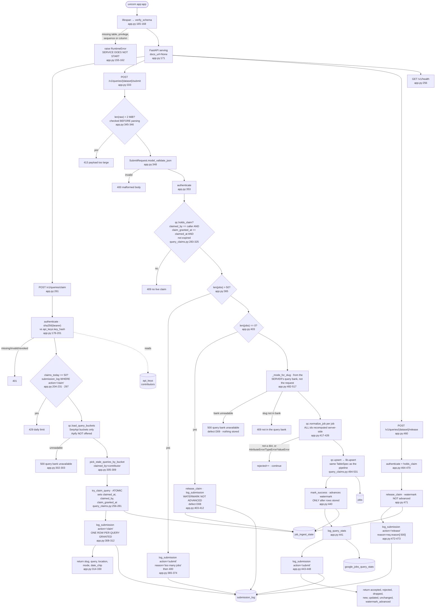

> **Provenance.** `generator: none` is literal: nothing in this repo produces
> `docs/ingest/*.md`. Earlier versions carried `generated:` frontmatter naming a
> tool that was never written, which made `.claude/CLAUDE.md`'s *"never hand-edit"*
> instruction unfollowable — the only way to fix a wrong line was to break the rule.
> The claim was dropped across all fourteen files on 2026-07-31; see
> [`34-documentation-cleanup.md`](../tasks/refactor/34-documentation-cleanup.md) §A2.
> These files are hand-written and are maintained by hand.

## Purpose

An HTTP service that lets volunteers contribute Google Jobs results using
**their own** SerpApi accounts. A contributor's worker claims stale queries
from `POST /v1/queries/claim`, runs them against SerpApi with its own key, and
posts the raw results back to `POST /v1/queries/{dataset}/submit`
(`backend/api/app.py:4-8`).

Everything stored is recomputed server-side from the raw payload
(`backend/api/app.py:414-426`), and the rows land in the same `jobs` table
tagged `platform='google_jobs'` through the same `lib.upsert` code path the
pipeline uses (`backend/api/query_claims.py:494-531`).

It coordinates with `ingest/google-serpapi.py` and `ingest/google-apify.py`
through the **same `job_ingest_state` rows** (`backend/api/query_claims.py:256-281`).

**This service has never been deployed** (`backend/api/README.md:32`).
`docs/tasks/README.md` used to record that it is expected to be deprecated;
**task 24 reverses that** and the sentence there is struck. The import boundary
it sits beside is *not* reversed — `webapp/` still imports nothing from here.

**It has tests as of 2026-08-02**, in `backend/api/tests/`, run by this
directory's own venv (`.venv/bin/python -m unittest discover -s tests`). They are
its first: system `python3` cannot import `app.py`, because this venv sets
`include-system-site-packages = false` and `fastapi` is not a pipeline
dependency.

---

## Invocation

**A long-running HTTP server**, not a scheduled script. FastAPI app object at
`backend/api/app.py:171`:

```
pip install -r requirements.txt
uvicorn app:app --port 8420
```

(`backend/api/app.py:29-31`.) `docs_url` and `redoc_url` are both `None`, so
the interactive API docs are disabled (`:171`).

**Startup is gated.** A `lifespan` context manager runs `verify_schema()`
before serving (`:165-168`), which raises `RuntimeError` — refusing to start —
if any required table, privilege, sequence **or column** is missing (`:82-162`).
The column check is new in task 24: `submission_log.action` is written by every
`INSERT` and created by `init-schema`, which is a separate admin command, so a
deploy that ships this code ahead of it would otherwise 500 on a contributor's
first claim. `query_claims.REQUIRED_COLUMNS` (`:127-137`) is the third map, and
carries the same argument `REQUIRED_SEQUENCES` does one level up.

The docstring is explicit that deployment (domain, TLS, reverse proxy,
firewall) is a separate manual step, and that binding to `0.0.0.0` without a
TLS-terminating proxy would expose API keys, since they are bearer tokens
(`:32-35`).

### CLI arguments

**None** on the service itself — it is an ASGI app. The sibling
`backend/api/manage_users.py` is the admin CLI (`backend/api/README.md:85-95`);
`init-schema` is the subcommand `verify_schema`'s error message names
(`:159-161`).

### Environment variables

| Variable | Default | Read at |
|---|---|---|
| `DATABASE_URL` | `postgresql://jobs_api@localhost:5432/jobs` | `backend/api/query_claims.py:78` |
| `GOOGLE_QUERIES_FILE` | `config/google-queries.json` | `backend/api/query_claims.py:146` |
| `CLAIM_TTL_MINUTES` | `15` | `backend/api/query_claims.py:155` |
| `GOOGLE_JOBS_MIN_HOURS_BETWEEN_RUNS` | `20` | `backend/api/README.md:226-238` |
| `MAX_JOBS_PER_SUBMIT` | `50` | `backend/api/app.py:50` |
| `MAX_QUERIES_PER_CLAIM` | `5` | `backend/api/app.py:51` |
| `MAX_CLAIMS_PER_CONTRIBUTOR_PER_DAY` | `50` | `backend/api/app.py:52-54` |
| `MAX_BODY_BYTES` | `2097152` (2 MiB) | `backend/api/app.py:59` |

Note this service **does** read `CLAIM_TTL_MINUTES`
(`backend/api/query_claims.py:155`), unlike `ingest/google-serpapi.py`, which
takes the library default — see `docs/ingest/google-serpapi.md`.

It has its own `.env` and its own venv; `backend/api/.env.example` sets only
`DATABASE_URL`.

### Expected runtime

Per request, not per run. No measurement exists — the service has never been
deployed.

### Concurrent runs

Concurrency is the design premise. Three mechanisms:

1. **One connection per request**, opened and closed by the `db()` context
   manager (`:61-79`). Its docstring records a real leak: psycopg's `with
   conn:` commits but deliberately does **not** close, so "every request was
   leaking a socket until GC got round to it."
2. **The atomic claim**, byte-for-byte the pipeline's conditional update plus
   `claimed_by` and `claim_granted_at` (`backend/api/query_claims.py:256-281`).
3. **`holds_claim`**, which re-verifies ownership at submit time
   (`backend/api/query_claims.py:283-325`).

---

## Data Flow



---

## Field Mapping

**Identical to both Google ingest scripts.** `normalize_job` is re-exported
from `backend/google_jobs.py` through `query_claims.py:61` and called at
`backend/api/app.py:424`. See `docs/ingest/google-serpapi.md` for the table.

What matters here is *which* fields the client is allowed to influence.

| Field | Source | Client-controllable? |
|---|---|---|
| `platform` | literal `"google_jobs"` (`backend/google_jobs.py:102`) | no |
| `company_token` | `slugify(payload.company_name)` (`:96`) | **derived from payload** |
| `source_id` | `ids.google_source_id(job, company_token)` (`:105`) | **derived from payload** |
| `mode` → `location_is_remote` | `_mode_for_slug(slug)` — the **server's** query bank (`backend/api/app.py:482-517`) | no |
| every other column | derived from the raw job object | derived |
| content hash, row id | recomputed by `lib.upsert` / `schema.make_job_id` | no |

The security note at `backend/google_jobs.py:48-64` is the reason this
function exists rather than accepting client-computed fields:
`platform`/`company_token`/`source_id` feed `make_id()`, so "letting a client
set those directly would let a hostile contributor overwrite arbitrary
existing rows — e.g. claiming a Greenhouse posting's id and replacing its
URL." Recomputing means "the worst a bad payload can do is insert junk under
its own derived id, never clobber another source's."

It also flags the residual: the fingerprint branch of `google_source_id`
depends on the apply URL, **which a contributor controls** — "still
client-derived-but-recomputed, never client-supplied" (`:62-64`).

`_mode_for_slug` is looked up server-side "so a contributor can't mislabel a
query's results" (`backend/api/app.py:483-485`). ~~It returns `"unknown"` if the
query bank is unreadable or the slug is absent.~~ **Fixed 2026-08-02 (defect
D09): it raises.** An unreadable bank is a 500 (`:509`) carrying the same
wording `claim` already used for the identical failure; a slug absent from a
readable bank is a 409 (`:513-516`), because `claim` only ever issues slugs from
this bank. Neither stores anything.

That matters because `mode` is not cosmetic: `google_jobs.py:99` reads it as
`is_remote = REMOTE_PATTERN.search(location) or mode == "remote"`, so the old
sentinel turned a one-request config read failure into a batch of remote
postings stored as non-remote — rows indistinguishable from correct ones
forever.

---

## Dedupe & Idempotency

### Row identity

Unchanged from the pipeline: `sha256("google_jobs:{token}:{source_id}")[:24]`
(`backend/schema.py:239-248`), applied by `qc.upsert` through the same
`schema.google_spec()` `TableSpec` (`backend/api/query_claims.py:70`, `:526`).

The docstring states the property this buys: "Rows written through this API
are therefore indistinguishable from locally-ingested ones by construction,
not by two files agreeing" (`backend/api/query_claims.py:497-500`).

That is also listed as a **gap** in `backend/api/README.md:214-224`: there is
no provenance column, so a submitted row cannot be told apart from a locally
ingested one.

### The claim protocol

`try_claim_query` (`backend/api/query_claims.py:256-281`) is the pipeline's
statement plus three columns:

```sql
INSERT INTO job_ingest_state (dataset, last_success_at, claimed_at, claimed_by, claim_granted_at)
VALUES (%(dataset)s, '', %(now)s, %(by)s, %(now)s)
ON CONFLICT (dataset) DO UPDATE
    SET claimed_at = %(now)s, claimed_by = %(by)s, claim_granted_at = %(now)s
    WHERE job_ingest_state.claimed_at IS NULL OR job_ingest_state.claimed_at < %(ttl_cutoff)s
RETURNING dataset
```

The `''` sentinel "must stay '' and not NULL, both because the column is NOT
NULL and because stalest-first ordering relies on '' sorting first"
(`:261-263`) — the same contract `backend/lib/state.py:105-110` states.

### `holds_claim` and the takeover problem

`holds_claim` (`backend/api/query_claims.py:283-325`) requires **three**
conditions: `claimed_by == contributor`, `claim_granted_at == claimed_at`, and
`claimed_at >= ttl_cutoff`.

The middle one exists because of a bug found by testing against the pipeline's
real SQL, documented in full at `:287-308`:

1. the API grants query X to contributor C (`claimed_by='C'`);
2. C stalls, the claim expires;
3. the local pipeline claims X — it sets `claimed_at` but **has no knowledge
   of `claimed_by`**, leaving it stale as `'C'`;
4. C submits. A naive `claimed_by == caller` check sees a matching id and a
   fresh `claimed_at`, and lets C write results and advance the watermark
   **while the pipeline is mid-fetch**.

`claim_granted_at` records what `claimed_at` was when *this service* granted
the claim. Any takeover rewrites `claimed_at`, so the two stop matching. The
fix is entirely on this side — "This is why no changes to the pipeline are
needed" (`:305-308`).

### Watermark advancement

`mark_success` is "the ONLY thing that may advance `last_success_at`, and it
must run only after results are actually stored"
(`backend/api/query_claims.py:327-336`). It is called at
`backend/api/app.py:440`, after `qc.upsert` at `:428`.

**And it is now conditional** (defect D08, fixed 2026-08-02). An empty `jobs`
array short-circuits at `:403-412`: the claim is released, a `submission_log`
row is written, `google_jobs_query_stats` is **not**, and the response carries
`watermark_advanced: false`. Before that, `{"jobs": []}` marked the query covered
for `GOOGLE_JOBS_MIN_HOURS_BETWEEN_RUNS` with nothing stored, so every posting
published in that window was skipped by every path, permanently, while the
response said success.

The pipeline does the opposite and is right to. `ingest/google-serpapi.py:335-351`
advances the watermark on zero results because it made the SerpApi call itself
and knows the fetch succeeded; this endpoint only ever sees an array, and an
empty one is what an exhausted key, a blocked worker, a wrong chip and a
genuinely quiet query all look like from here. The cost of the fix, stated: an
honestly-empty query is handed out and fetched again. That is one credit,
bounded by the daily cap (which D41's fix makes real) and by the per-bucket
budgets. The other direction is a posting nobody ever sees and no counter
records.

`release` deliberately does **not** advance it, "so the next contributor to
pick this query up gets a date_chip covering the window this attempt missed"
(`backend/api/app.py:461-463`).

### Full re-submit

A contributor cannot re-submit the same claim: `mark_success` clears
`claimed_at`, `claimed_by` and `claim_granted_at`
(`backend/api/query_claims.py:335-343`), so the next `holds_claim` returns
`False` and the second submit gets a 409.

The rows themselves take the ordinary three-branch upsert path with sticky
`posted_at` (`backend/schema.py:222-236`), so a duplicate write would be
`unchanged` rather than duplicated.

### Partial re-run after a mid-batch crash

`db()` wraps each request in `with conn:` (`:76`), which commits on clean exit
and **rolls back on exception**. Within `submit`, three explicit
`conn.commit()` calls punctuate that: `qc.upsert` commits
(`backend/api/query_claims.py:530`), `mark_success` commits, and `app.py:449`
commits the `submission_log` row. `log_submission` itself deliberately does not
commit: several of its callers raise an `HTTPException` immediately afterwards,
and committing inside it would decide for them whether the surrounding work is
kept.

So a crash after `upsert` but before `mark_success` leaves rows written with
the watermark unadvanced and the claim still held — recoverable once the TTL
expires. A crash between `mark_success` and the `submission_log` insert leaves
the audit log missing an entry that the daily-quota count is derived from. That
no longer costs a claim: since 2026-08-02 the quota counts `action = 'claim'`
rows written by `claim` (`:204-231`, `:308-312`), and those are committed before
the response is built, so a crash in `submit` cannot refund one.

---

## Failure Modes

### Rate limits and caps

Four caps, each with its own failure shape:

| Cap | Default | Enforced at | Response |
|---|---|---|---|
| Body size | 2 MiB | `:345` — **before** parsing | 413 |
| Jobs per submit | 50 | `:365` | 400, **and a `submission_log` row with `reason='too many jobs'`** (`:365-374`) |
| Queries per claim | 5 | Pydantic `Field(le=MAX_QUERIES_PER_CLAIM)` (`:238`) | 422 from validation |
| Claims per contributor per day | 50 | `:296-301` | 429 |

The body cap is read manually rather than via a Pydantic body parameter
specifically so it applies pre-parse — "a 500MB JSON array should be rejected
on sight, not after being deserialized into memory" (`:340-342`).

The daily count is derived from `submission_log` rather than a counter, "one
less piece of mutable state to get out of sync" (`:205-207`).

~~**No rate limiting on `claim` itself beyond the daily cap.**~~ **Fixed
2026-08-02 (defect D41).** `claim` writes one `submission_log` row per query it
grants (`:308-312`), and `claims_today()` counts rows with `action = 'claim'`
and nothing else (`:204-231`) — so the cap now means *queries claimed today*,
which is what its name always said. Both halves are load-bearing: without the
action filter an honest submit and an honest release would each burn a claim,
so doing the work would reduce how much work you were allowed.

A request granted **nothing** writes nothing, deliberately: it locked no query,
and metering it would exhaust an honest daily cron's allowance on exactly the
days the bank is fresh — the worker prints "nothing to do" and exits 0 on those
(`contributor-worker/google-serpapi-worker.py:121-126`).

**Still uncapped: concurrency.** Fifty outstanding claims is inside the daily cap
and is most of a 32-slug bank, each locked for `CLAIM_TTL_MINUTES`. That is
written up in task 24 rather than built.

### Auth

Bearer token in the `Authorization` header (`:187-191`). The raw key is
**never stored** — lookup is by `sha256(token)` against `api_keys.key_hash`
(`:192-195`), "so a database leak does not hand out working credentials"
(`:181-182`).

Revoked keys are rejected but their rows are kept, deliberately: the audit
trail references contributors, and keeping the row means "a revoked key can
never be silently re-minted into validity" (`:182-185`).

There is **no token refresh, expiry or rotation** in this code — keys are
minted by `manage_users.py` and live until revoked.

### Startup verification

`verify_schema` (`:82-162`) checks **four** things, and the docstring explains
why each was added:

- **Existence** — "a missing table is a deployment error to report, not damage
  to silently repair." The service holds no DDL rights by design; creating the
  schema here "would mean an internet-facing service permanently holding
  CREATE on the same schema the ingest pipeline owns" (`:85-89`).
- **Privileges**, via `has_table_privilege` — "a table can exist and still be
  unusable if a GRANT was missed… INSERT without SELECT on
  `google_jobs_query_stats` looks fine until the first ON CONFLICT runs"
  (`:95-99`).
- **Sequences**, via `has_sequence_privilege` — `submission_log.id` is
  BIGSERIAL, so an INSERT needs USAGE on the sequence. That grant "was in
  README's privilege table and in nothing that ran, which made it the one
  documented requirement a startup check could not catch" (`:101-105`).
- **Columns** (new 2026-08-02), against `information_schema.columns`. A table can
  exist, be granted correctly and still be missing a column every INSERT names,
  because `init-schema` is a separate admin command this service holds no rights
  to run. `qc.REQUIRED_COLUMNS` lists only columns this service *writes*; reads
  that lose a column fail visibly at the query (`:143-154`, `:107-111`).

Required objects (`backend/api/query_claims.py:97-137`):

| Table | Privileges |
|---|---|
| `jobs` | SELECT, INSERT, UPDATE |
| `job_ingest_state` | SELECT, INSERT, UPDATE |
| `google_jobs_query_stats` | SELECT, INSERT |
| `contributors` | SELECT, INSERT |
| `api_keys` | SELECT, INSERT, UPDATE |
| `submission_log` | SELECT, INSERT |

| Sequence | Privileges |
|---|---|
| `submission_log_id_seq` | USAGE, SELECT |

| Table | Required columns |
|---|---|
| `submission_log` | `action` |

**No DELETE anywhere, and nothing on the seven pipeline-owned tables**
(`backend/api/README.md:144-158`).

### Malformed or empty payloads

| Input | Behavior |
|---|---|
| Body over 2 MiB | 413 before parsing (`:345-346`) |
| Body that is not valid `SubmitRequest` JSON | 400 (`:347-350`), detail naming the failing `loc` and error `type` only — ~~*was:* `f"malformed body: {e}"`, which echoed the offending input and, for a syntactically broken body, the whole request body; defect D73~~ |
| A job element that is not a dict | `rejected++`, `continue` (`:420-422`) |
| A job raising `AttributeError`/`TypeError`/`ValueError` in `normalize_job` | `rejected++`, `continue` (`:423-426`) |
| `jobs: []` | accepted, watermark **not** advanced, claim released, logged, `watermark_advanced: false` (`:403-412`) — ~~*was:* still advanced the watermark, defect D08~~ |
| Query bank unreadable during `claim` | 500 with detail (`:302-303`) |
| Query bank unreadable during `submit` | 500, same wording, nothing stored (`:508-509`) — ~~*was:* `_mode_for_slug` silently returned `"unknown"`, defect D09~~ |
| Slug absent from a readable bank during `submit` | 409, nothing stored (`:513-516`) |

### Does a single bad record fail the batch?

**No, and fixing that is why `qc.upsert` exists in its current form.** The
docstring at `backend/api/query_claims.py:501-508` records what the
hand-rolled predecessor did:

> lib.upsert opens a SAVEPOINT per record. The hand-rolled version this
> replaces did not, and on Postgres a single failed statement aborts the whole
> transaction — so one malformed posting in a contributor's batch of 50 took
> the other 49 with it, returned a 500, wrote no submission_log row, never
> called mark_success, and spent the contributor's SerpApi credit for nothing.

### Logged vs. swallowed

| Event | Where it goes |
|---|---|
| Every claim | one `submission_log` row **per query granted**, `action='claim'` (`:308-312`) — new 2026-08-02, defect D41 |
| Every submit | `submission_log` row with `fetched_count`, `accepted_count`, `rejected_count`, `action='submit'` (`:443-448`) |
| Over-cap submit | `submission_log` row with `reason='too many jobs'` **before** the 400 (`:365-374`) |
| Empty submit | `submission_log` row saying the watermark was not advanced (`:405-407`) |
| Release | `submission_log` row with the caller's reason, truncated to 500 chars, `action='release'` (`:472-473`) |
| Per-job rejection | counted in `rejected`, returned in the response and stored — but **which** job and **why** is not recorded (`:329`, `:334`) |
| **Per-record upsert failure** | **no longer discarded.** `backend/api/app.py:435` reads `len(result.errors)` into `dropped`, which goes into the response **and** into `submission_log` — a contributor whose rows silently vanished has no other way to find out (`:430-434`). It is kept distinct from `rejected`, which counts payload entries refused before reaching the database. ~~*Was:* discarded — `app.py:336` unpacked `new, updated, unchanged` and never read `.errors`; fixed 2026-07-28, `e353e3e`, defect D01~~ |
| Auth failures | HTTP status only; no log |

The audit trail is the strongest of any component here — and the upsert-error
gap is the same one every ingest script has.

---

## External Dependencies

**This service makes no outbound HTTP calls.** It is the inbound side; the
contributor's worker is what talks to SerpApi.

| Direction | Party | Auth |
|---|---|---|
| inbound | contributor workers | bearer token, sha256-hashed at rest |
| outbound | Postgres, as role `jobs_api` | `DATABASE_URL` |

### The contributor worker

`backend/api/contributor-worker/google-serpapi-worker.py` runs on the
contributor's machine. Its configuration (`:46-51`): `JOBS_API_BASE_URL`,
`JOBS_API_KEY`, `SERPAPI_API_KEY`, `MAX_QUERIES` (default 1), `HTTP_TIMEOUT`
(default 45), `DEBUG`.

It holds a SerpApi key and a jobs-API key, and **never** a database
credential — that is the arrangement's whole point (`backend/api/app.py:4-8`,
`:14-16`).

### Tables this service owns

Created by `backend/api/query_claims.py:205`, `:213`, `:223`:
`contributors`, `api_keys`, `submission_log`. It also adds `claimed_by` and
`claim_granted_at` to `job_ingest_state`.
`backend/docs/DEVELOPER.md` describes the schema impact on the pipeline as
"additive only" — the ingest scripts never read or write any of them.

### Undocumented assumptions

- **Apify is deliberately not offered.** `claim` serves SerpApi buckets only,
  because Apify "bills per result against the operator's own account, so
  letting contributors trigger it would spend the operator's money on someone
  else's request" (`:228-232`).
- **`dataset` arrives as a path parameter with `:path`** (`:274`), so it can
  contain the colons in `google_jobs:query:{slug}`. The slug is recovered by
  string replacement (`:322`), not by parsing — a dataset string not matching
  that prefix yields a slug equal to the whole string, and `_mode_for_slug`
  then returns `"unknown"`.
- **Submitted payloads are raw SerpApi job objects** (`:206-208`). Nothing
  validates that shape beyond `isinstance(job, dict)`; a well-formed dict with
  no recognizable fields normalizes into a row of mostly `None`.

### Python dependencies

`fastapi>=0.115`, `uvicorn[standard]>=0.30`, `psycopg[binary]>=3.1`,
`pydantic>=2.7` (`backend/api/requirements.txt`). Repo-local: `query_claims`
(`:47`) and `lib.text` (`:48`).

**Import order is load-bearing**: `import query_claims as qc` carries the
comment "also puts the repo root on sys.path" (`:47`), so it must precede
`from lib import text`. `backend/docs/DEVELOPER.md` states the same rule.

---

## Open Questions

**Nothing here has ever run in production.** `backend/api/README.md:32`
records that the service has never been deployed. (The deprecation expectation
in `docs/tasks/README.md` is reversed by task 24 and struck there.) Every
behavior described above is read from code and from
`backend/api/tests/` — which exist as of 2026-08-02 and did not when this
document was written — not observed in production. The live database has zero rows I could
attribute to it — `submission_log`, `contributors` and `api_keys` exist only
if `manage_users.py init-schema` has been run, which I did not check.

**Runtime and throughput are unmeasured**, necessarily.

~~**`jobs: []` advances the watermark.**~~ **Answered and fixed 2026-08-02
(defect D08)** — see *Watermark advancement* above. The open question inside it
was the useful part and has an answer now: a contributor whose SerpApi call
returned zero results may call **either**, and the server treats them the same
way, because it cannot tell an honest empty result from a broken worker and
should not have to. The worker script calls `submit` (`google-serpapi-worker.py:
147-151`); that is fine and was left alone.

~~**The `submission_log` gap after a partial failure would grant an extra
claim.**~~ **No longer true, 2026-08-02.** The quota is counted from the
`action = 'claim'` rows `claim` writes and commits before it responds
(`:308-312`), so a crash anywhere in `submit` cannot refund a claim. The audit
row for the submission itself can still be lost that way; that costs a line in
the log, not an allowance.

**Whether `MAX_QUERIES_PER_CLAIM` is enforceable as written.**
`ClaimRequest.max` uses `Field(default=1, ge=1, le=MAX_QUERIES_PER_CLAIM)`
(`:202`), where the bound is read from the environment at import time
(`:51`). A Pydantic validation failure returns 422, not the 400/429 the other
caps return — I did not verify which status FastAPI emits for this specific
model.

~~**Claiming is unmetered, and the README says so.**~~ **Half fixed 2026-08-02
(defect D41).** The suspicion recorded here was correct: the daily cap counted
`submission_log` rows and `claim` wrote none, so a pure claim-loop was uncapped.
It is now metered per query granted — see *Rate limits and caps* above.
**Concurrency is still uncapped**, and so is provenance: submitted rows carry no
column distinguishing them from locally-ingested ones, so one contributor's rows
cannot be traced or purged.

**`_mode_for_slug` reloads the query bank on every submit** (`:507`), reading
the JSON file from disk per request. Whether that is a performance concern at
any realistic contributor volume I did not assess; there is no caching. Note the
D09 fix makes this *more* than a performance question: a read that fails now
rejects the submission, so the reload is on the critical path for correctness as
well as latency. Caching it at import time would trade one failure mode (a
transient read failure costs a submission) for another (an edited bank needs a
restart), and that trade has not been taken.

**`manage_users.py` was not read in full when this document was written.** The
privilege model, key issuance and revocation flows were described from
`backend/api/README.md` plus the `REQUIRED_TABLES` map, not from that file's
code. It is now at least scanned by `tests/test_grants.py`, which parses its SQL
and asserts every table it names is declared — which is a statement about its
grants, not about its logic. Nothing tests `create`, `list` or `revoke`.

~~**The claim protocol has no test.** `try_claim_query`'s conditional update and
`holds_claim`'s three conditions — including the `claim_granted_at` takeover
guard, which is this service's subtlest piece of reasoning — are SQL semantics,
and `tests/fakedb.py` cannot falsify a WHERE clause. `backend/webapp/tests/test_event_replay.py` is the pattern for closing this against a scratch schema;
it is not built. Written up in task 24.~~

**Numbered `D72` and closed 2026-08-02** by `backend/api/tests/test_claim_protocol.py`,
against a scratch schema, skipping where no database is reachable. The takeover
guard is exercised by calling the pipeline's own `lib.state.try_claim` rather
than a hand-written `UPDATE`, so the premise the guard defends against — the
pipeline rewrites `claimed_at` and leaves `claimed_by` stale — is pinned as its
own assertion beside the guard itself. See
[`DEFECTS.md` § D72](DEFECTS.md#d72).

**`submission_log` is now read by something.** `backend/api/contribution_report.py`
buckets it by `action` per contributor and, with `--by-dataset`, per query slug —
the deliverable for task 24's *"contribution counts tracked; empty-submission
workers detectable"*. It runs on this service's own restricted role, which is why
it lives in `backend/api/` and not in `backend/tools/`: `submission_log` is
granted to `jobs_api` alone. A NULL `action` is carried as an unknown throughout
and never counted as a claim, a submit or a zero.
