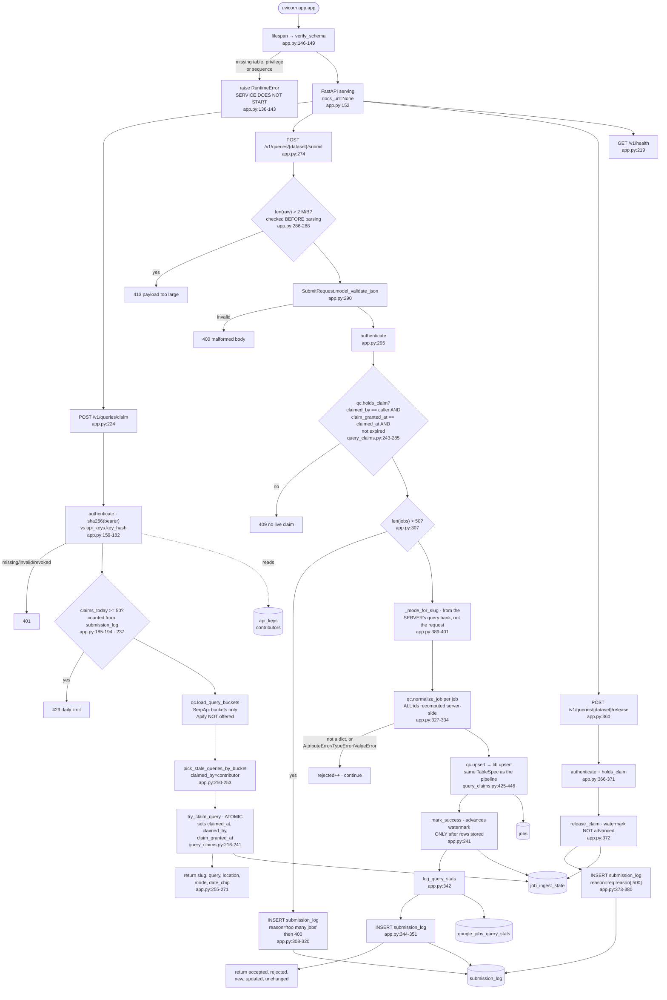

> **Provenance.** `generator: none` is literal: nothing in this repo produces
> `docs/ingest/*.md`. Earlier versions carried `generated:` frontmatter naming a
> tool that was never written, which made `.claude/CLAUDE.md`'s *"never hand-edit"*
> instruction unfollowable — the only way to fix a wrong line was to break the rule.
> The claim was dropped across all fourteen files on 2026-07-31; see
> [`34-documentation-cleanup.md`](../tasks/refactor/34-documentation-cleanup.md) §A2.
> These files are hand-written and are maintained by hand.

## Purpose

An HTTP service that lets volunteers contribute Google Jobs results using
**their own** SerpApi accounts. A contributor's worker claims stale queries
from `POST /v1/queries/claim`, runs them against SerpApi with its own key, and
posts the raw results back to `POST /v1/queries/{dataset}/submit`
(`backend/api/app.py:4-8`).

Everything stored is recomputed server-side from the raw payload
(`backend/api/app.py:325-334`), and the rows land in the same `jobs` table
tagged `platform='google_jobs'` through the same `lib.upsert` code path the
pipeline uses (`backend/api/query_claims.py:425-446`).

It coordinates with `ingest/google-serpapi.py` and `ingest/google-apify.py`
through the **same `job_ingest_state` rows** (`backend/api/query_claims.py:216-241`).

**This service has never been deployed** (`backend/api/README.md:32`), and
`docs/tasks/README.md` records that it is expected to be deprecated.

---

## Invocation

**A long-running HTTP server**, not a scheduled script. FastAPI app object at
`backend/api/app.py:152`:

```
pip install -r requirements.txt
uvicorn app:app --port 8420
```

(`backend/api/app.py:29-31`.) `docs_url` and `redoc_url` are both `None`, so
the interactive API docs are disabled (`:152`).

**Startup is gated.** A `lifespan` context manager runs `verify_schema()`
before serving (`:146-149`), which raises `RuntimeError` — refusing to start —
if any required table, privilege or sequence is missing (`:82-143`).

The docstring is explicit that deployment (domain, TLS, reverse proxy,
firewall) is a separate manual step, and that binding to `0.0.0.0` without a
TLS-terminating proxy would expose API keys, since they are bearer tokens
(`:32-35`).

### CLI arguments

**None** on the service itself — it is an ASGI app. The sibling
`backend/api/manage_users.py` is the admin CLI (`backend/api/README.md:85-95`);
`init-schema` is the subcommand `verify_schema`'s error message names
(`:140-142`).

### Environment variables

| Variable | Default | Read at |
|---|---|---|
| `DATABASE_URL` | `postgresql://jobs_api@localhost:5432/jobs` | `backend/api/query_claims.py:77` |
| `GOOGLE_QUERIES_FILE` | `config/google-queries.json` | `backend/api/query_claims.py:116` |
| `CLAIM_TTL_MINUTES` | `15` | `backend/api/query_claims.py:125` |
| `GOOGLE_JOBS_MIN_HOURS_BETWEEN_RUNS` | `20` | `backend/api/README.md:226-238` |
| `MAX_JOBS_PER_SUBMIT` | `50` | `backend/api/app.py:50` |
| `MAX_QUERIES_PER_CLAIM` | `5` | `backend/api/app.py:51` |
| `MAX_CLAIMS_PER_CONTRIBUTOR_PER_DAY` | `50` | `backend/api/app.py:52-54` |
| `MAX_BODY_BYTES` | `2097152` (2 MiB) | `backend/api/app.py:59` |

Note this service **does** read `CLAIM_TTL_MINUTES`
(`backend/api/query_claims.py:125`), unlike `ingest/google-serpapi.py`, which
takes the library default — see `docs/ingest/google-serpapi.md`.

It has its own `.env` and its own venv; `backend/api/.env.example` sets only
`DATABASE_URL`.

### Expected runtime

Per request, not per run. No measurement exists — the service has never been
deployed.

### Concurrent runs

Concurrency is the design premise. Three mechanisms:

1. **One connection per request**, opened and closed by the `db()` context
   manager (`:61-79`). Its docstring records a real leak: psycopg's `with
   conn:` commits but deliberately does **not** close, so "every request was
   leaking a socket until GC got round to it."
2. **The atomic claim**, byte-for-byte the pipeline's conditional update plus
   `claimed_by` and `claim_granted_at` (`backend/api/query_claims.py:216-241`).
3. **`holds_claim`**, which re-verifies ownership at submit time
   (`backend/api/query_claims.py:243-285`).

---

## Data Flow



---

## Field Mapping

**Identical to both Google ingest scripts.** `normalize_job` is re-exported
from `backend/google_jobs.py` through `query_claims.py:61` and called at
`backend/api/app.py:332`. See `docs/ingest/google-serpapi.md` for the table.

What matters here is *which* fields the client is allowed to influence.

| Field | Source | Client-controllable? |
|---|---|---|
| `platform` | literal `"google_jobs"` (`backend/google_jobs.py:102`) | no |
| `company_token` | `slugify(payload.company_name)` (`:96`) | **derived from payload** |
| `source_id` | `ids.google_source_id(job, company_token)` (`:105`) | **derived from payload** |
| `mode` → `location_is_remote` | `_mode_for_slug(slug)` — the **server's** query bank (`backend/api/app.py:389-401`) | no |
| every other column | derived from the raw job object | derived |
| content hash, row id | recomputed by `lib.upsert` / `schema.make_job_id` | no |

The security note at `backend/google_jobs.py:48-64` is the reason this
function exists rather than accepting client-computed fields:
`platform`/`company_token`/`source_id` feed `make_id()`, so "letting a client
set those directly would let a hostile contributor overwrite arbitrary
existing rows — e.g. claiming a Greenhouse posting's id and replacing its
URL." Recomputing means "the worst a bad payload can do is insert junk under
its own derived id, never clobber another source's."

It also flags the residual: the fingerprint branch of `google_source_id`
depends on the apply URL, **which a contributor controls** — "still
client-derived-but-recomputed, never client-supplied" (`:62-64`).

`_mode_for_slug` is looked up server-side "so a contributor can't mislabel a
query's results" (`backend/api/app.py:390-392`). It returns `"unknown"` if the
query bank is unreadable or the slug is absent (`:396`, `:401`).

---

## Dedupe & Idempotency

### Row identity

Unchanged from the pipeline: `sha256("google_jobs:{token}:{source_id}")[:24]`
(`backend/schema.py:239-248`), applied by `qc.upsert` through the same
`schema.google_spec()` `TableSpec` (`backend/api/query_claims.py:69`, `:445`).

The docstring states the property this buys: "Rows written through this API
are therefore indistinguishable from locally-ingested ones by construction,
not by two files agreeing" (`backend/api/query_claims.py:429-432`).

That is also listed as a **gap** in `backend/api/README.md:214-224`: there is
no provenance column, so a submitted row cannot be told apart from a locally
ingested one.

### The claim protocol

`try_claim_query` (`backend/api/query_claims.py:216-241`) is the pipeline's
statement plus three columns:

```sql
INSERT INTO job_ingest_state (dataset, last_success_at, claimed_at, claimed_by, claim_granted_at)
VALUES (%(dataset)s, '', %(now)s, %(by)s, %(now)s)
ON CONFLICT (dataset) DO UPDATE
    SET claimed_at = %(now)s, claimed_by = %(by)s, claim_granted_at = %(now)s
    WHERE job_ingest_state.claimed_at IS NULL OR job_ingest_state.claimed_at < %(ttl_cutoff)s
RETURNING dataset
```

The `''` sentinel "must stay '' and not NULL, both because the column is NOT
NULL and because stalest-first ordering relies on '' sorting first"
(`:221-223`) — the same contract `backend/lib/state.py:105-110` states.

### `holds_claim` and the takeover problem

`holds_claim` (`backend/api/query_claims.py:243-285`) requires **three**
conditions: `claimed_by == contributor`, `claim_granted_at == claimed_at`, and
`claimed_at >= ttl_cutoff`.

The middle one exists because of a bug found by testing against the pipeline's
real SQL, documented in full at `:247-268`:

1. the API grants query X to contributor C (`claimed_by='C'`);
2. C stalls, the claim expires;
3. the local pipeline claims X — it sets `claimed_at` but **has no knowledge
   of `claimed_by`**, leaving it stale as `'C'`;
4. C submits. A naive `claimed_by == caller` check sees a matching id and a
   fresh `claimed_at`, and lets C write results and advance the watermark
   **while the pipeline is mid-fetch**.

`claim_granted_at` records what `claimed_at` was when *this service* granted
the claim. Any takeover rewrites `claimed_at`, so the two stop matching. The
fix is entirely on this side — "This is why no changes to the pipeline are
needed" (`:265-268`).

### Watermark advancement

`mark_success` is "the ONLY thing that may advance `last_success_at`, and it
must run only after results are actually stored"
(`backend/api/query_claims.py:287-296`). It is called at
`backend/api/app.py:341`, after `qc.upsert` at `:336`.

`release` deliberately does **not** advance it, "so the next contributor to
pick this query up gets a date_chip covering the window this attempt missed"
(`backend/api/app.py:362-364`).

### Full re-submit

A contributor cannot re-submit the same claim: `mark_success` clears
`claimed_at`, `claimed_by` and `claim_granted_at`
(`backend/api/query_claims.py:295-300`), so the next `holds_claim` returns
`False` and the second submit gets a 409.

The rows themselves take the ordinary three-branch upsert path with sticky
`posted_at` (`backend/schema.py:222-236`), so a duplicate write would be
`unchanged` rather than duplicated.

### Partial re-run after a mid-batch crash

`db()` wraps each request in `with conn:` (`:76`), which commits on clean exit
and **rolls back on exception**. Within `submit`, three explicit
`conn.commit()` calls punctuate that: `qc.upsert` commits
(`backend/api/query_claims.py:446`), `mark_success` commits, and `:352` commits
the `submission_log` row.

So a crash after `upsert` but before `mark_success` leaves rows written with
the watermark unadvanced and the claim still held — recoverable once the TTL
expires. A crash between `mark_success` and the `submission_log` insert leaves
the audit log missing an entry that the daily-quota count is derived from
(`:185-194`), so that contributor gets one extra claim that day.

---

## Failure Modes

### Rate limits and caps

Four caps, each with its own failure shape:

| Cap | Default | Enforced at | Response |
|---|---|---|---|
| Body size | 2 MiB | `:287` — **before** parsing | 413 |
| Jobs per submit | 50 | `:307` | 400, **and a `submission_log` row with `reason='too many jobs'`** (`:308-316`) |
| Queries per claim | 5 | Pydantic `Field(le=MAX_QUERIES_PER_CLAIM)` (`:202`) | 422 from validation |
| Claims per contributor per day | 50 | `:237-242` | 429 |

The body cap is read manually rather than via a Pydantic body parameter
specifically so it applies pre-parse — "a 500MB JSON array should be rejected
on sight, not after being deserialized into memory" (`:282-284`).

The daily count is derived from `submission_log` rather than a counter, "one
less piece of mutable state to get out of sync" (`:186-188`).

**No rate limiting on `claim` itself beyond the daily cap.**
`backend/api/README.md:214-224` names this as a known gap before opening up:
claiming is unmetered, so a claim-loop could lock the whole query bank and
starve the operator's own nightly pipeline.

### Auth

Bearer token in the `Authorization` header (`:168-172`). The raw key is
**never stored** — lookup is by `sha256(token)` against `api_keys.key_hash`
(`:173-176`), "so a database leak does not hand out working credentials"
(`:162-163`).

Revoked keys are rejected but their rows are kept, deliberately: the audit
trail references contributors, and keeping the row means "a revoked key can
never be silently re-minted into validity" (`:163-166`).

There is **no token refresh, expiry or rotation** in this code — keys are
minted by `manage_users.py` and live until revoked.

### Startup verification

`verify_schema` (`:82-143`) checks three things per required object, and the
docstring explains why each was added:

- **Existence** — "a missing table is a deployment error to report, not damage
  to silently repair." The service holds no DDL rights by design; creating the
  schema here "would mean an internet-facing service permanently holding
  CREATE on the same schema the ingest pipeline owns" (`:85-89`).
- **Privileges**, via `has_table_privilege` — "a table can exist and still be
  unusable if a GRANT was missed… INSERT without SELECT on
  `google_jobs_query_stats` looks fine until the first ON CONFLICT runs"
  (`:95-99`).
- **Sequences**, via `has_sequence_privilege` — `submission_log.id` is
  BIGSERIAL, so an INSERT needs USAGE on the sequence. That grant "was in
  README's privilege table and in nothing that ran, which made it the one
  documented requirement a startup check could not catch" (`:101-105`).

Required objects (`backend/api/query_claims.py:96-113`):

| Table | Privileges |
|---|---|
| `jobs` | SELECT, INSERT, UPDATE |
| `job_ingest_state` | SELECT, INSERT, UPDATE |
| `google_jobs_query_stats` | SELECT, INSERT |
| `contributors` | SELECT, INSERT |
| `api_keys` | SELECT, INSERT, UPDATE |
| `submission_log` | SELECT, INSERT |

**No DELETE anywhere, and nothing on the seven pipeline-owned tables**
(`backend/api/README.md:144-158`).

### Malformed or empty payloads

| Input | Behavior |
|---|---|
| Body over 2 MiB | 413 before parsing (`:287-288`) |
| Body that is not valid `SubmitRequest` JSON | 400 (`:289-292`) |
| A job element that is not a dict | `rejected++`, `continue` (`:328-330`) |
| A job raising `AttributeError`/`TypeError`/`ValueError` in `normalize_job` | `rejected++`, `continue` (`:331-334`) |
| `jobs: []` | accepted — upserts nothing, **still advances the watermark** and logs the submission (`:336-351`) |
| Query bank unreadable during `claim` | 500 with detail (`:246-247`) |
| Query bank unreadable during `submit` | `_mode_for_slug` silently returns `"unknown"` (`:395-396`) |

### Does a single bad record fail the batch?

**No, and fixing that is why `qc.upsert` exists in its current form.** The
docstring at `backend/api/query_claims.py:433-440` records what the
hand-rolled predecessor did:

> lib.upsert opens a SAVEPOINT per record. The hand-rolled version this
> replaces did not, and on Postgres a single failed statement aborts the whole
> transaction — so one malformed posting in a contributor's batch of 50 took
> the other 49 with it, returned a 500, wrote no submission_log row, never
> called mark_success, and spent the contributor's SerpApi credit for nothing.

### Logged vs. swallowed

| Event | Where it goes |
|---|---|
| Every submit | `submission_log` row with `fetched_count`, `accepted_count`, `rejected_count` (`:344-351`) |
| Over-cap submit | `submission_log` row with `reason='too many jobs'` **before** the 400 (`:308-316`) |
| Release | `submission_log` row with the caller's reason, truncated to 500 chars (`:373-380`) |
| Per-job rejection | counted in `rejected`, returned in the response and stored — but **which** job and **why** is not recorded (`:329`, `:334`) |
| **Per-record upsert failure** | **no longer discarded.** `backend/api/app.py:343` reads `len(result.errors)` into `dropped`, which goes into the response **and** into `submission_log` — a contributor whose rows silently vanished has no other way to find out (`:338-342`). It is kept distinct from `rejected`, which counts payload entries refused before reaching the database. ~~*Was:* discarded — `app.py:336` unpacked `new, updated, unchanged` and never read `.errors`; fixed 2026-07-28, `e353e3e`, defect D01~~ |
| Auth failures | HTTP status only; no log |

The audit trail is the strongest of any component here — and the upsert-error
gap is the same one every ingest script has.

---

## External Dependencies

**This service makes no outbound HTTP calls.** It is the inbound side; the
contributor's worker is what talks to SerpApi.

| Direction | Party | Auth |
|---|---|---|
| inbound | contributor workers | bearer token, sha256-hashed at rest |
| outbound | Postgres, as role `jobs_api` | `DATABASE_URL` |

### The contributor worker

`backend/api/contributor-worker/google-serpapi-worker.py` runs on the
contributor's machine. Its configuration (`:46-51`): `JOBS_API_BASE_URL`,
`JOBS_API_KEY`, `SERPAPI_API_KEY`, `MAX_QUERIES` (default 1), `HTTP_TIMEOUT`
(default 45), `DEBUG`.

It holds a SerpApi key and a jobs-API key, and **never** a database
credential — that is the arrangement's whole point (`backend/api/app.py:4-8`,
`:14-16`).

### Tables this service owns

Created by `backend/api/query_claims.py:176`, `:184`, `:194`:
`contributors`, `api_keys`, `submission_log`. It also adds `claimed_by` and
`claim_granted_at` to `job_ingest_state`.
`backend/docs/DEVELOPER.md` describes the schema impact on the pipeline as
"additive only" — the ingest scripts never read or write any of them.

### Undocumented assumptions

- **Apify is deliberately not offered.** `claim` serves SerpApi buckets only,
  because Apify "bills per result against the operator's own account, so
  letting contributors trigger it would spend the operator's money on someone
  else's request" (`:228-232`).
- **`dataset` arrives as a path parameter with `:path`** (`:274`), so it can
  contain the colons in `google_jobs:query:{slug}`. The slug is recovered by
  string replacement (`:322`), not by parsing — a dataset string not matching
  that prefix yields a slug equal to the whole string, and `_mode_for_slug`
  then returns `"unknown"`.
- **Submitted payloads are raw SerpApi job objects** (`:206-208`). Nothing
  validates that shape beyond `isinstance(job, dict)`; a well-formed dict with
  no recognizable fields normalizes into a row of mostly `None`.

### Python dependencies

`fastapi>=0.115`, `uvicorn[standard]>=0.30`, `psycopg[binary]>=3.1`,
`pydantic>=2.7` (`backend/api/requirements.txt`). Repo-local: `query_claims`
(`:47`) and `lib.text` (`:48`).

**Import order is load-bearing**: `import query_claims as qc` carries the
comment "also puts the repo root on sys.path" (`:47`), so it must precede
`from lib import text`. `backend/docs/DEVELOPER.md` states the same rule.

---

## Open Questions

**Nothing here has ever run in production.** `backend/api/README.md:32`
records that the service has never been deployed, and `docs/tasks/README.md`
records the expectation that it will be deprecated. Every behavior described
above is read from code, not observed. The live database has zero rows I could
attribute to it — `submission_log`, `contributors` and `api_keys` exist only
if `manage_users.py init-schema` has been run, which I did not check.

**Runtime and throughput are unmeasured**, necessarily.

**`jobs: []` advances the watermark.** `submit` performs no check that the
payload is non-empty: `qc.upsert(conn, [])` writes nothing, then
`mark_success` runs unconditionally (`:336-341`), marking the query as
successfully covered for the next 20 hours. Whether a contributor whose
SerpApi call returned zero results should call `submit` or `release` is not
stated anywhere, and the worker script's behavior in that case I did not
verify.

**The `submission_log` gap after a partial failure would grant an extra
claim.** `claims_today` counts `submission_log` rows (`:185-194`), and that
row is the **last** thing written in `submit` (`:344-352`). A crash between
`mark_success` and that insert loses the quota record. How likely that is in
practice cannot be assessed without deploying.

**Whether `MAX_QUERIES_PER_CLAIM` is enforceable as written.**
`ClaimRequest.max` uses `Field(default=1, ge=1, le=MAX_QUERIES_PER_CLAIM)`
(`:202`), where the bound is read from the environment at import time
(`:51`). A Pydantic validation failure returns 422, not the 400/429 the other
caps return — I did not verify which status FastAPI emits for this specific
model.

**Claiming is unmetered, and the README says so.**
`backend/api/README.md:214-224` lists two gaps before opening up: a claim-loop
could lock the whole query bank and starve the operator's own pipeline, and
submitted rows carry no provenance. Neither has code addressing it at this
commit. I did not determine whether the daily cap at `:237-242` partially
mitigates the first — it counts `submission_log` rows, and a claim that is
never submitted writes no such row, so a pure claim-loop appears uncapped.

**`_mode_for_slug` reloads the query bank on every submit** (`:394`), reading
the JSON file from disk per request. Whether that is a performance concern at
any realistic contributor volume I did not assess; there is no caching.

**I did not read `manage_users.py` in full.** The privilege model, key
issuance and revocation flows are described from `backend/api/README.md:85-95`
and `:131-172` plus the `REQUIRED_TABLES` map, not from that file's code.
