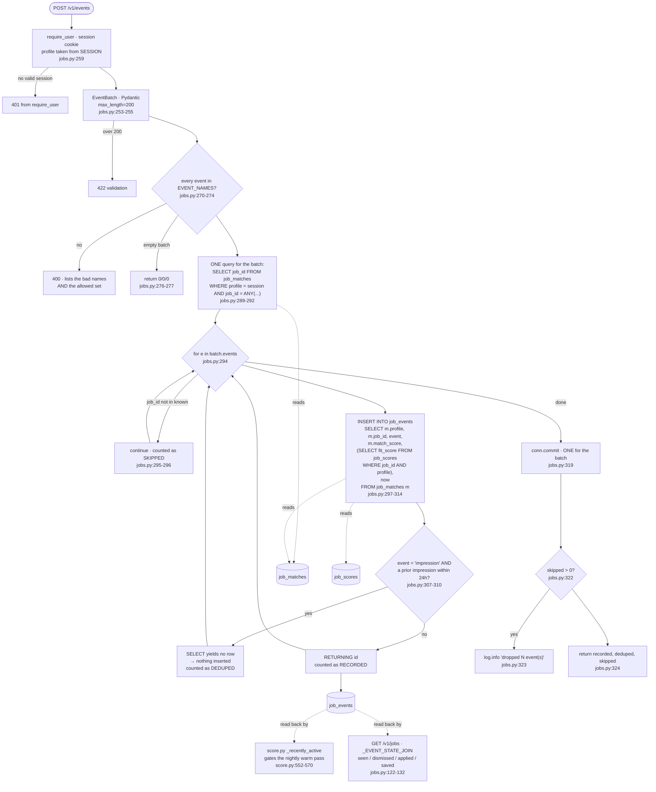

## Purpose

`POST /v1/events` is the only path in the system that writes `job_events`
(`backend/webapp/jobs.py:258-324`). A signed-in user's interactions with the
ranked list — impressions, opens, saves, dismissals, applications — are
recorded together with the `match_score` and `fit_score` **as of that moment**,
both read server-side.

This is not job-posting ingestion. It is the inbound half of the delivery
layer, and it closes a loop: `score.py` reads `job_events` to decide which
profiles get a nightly warm pass (`backend/score.py:552-570`).

`backend/webapp/app.py:4-8` states the gap it fills: their interactions "land
in `job_events`, which nothing has ever written and which ../score.py already
reads."

The same module also serves the read endpoints (`GET /v1/jobs`,
`GET /v1/jobs/{id}`), which are out of scope here except where they consume
`job_events`.

---

## Invocation

**Request-driven.** A FastAPI router (`:34`) mounted by
`backend/webapp/app.py`, run under uvicorn:

```
cd backend/webapp
.venv/bin/uvicorn app:app --port 8421
```

There is no scheduled component and no CLI. Every write happens because a
browser posted to the endpoint.

**Nothing has ever called it.** `SELECT count(*) FROM job_events` returns
**0**.

### Authentication

`user: User = Depends(require_user)` (`:259`) — an opaque session cookie
resolved by `backend/webapp/auth.py`. There is no bearer-token path and no
anonymous access.

**Tenancy is taken from the session, never from a parameter** (`:3-7`):

> Every query here is scoped to `user.profile`, taken from the SESSION and
> never from a request parameter. That is the whole model. A `?profile=`
> parameter would turn one forgotten check into a cross-user data leak.

### Environment variables

Read by `backend/webapp/config.py`, not by this module. `jobs.py` reads no
environment variable directly; its two tunables are module constants:

| Constant | Value | Line |
|---|---|---|
| `EVENT_NAMES` | `("impression", "open", "save", "unsave", "dismiss", "applied")` | `:43` |
| `IMPRESSION_DEDUP_HOURS` | `24` | `:48` |
| `DEFAULT_LIMIT` / `MAX_LIMIT` | `25` / `100` (read endpoints) | `:36-37` |

The service connects as its own Postgres role, `jobs_web`, distinct from both
the pipeline's and `api/`'s (`backend/webapp/app.py:10-19`).

### Expected runtime

Per request. One `SELECT` for the whole batch (`:289-292`) plus one
`INSERT ... RETURNING` per event (`:297-314`), then one commit (`:319`).

Batch size is capped at 200 by Pydantic (`:255`), so worst case is 201 round
trips in one request.

### Concurrent runs

Many, by nature — it is an HTTP endpoint. `backend/webapp/db.py`'s `db()`
context manager scopes a connection per request.

The impression-dedup check is a `NOT EXISTS` subquery inside the `INSERT`
(`:307-310`), evaluated in the same statement as the insert, so two
simultaneous impression posts for the same job could both pass it. See Open
Questions.

---

## Data Flow



---

## Field Mapping

The client sends only two fields per event. Everything else is derived
server-side.

### Client input (`Event`, `:246-250`; `EventBatch`, `:253-255`)

| Client field | Type | Validation |
|---|---|---|
| `job_id` | string | must appear in this profile's `job_matches` (`:289-296`) |
| `event` | string | must be in `EVENT_NAMES` (`:270-274`) |
| *(batch)* `events` | list | `max_length=200` (`:255`) |

### Written to `job_events`

| Column | Source | Client-controllable? |
|---|---|---|
| `profile` | `m.profile` — from `job_matches`, matched on the **session's** profile (`:301`, `:306`) | **no** |
| `job_id` | `m.job_id` — from `job_matches`, not echoed from the request (`:301`) | no |
| `event` | the client's string, after allowlist check (`:301`) | yes, from a closed set |
| **`match_score`** | `m.match_score` — read from `job_matches` in the same statement (`:301`) | **no** |
| **`fit_score`** | correlated subquery on `job_scores` for the same (job, profile) (`:302-303`) | **no** |
| `occurred_at` | `utc_now_str()` computed once for the batch (`:279`, `:304`) | no |
| `id` | `BIGSERIAL` (`backend/schema.py:391`) | no |

The two score columns are the point of the table. `:262-268` quotes
`docs/SCORING.md`:

> Recording `match_score` and `fit_score` **AS OF** the impression is the
> load-bearing part — without them you cannot reconstruct what the user was
> reacting to once weights change.

and adds: "A client-supplied score would be unverifiable training data, which
is worse than none. It is the same rule `api/` applies to postings, arrived at
independently."

Note the insert is `INSERT ... SELECT ... FROM job_matches` (`:299-306`), not
`INSERT ... VALUES`. That is what makes the server-side derivation atomic with
the write and makes a missing match row a no-op rather than a bad row.

### Why the event vocabulary is closed

`job_events.event` is free `TEXT` (`backend/schema.py:394`), so the
`EVENT_NAMES` allowlist "is the only thing keeping the table analysable a year
from now, when the learned ranker in docs/SCORING.md wants to read it. A
typo'd event name is worse than a rejected one: it is silently unusable
training data" (`:39-42`).

### Read back

| Reader | Uses |
|---|---|
| `score.py:_recently_active` (`backend/score.py:552-570`) | any event within N days gates the nightly warm pass; **zero events counts as active** |
| `GET /v1/jobs` `_EVENT_STATE_JOIN` (`:122-132`) | `bool_or(event IN ('impression','open')) AS seen`, `bool_or(event='dismiss')`, `bool_or(event='applied')`, and the latest `save`/`unsave` timestamps |

The save/unsave pair is resolved by comparing `max(occurred_at)` of each
(`:126-127`) rather than by storing a mutable flag — the event log is
append-only and the current state is derived.

---

## Dedupe & Idempotency

### There is no natural key

`job_events.id` is a `BIGSERIAL` surrogate (`backend/schema.py:391`), and the
table is append-only. Two identical `open` events one second apart are two
rows, deliberately — the table is a log, not a state store.

### Impression dedup is the one exception

An `impression` is suppressed if the same profile already recorded one for the
same job within `IMPRESSION_DEDUP_HOURS` (24). The check is a `NOT EXISTS`
inside the insert's `WHERE` (`:307-310`):

```sql
AND (%s <> 'impression' OR NOT EXISTS (
      SELECT 1 FROM job_events prior
       WHERE prior.profile = m.profile AND prior.job_id = m.job_id
         AND prior.event = 'impression' AND prior.occurred_at >= %s))
```

The comment gives the reason: "A list re-render is not new information;
without this the table's most common row is also its least meaningful one"
(`:46-48`).

Only `impression` is deduplicated. `open`, `save`, `unsave`, `dismiss` and
`applied` are always appended.

### The three-way outcome

The response distinguishes what happened to each event (`:324`):

| Outcome | Meaning | Counted at |
|---|---|---|
| `recorded` | inserted | `:315-316` |
| `deduped` | the insert's `SELECT` matched nothing — an impression inside the 24h window | `:317-318` |
| `skipped` | `job_id` is not in this profile's `job_matches` | `:321` |

The `known` set is queried up front specifically to keep those apart: "Doing it
up front is what lets a zero-row insert below be reported as 'deduped' rather
than lumped in with 'unknown job' — a client bug should be visible, not
silent" (`:285-288`).

### Full re-submit

Re-posting the same batch appends new rows for every non-impression event.
Impressions inside the window return `deduped`. The endpoint is **not**
idempotent, and does not claim to be.

### Partial failure

One commit for the whole batch (`:319`), inside `db()`'s context manager. An
exception part-way through rolls back **every** event in that request — there
is no per-event isolation of the kind `lib.upsert` provides
(`backend/lib/upsert.py:191-198`). A client would retry the whole batch.

---

## Failure Modes

### Rate limits, retries, backoff

**None.** No outbound calls, so no retry policy applies. There is no rate
limiting on this endpoint — no per-user cap, no throttle. The only volume
control is `max_length=200` per request (`:255`).

Contrast `backend/api/`, whose equivalent write path has four caps
(`backend/api/app.py:50-59`). See Open Questions.

### Auth

Session cookie via `require_user` (`:259`). Token refresh, expiry and the SSO
round trip all live in `backend/webapp/auth.py`, not here.

### Malformed or empty payloads

| Input | Behavior |
|---|---|
| Unknown event name | 400 naming both the bad values and the allowed set (`:270-274`) |
| More than 200 events | 422 from Pydantic (`:255`) |
| Empty `events` list | `{"recorded": 0, "deduped": 0, "skipped": 0}`, no DB access (`:276-277`) |
| `job_id` not in this profile's matches | silently skipped, counted (`:295-296`, `:321`) |
| `job_id` in matches but with no `job_scores` row | inserted with `fit_score` NULL — the subquery at `:302-303` yields NULL, not an error |
| Duplicate impression inside 24h | `deduped` |

Validation is **fail-fast for the whole batch**: one bad event name rejects
all 200 (`:270-274`), before any database access.

### Does a single bad record fail the batch?

**Depends on the failure.**

- **Bad event name** — yes, the whole request is rejected with 400 before
  anything is written (`:270-274`).
- **Unknown `job_id`** — no, it is skipped and the rest proceed (`:295-296`).
- **A database error mid-loop** — yes, the single commit at `:319` means the
  whole batch rolls back.

### Logged vs. swallowed

| Event | Where it goes |
|---|---|
| Skipped events | `log.info("dropped %d event(s) for jobs not in profile %s", …)` (`:322-323`), **and** returned in the response |
| Deduped impressions | returned in the response; not logged |
| Recorded count | returned in the response |
| Which specific `job_id`s were skipped | **nothing** — only the count reaches the log (`:323`) |

This is the most transparent write path documented in this directory: the
caller gets an exact three-way breakdown, and nothing is silently discarded
without appearing in either the response or the log.

### Status codes

| Condition | Status |
|---|---|
| No valid session | 401 (from `require_user`) |
| Unknown event name | 400 (`:272-274`) |
| Batch over 200 | 422 (Pydantic, `:255`) |
| Success, including all-skipped | 200 with the three counters |

---

## External Dependencies

**No outbound calls.** The only dependency is Postgres, reached as the
`jobs_web` role through `backend/webapp/db.py`.

| Table | Access |
|---|---|
| `job_events` | INSERT (this endpoint), SELECT (`_EVENT_STATE_JOIN`, `:122-132`) |
| `job_matches` | SELECT — the tenancy and existence gate (`:290`, `:305`) |
| `job_scores` | SELECT — the `fit_score` snapshot (`:302-303`) |
| `jobs_app` view | SELECT — the read endpoints |

The service "never writes `jobs`, `job_facts`, `job_matches` or `job_scores`"
— its role is granted read on the corpus and append on engagement
(`backend/webapp/app.py:10-19`).

### Index support

`idx_job_events_profile_job ON job_events(profile, job_id)`
(`backend/schema.py:416`) exists specifically for this access pattern —
`backend/schema.py` notes it answers "has this profile saved/dismissed THIS
job", which the other index `(profile, occurred_at DESC)` cannot.

### Undocumented assumptions

- **`job_matches` is the authority on what a user may react to.** An event for
  a job the profile can see in `jobs_app` but which has no `job_matches` row
  is impossible, since the view inner-joins matches
  (`backend/schema.py:512-560`) — so the gate is consistent with the read
  surface by construction, not by a separate check.
- **`match.py` may delete a `job_matches` row that `job_events` references.**
  `job_events.job_id` references `jobs(id)`, not `job_matches`
  (`backend/schema.py:392`), so a demoted or pruned match leaves historical
  events intact. That is what makes the score snapshot meaningful after a
  weight change.
- **Column names are the view's own.** "the frontend does not exist yet to
  have an opinion, and a translation layer between two things that agree is
  pure maintenance" (`:51-54`).

### Python dependencies

`fastapi`, `pydantic`, `psycopg` (via `db.py`). Repo-local: `config` — which
**must be imported first** because it performs the `sys.path` insert (`:23`) —
`auth`, `db`, and `lib.timeparse.utc_now_str` (`:28-30`).

---

## Open Questions

**The table is empty and this endpoint has never run.** `SELECT count(*) FROM
job_events` returns 0. Every behavior above is read from code. The live
consequence is visible one stage upstream: `run-daily.py` passes
`--active-within-days 7` to `score.py` (`backend/run-daily.py:119`), and
`_recently_active` treats a profile with zero events as active
(`backend/score.py:563-564`), so the flag currently filters nothing. The gate
it exists for has never fired.

**Impression dedup has a race.** The `NOT EXISTS` at `:307-310` is evaluated
within the inserting statement, but two concurrent requests for the same
(profile, job) can both find no prior row and both insert. There is no unique
constraint on `(profile, job_id, event)` — nor could there be, since the table
is intentionally an append-only log. How much this matters depends on whether
a client ever posts the same impression twice concurrently, which I could not
assess with no client.

**There is no rate limiting.** `api/` caps body size, per-request count and
per-contributor daily volume (`backend/api/app.py:50-59`), and its README
treats an unmetered endpoint as a gap to close before opening up. This
endpoint has only the 200-event batch cap. Whether that is deliberate — the
caller is a logged-in allowlisted user rather than an untrusted contributor —
is not stated anywhere in `jobs.py` or `backend/webapp/README.md` as far as I
read.

**A batch is all-or-nothing on database failure.** One commit at `:319` with
no per-event savepoint, unlike `lib.upsert`. Whether a partial success would
be preferable for a page of impressions is not discussed; with no client, the
retry semantics have never been exercised.

**I did not read `backend/webapp/auth.py`, `db.py` or `config.py`.** The
session model, the `jobs_web` role's exact grants, and the connection
lifecycle are described from `jobs.py`'s call sites and
`backend/webapp/app.py`'s docstring, not from those files' code. The claim
that the role "can read the corpus and append engagement and rewrite nothing"
comes from `backend/webapp/app.py:10-19` and the root `README.md`, and I did
not verify it against an actual GRANT list.

**Whether `score.py`'s login-triggered path is wired to this service is
unverified.** `backend/score.py:458-462` says "the login path calls it
directly", but I did not find the call site — it would be in
`backend/webapp/auth.py`, which I did not read. If it does not exist, the
"cost tracks engagement rather than registration" property is aspirational.

**The learned ranker that justifies the score snapshot does not exist.**
`docs/SCORING.md` is cited at `:263-268` as the reason for recording
`match_score` and `fit_score` per event. Nothing reads those two columns at
this commit — `_EVENT_STATE_JOIN` (`:122-132`) reads only `event` and
`occurred_at`, and `_recently_active` reads only `occurred_at`.
