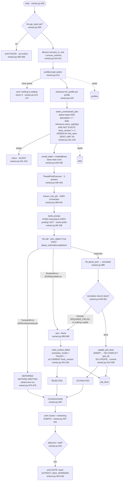

> Stage 2 of 4. For what the extracted facts mean downstream, which of the
> 17 fields the ranker actually reads, and how a failed extraction differs
> from a deferred one, see [`../scoring.md`](../scoring.md).

## Purpose

Reads open, described, relevance-eligible rows from `jobs` that have no
current-version facts, sends each one to an LLM, and writes 17 structured
fields into `job_facts` (`backend/extract.py:161-194`, `:305-338`).

**One LLM call per posting, ever** — the facts are profile-independent and
shared by every profile that will ever exist (`:3`, `:15-19`). It does not
write `jobs`, `job_matches` or `job_scores`.

The stage exists because `score.py` used to make one call per (job, profile),
which grows as jobs × profiles: "Measured on this corpus at 100 profiles it is
11,500 calls a day, and a new profile sees nothing until its whole eligible
backlog has been scored — about four hours" (`:5-10`).

---

## Invocation

**Scheduled.** Seventh of the nine steps in `run-daily.py`
(`backend/run-daily.py:104-119`), and the position matters: the comment at
`backend/run-daily.py:99-103` states the order is extract → match → score,
because "running score before match would write narratives for yesterday's
ordering."

**Manual.** `backend/scripts/backfill-facts.sh` loops this script until it
stops finding work.

### CLI arguments

**None.** No `argparse` import, no `sys.argv` read; `main()` takes no
parameters (`backend/extract.py:404`). Everything is environment-driven.

### Environment variables

| Variable | Default | Read at |
|---|---|---|
| `DATABASE_URL` | none — raises | `backend/lib/dbconn.py:77-91` |
| `EXTRACT_BATCH_SIZE` | `40` | `:66` |
| `EXTRACT_MAX_WORKERS` | `3` | `:67` |
| `DEBUG_PRINT_KEYS` | unset | `:68` |
| `JOB_SCORING_API_KEY` / `GLM_API_KEY` | none — hard exit | checked `:405-408` via `llm.api_key()` |
| `JOB_SCORING_BASE_URL` | `https://api.z.ai/api/paas/v4` | `backend/llm.py:29` |
| `JOB_SCORING_MODEL` | `glm-4.5-flash` | `backend/llm.py:30` |
| `LLM_BACKEND` | `http` | `backend/llm.py:65` |
| `LLM_MAX_RPM` / `LLM_MAX_RPD` (+ per-model overrides) | unset = unlimited | `backend/ratelimit.py:87` |
| `JOBS_MATCH_FLOOR`, `JOBS_PROFILE` | — | read by `schema.py`, not used here |

Live `job_facts` rows were written by
`deepseek-v4-flash@api.deepseek.com`, not the documented default — see Open
Questions.

### Expected runtime

Not separately measured. Bounded by `EXTRACT_BATCH_SIZE` (40) LLM calls at
`EXTRACT_MAX_WORKERS` (3) concurrency, each with a 120-second timeout
(`backend/llm.py:41`).

`backend/llm.py:31-40` records why the timeout is 120 and not 60: glm-4.5-flash
has a 39s median and 85s max, so 60 "cost 3 rounds out of 7 — every call in
them deferred, none of them actually failing."

Together with `score.py`, this is one of the two steps the systemd unit's
`TimeoutStartSec=10800` was raised for
(`~/.config/systemd/user/jobs-ingest.service`).

### Concurrent runs

No lock. A `ThreadPoolExecutor` runs `EXTRACT_MAX_WORKERS` threads
(`:430-433`), and **each worker opens its own connection**
(`:371`) because "psycopg connections are not safe for concurrent use and
search_path is per-connection" (`:369-370`). The main connection is closed
**before** the pool starts (`:428`).

Two concurrent processes would both select overlapping batches — the `SELECT`
at `:176-191` takes no lock — and duplicate LLM spend. `ON CONFLICT (job_id)
DO UPDATE` (`:329`) means the writes would not error, just cost twice.

---

## Data Flow



---

## Field Mapping

Input is one `jobs` row; output is one `job_facts` row. The LLM sits between
them, so the mapping is prompt-field → JSON key → column.

### Prompt input (`build_prompt`, `:149-158`)

| `jobs` column | Placed in prompt as | Transformation |
|---|---|---|
| `title` | `Title:` | none |
| `company_name` | `Company:` | none |
| `location_raw` | `Location:` | none |
| `platform` | `Source:` | none |
| `description_text` | `Description:` | truncated to `MAX_DESCRIPTION_CHARS = 3000` (`:73`) |

**The posting goes last, deliberately** (`:31-33`): the instruction block is
byte-identical for every job and every profile, so it is one cache prefix
across the corpus. "Measured on the scoring prompt, a warm prefix cache bills
at 1/50th." Anything variable placed before the fixed instructions would
truncate the common prefix and forfeit the cache.

The 3,000-char cap here is independent of `text.MAX_DESCRIPTION_CHARS` (20,000)
used at ingest, and independent of `score.py`'s own truncation.

### Model output → `job_facts`

`normalize` (`:249-302`) coerces every field. `_FACT_COLUMNS` (`:305-311`) is
the 17-column write list.

| JSON key | Column | Coercion | Nullable? |
|---|---|---|---|
| `seniority_level` | `seniority_level` | `_enum(..., SENIORITY)`, no default (`:266`) | yes |
| `role_archetype` | `role_archetype` | `_enum(..., ARCHETYPE, "other")` (`:267`) | defaults to `"other"` |
| `years_experience_min` / `_max` | same | `_int_or_none(..., 0, 50)`; **swapped if max < min** (`:273-276`) | yes |
| `tech_stack` | `tech_stack` | non-list → `[]`; lowercased, stripped, de-duplicated, **sorted**, then `json.dumps` (`:258-261`, `:283`) | stored as a JSON string |
| `ai_involvement` | same | `_enum(..., AI_INVOLVEMENT, "none")` (`:284`) | defaults `"none"` |
| `ml_research_required` | same | `bool(...)` (`:286`) | never NULL |
| `advanced_degree_required` | same | `bool(...)` (`:287`) | never NULL |
| `customer_facing` | same | `bool(...)` (`:288`) | never NULL |
| `remote_policy` | same | `_enum(..., REMOTE_POLICY, "unknown")` (`:289`) | defaults `"unknown"` |
| `employment_type` | same | `_enum(..., EMPLOYMENT_TYPE, "unknown")` (`:291`) | defaults `"unknown"` |
| `comp_min` / `comp_max` | same | `_int_or_none(...)`, bounds 0–1,000,000 (`:238`, `:293-294`) | yes |
| `comp_currency` | same | kept only if a `str` (`:295-297`) | yes |
| `gap_friendly_language` | same | `bool(...)` (`:298`) | never NULL |
| `visa_sponsorship` | same | `_enum(..., VISA, "unknown")` (`:299`) | defaults `"unknown"` |
| `summary` | same | `.strip()` if a `str`, else `None` (`:263-264`) | yes |
| — | `facts_version` | `schema.FACTS_VERSION` = 2 (`backend/schema.py:158`) | never NULL |
| — | `extracted_at` | `utc_now_str()` (`:336`) | never NULL |
| — | `extraction_model` | `f"{llm.model()}@{urlparse(llm.base_url()).hostname}"` (`:426-427`) | |

### The closed vocabularies

Defined at `:82-93`: `SENIORITY` (intern … staff+), `ARCHETYPE`, `AI_INVOLVEMENT`,
`REMOTE_POLICY`, `EMPLOYMENT_TYPE`, `VISA`.

`_enum` (`:217-237`) tolerates "the shapes models actually produce" — `"Mid"`,
`"mid-level"` — and falls back to the default or `None`. The reason is stated
at `:34-40`: `match.py` compares these strings exactly, so a model answering
`"Senior/Mid"` "does not error — it silently scores as unknown for every
profile forever." Hence: "NULL is a data gap the matcher can reason about;
'Mid-Level' is a landmine."

### The three fields nothing here writes

`job_facts` also has `job_id` (the PK, `:334`) and the version/timestamp/model
triple. Every other column in `backend/schema.py:343-368` is in
`_FACT_COLUMNS`.

---

## Dedupe & Idempotency

### The key

`job_facts.job_id` is the primary key —
`REFERENCES jobs(id) ON DELETE CASCADE ON UPDATE CASCADE`
(`backend/schema.py:344-345`). **One row per posting, never per profile**,
which is the entire point of the stage.

### What makes a job eligible

`select_unextracted_jobs` (`:161-194`):

```sql
WHERE j.status = 'open'
  AND coalesce(j.description_text, '') <> ''
  AND <relevance.union_sql(cfgs)>
  AND NOT EXISTS (SELECT 1 FROM job_facts f
                  WHERE f.job_id = j.id AND f.facts_version >= 2)
ORDER BY j.first_seen DESC
LIMIT 40
```

The **version comparison rather than a bare `NOT EXISTS`** is what makes a
schema change a resumable burn-down: "bump `FACTS_VERSION` and yesterday's
rows become eligible again, one batch at a time, without a TRUNCATE"
(`:164-168`).

`relevance.union_sql(cfgs)` is the OR across all active profiles
(`backend/relevance.py:199-217`), because facts are shared. An empty profile
list returns `"FALSE"`, not `"TRUE"` — "No active profiles means nobody is
waiting for this work."

`remaining()` (`:197-214`) duplicates that WHERE clause, with the comment "if
one changes the other must" (`:198-199`).

### Full re-run

Idempotent and cheap: rows already at `facts_version >= 2` are excluded by the
`NOT EXISTS`, so a second run the same day selects only what the first did not
finish. Tombstones are stored **at the current version** precisely so they do
not come back (`:170-171`, `:344-346`).

Live state: 5,288 `job_facts` rows — 5,273 at version 2, **15 still at version
1**, and 7 tombstoned. The 15 remain eligible on every run.

### Partial re-run after a mid-batch crash

**Per-job durability.** Each worker commits its own write
(`:338`, `:361`) on its own connection (`:371`). A crash loses only the calls
in flight; everything already written survives, and the next run's `WHERE`
clause is the only state.

`backend/scripts/backfill-facts.sh` relies on this — its comment records
"Progress IS the remaining count — extract.py's WHERE clause is the only
state, so this is interruptible and resumable with no bookkeeping."

### Re-extraction semantics

`update_job_facts` uses `ON CONFLICT (job_id) DO UPDATE` rather than
`DO NOTHING`, because "re-extraction is a deliberate act (a `FACTS_VERSION`
bump, a better model), and the newer answer is the one that should stand"
(`:317-319`). `match.py` notices via `facts_version`.

---

## Failure Modes

### The three-way split

`EXTRACTED / REJECTED / DEFERRED` (`:365`), and the distinction is the point of
the stage's error handling (`:42-47`).

| Outcome | Trigger | Written | Retried? |
|---|---|---|---|
| **DEFERRED** | `llm.TransientError` — 429, 5xx, timeout, connection failure, or `ratelimit.QuotaExhausted` | **nothing** | yes, next run |
| **REJECTED** | `RuntimeError`, `JSONDecodeError`, or `normalize()` returning `None` | tombstone: `extraction_model='FAILED:...'`, every fact column NULL | no, until a version bump |
| **EXTRACTED** | usable facts | full row | n/a |

Getting this backwards "permanently discards jobs that were never evaluated"
(`:46-47`). `backend/ratelimit.py:20-26` states the same rule for quota:
"Recording 'we ran out of budget' as a judgement about the posting would
silently discard jobs nobody ever looked at."

### Transient vs. permanent, as `llm.py` classifies it

| Condition | Class | Line |
|---|---|---|
| HTTP 408, 409, 425, 429, 500, 502, 503, 504 | transient | `backend/llm.py:120` |
| `URLError`, `TimeoutError`, `OSError` | transient — "No response at all… Never evidence about the prompt" | `backend/llm.py:232-235` |
| RPD budget spent | transient, via `QuotaExhausted` → `TransientError` | `backend/ratelimit.py:79`, `backend/llm.py:139-142` |
| Any other HTTP status | permanent → `RuntimeError` → tombstone | |
| Claude-CLI backend: text matching `rate.?limit\|overloaded\|quota\|…` | transient | `backend/llm.py:153` |
| Claude-CLI backend: `OSError` (binary missing) | **permanent**, "so the caller stops rather than retrying 11k times against a path that will never exist" | `backend/llm.py` |

### Rate limits

Enforced **client-side, before the request**, by `ratelimit.acquire(model)`
(`backend/ratelimit.py:156`, called from `backend/llm.py:139-142`) — so the
pipeline stops before the provider does. Unset budgets mean unlimited, making
this a no-op for local and paid endpoints.

Pacing is **even spacing, not a token bucket** (`backend/ratelimit.py:179-189`):
"a bucket lets N calls fire at once and refill, which is exactly the burst that
trips a per-minute limit." Daily counts persist to
`~/.cache/hermes/llm-quota.json` with an atomic `os.replace`; a corrupt or
missing file reads as empty and is never fatal
(`backend/ratelimit.py:117-133`).

### Does a single bad record fail the batch?

**No.** `extract_one_job` catches per job and returns an outcome string
(`:373-399`), and `pool.map` collects them. An exception type not caught at
`:375` or `:380` would propagate out of the worker and `pool.map` would
re-raise it in `main()`, killing the run — `normalize` itself is unguarded
(`:386`), though it uses `.get()` throughout.

### Logged vs. swallowed

| Event | Where it goes |
|---|---|
| Per-job outcome | aggregated into `Counter` and printed **unconditionally** (`:435-441`) |
| Which job deferred / failed, and why | stderr **only** if `DEBUG_PRINT_KEYS` (`:376-378`, `:381-383`, `:396-398`) |
| Endpoint throttling | an explicit NOTE when `deferred > len(results)/2`, naming the variable to lower (`:442-446`) |
| No active profiles | printed (`:415`) |
| Nothing to extract | **silent**, "same convention as the ingest scripts" (`:423`) |

This is the **only** stage documented here whose summary line prints
unconditionally when it did work — every ingest script guards its summary
behind a non-zero counter.

### Exit codes

| Condition | Exit | Line |
|---|---|---|
| No LLM API key | 1 | `:405-408` |
| `DATABASE_URL` unset or Postgres unreachable | 1 | `backend/lib/dbconn.py:203` |
| No active profiles | 0 | `:414-417` (early `return`) |
| Nothing eligible | 0 | `:421-423` |
| Every call deferred | **0** | no gate — deferral is not failure |

---

## External Dependencies

| Endpoint | Auth | Called at | Response shape assumed |
|---|---|---|---|
| `POST {JOB_SCORING_BASE_URL}/chat/completions` | `Authorization: Bearer` | `backend/llm.py:210-241` | OpenAI-compatible: `choices[0].message.content` |
| `claude -p <prompt> --output-format json --max-turns 1` | the CLI's OAuth store | `backend/llm.py:159` | only when `LLM_BACKEND=claude` |

The HTTP path sends `{"model", "temperature", "messages":[{"role":"user",...}]}`
plus `response_format={"type":"json_object"}` when `json_object=True`, which is
the default for this caller.

### Undocumented assumptions

- **`temperature=0`** (`backend/llm.py:59`). The measurement at `:44-58`:
  qwen2.5:14b at the provider default gave Spearman 0.666 and top-15 overlap
  11/15; at temperature 0, 1.000 and 15/15. "That is the difference between a
  ranking and a lottery."
- **The endpoint honors `response_format: json_object`.** The Claude-CLI
  backend has no equivalent and relies on `parse_json`'s tolerance
  (`backend/llm.py:243-260`), which strips markdown fences and takes the
  outermost `{...}`.
- **The prompt prefix is cached by the provider.** The entire no-persona,
  posting-last design (`:22-33`) assumes prefix caching exists and is billed
  at a discount. Nothing verifies a cache hit at runtime.
- **`tech_stack` is stored as a JSON string in a TEXT column** (`:283`,
  `backend/schema.py:350`), not JSONB. `match.py` parses it back.

### Python dependencies

`psycopg` via `lib/dbconn.py`; everything else is stdlib. Repo-local: `llm`,
`profiles`, `relevance`, `schema`, `lib.dbconn`, `lib.timeparse.utc_now_str`
(`:59-64`). No unused imports were found — `Counter` is used at `:435`,
`urllib.parse` at `:426`, `concurrent.futures` at `:430`.

---

## Open Questions

**The live extraction model is not the documented default.** All 5,288
`job_facts` rows carry `extraction_model = 'deepseek-v4-flash@api.deepseek.com'`
(or its `FAILED:` variant). `backend/llm.py:29-30` defaults to
`glm-4.5-flash` at `api.z.ai`, and `backend/README.md`'s configuration table
says the same. The values are environment-driven (`backend/llm.py:65`), so
there is no contradiction in the code — but the documented default has not
been what runs, and I could not determine when or why it changed. Nothing in
`backend/.env.example` names deepseek.

**15 rows are stuck at `facts_version = 1`.** They match
`select_unextracted_jobs`'s `NOT EXISTS ... facts_version >= 2` predicate
(`:184-186`), so they should be re-extracted on any run that reaches them —
but `ORDER BY j.first_seen DESC` (`:187`) puts the newest first, and these are
by definition old. Whether they are permanently starved by that ordering, or
simply excluded by the relevance union or a closed status, I could not
determine without running the query against live data with the current profile
configs.

**Runtime is not separately measured**, for the same reason as every other
step: `run-daily.py` captures and re-emits output after completion
(`backend/run-daily.py:126-133`).

**Whether prompt-prefix caching is actually being obtained is unverified.**
The "1/50th" figure at `:26-28` is attributed to a measurement on the scoring
prompt, undated, and the design decision that follows from it (posting last,
no persona) shapes the whole module. Nothing logs cache-hit rates or billed
token counts, and the provider has changed since — see the model question
above.

**Two concurrent runs would double-spend.** The `SELECT` at `:176-191` takes
no `FOR UPDATE SKIP LOCKED`, and there is no claim mechanism analogous to the
Google scripts'. `backend/scripts/backfill-facts.sh` loops this script; whether
it can overlap with the nightly `run-daily.py` depends on the `flock` in the
systemd unit, which guards `run-daily.py` only. I did not read that shell
script.

**`normalize` can return facts that are almost entirely defaults.** The guard
at `:268-271` rejects a response only when seniority is None **and** archetype
fell back to `"other"` **and** stack is empty **and** summary is absent. A
response with only a summary passes and is stored with `"other"`/`"none"`/
`"unknown"` in every enum. How many of the 5,273 successful rows look like
that I did not measure.

**The 7 tombstones are not broken down.** `mark_extract_failed` records only
the model label (`:341-361`), not which of the three rejection paths fired —
`RuntimeError`, `JSONDecodeError`, or `normalize` returning `None`. Recovering
that would require re-running those jobs.
