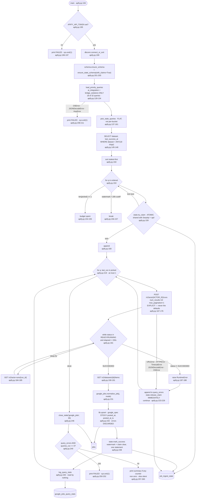

> **Provenance.** `generator: none` is literal: nothing in this repo produces
> `docs/ingest/*.md`. Earlier versions carried `generated:` frontmatter naming a
> tool that was never written, which made `.claude/CLAUDE.md`'s *"never hand-edit"*
> instruction unfollowable — the only way to fix a wrong line was to break the rule.
> The claim was dropped across all fourteen files on 2026-07-31; see
> [`34-documentation-cleanup.md`](../tasks/refactor/34-documentation-cleanup.md) §A2.
> These files are hand-written and are maintained by hand.

## Purpose

Runs **one** Google Jobs query per day through an Apify actor
(`johnvc~google-jobs-scraper---pay-per-result`) and upserts the results into
`jobs` tagged `platform='google_jobs'`
(`backend/ingest/google-apify.py:101`, `:164-191`).

It draws from the **same** query bank and the **same** claim rows as
`ingest/google-serpapi.py` (`:137-161`), so the two never redo each other's
work — but only from two of the four buckets, `ai_integration` and
`bridge_solutions` (`:125`, `:128-134`).

Rows not re-seen for 30 days are closed (`:106`, `:246`), against the same
`google_jobs` platform the SerpApi script closes.

Normalization is shared, in `backend/google_jobs.py` (`:89`) — see
`docs/ingest/google-serpapi.md` for the field table, which is identical here.

---

## Invocation

**Scheduled.** Sixth of the nine steps in `run-daily.py`
(`backend/run-daily.py:104-119`), and the ordering is load-bearing: it runs
**after** `ingest/google-serpapi.py` "so its least-recently-run picks are
already disjoint from whatever SerpApi covered today" (`:61-63`).

### CLI arguments

**None.** No `argparse` import, no `sys.argv` read; `main()` takes no
parameters (`backend/ingest/google-apify.py:194`).

### Environment variables

| Variable | Required | Default | Read at |
|---|---|---|---|
| `DATABASE_URL` | yes | none — raises `RuntimeError` | `backend/lib/dbconn.py:77-91` |
| `APIFY_API_TOKEN` | **yes** | none — hard exit if unset | `:94`, checked `:195-197` |
| `GOOGLE_JOBS_QUERIES_FILE` | no | `<repo>/backend/config/google-queries.json` | `:95-98` |
| `GOOGLE_JOBS_MIN_HOURS_BETWEEN_RUNS` | no | `20` | `:111` |
| `DEBUG_PRINT_KEYS` | no | unset | `:99` |

Four cost-relevant values are **module constants, not environment variables**
(`:101-105`):

| Constant | Value | Purpose |
|---|---|---|
| `ACTOR_ID` | `johnvc~google-jobs-scraper---pay-per-result` | |
| `APIFY_DAILY_QUERY_BUDGET` | `1` | queries claimed per run |
| `APIFY_RESULTS_PER_QUERY` | `10` | sent as `num_results` |
| `APIFY_RUN_TIMEOUT_SECS` / `APIFY_POLL_INTERVAL_SECS` | `150` / `5` | poll loop bounds |

Changing the budget requires editing the file. The docstring says to raise
`APIFY_DAILY_QUERY_BUDGET` and/or `APIFY_RESULTS_PER_QUERY` directly on a plan
upgrade, "no other code change needed" (`:40-45`).

### Expected runtime

**The longest-running ingest step per unit of work**, because it polls.

At most one query is claimed (`:102`, `:213`). For that query:

- 1 POST to start the run (`:167`).
- Up to 30 polls at 5-second intervals — `APIFY_RUN_TIMEOUT_SECS / APIFY_POLL_INTERVAL_SECS = 150/5` (`:181-185`).
- 1 GET for the dataset items (`:191`).

So **3 to 32 HTTP requests** and up to **150 seconds of sleeping**, versus one
request for the SerpApi equivalent. When nothing is claimable the script does
none of this and exits having spent nothing.

### Concurrent runs

Coordinated through the **same** `job_ingest_state` rows as
`ingest/google-serpapi.py` and `backend/api/`, keyed
`google_jobs:query:{slug}` (`:158`), using the same atomic claim
(`backend/lib/state.py:111-123`). The docstring states this is what makes it
"claim-safe against both other Apify runs AND any SerpApi machines"
(`:138-141`).

The `flock` in the systemd unit names the metered Google steps as one of the
two reasons an overlapping hand-run is expensive
(`~/.config/systemd/user/jobs-ingest.service`).

---

## Data Flow



---

## Field Mapping

**Identical to `ingest/google-serpapi.py`** — both call
`normalize_job(job, mode)` from `backend/google_jobs.py:45-123` (`:89`,
`:231`). See `docs/ingest/google-serpapi.md` for the full table, the
`ids.google_source_id` reasoning and the sticky-column mechanism.

The docstring records that this actor returned "literally identical `job_id`
values to SerpApi's own output for the same posting" in live testing
(`:26-28`), which is what makes one shared normalizer correct rather than
merely convenient.

`backend/google_jobs.py:3-19` records the cost of the alternative: the API had
a drifted copy truncating at 5,000 instead of 20,000 chars and not parsing
"yesterday", and since both feed `content_hash`, the two sides "rewrote each
other's rows on alternating runs".

### Actor input parameters

| Parameter | Value | Line |
|---|---|---|
| `query` | from the query bank | `:170` |
| `location` | from the query bank | `:171` |
| `country` | literal `"us"` | `:172` |
| `num_results` | `APIFY_RESULTS_PER_QUERY` = 10 | `:173` |
| `max_pagination` | `max(1, 10 // 10)` = **1** | `:174` |

There is **no date-filter parameter**. The docstring records this was
confirmed by inspecting the actor's full input schema on 2026-07-24 — "no
date_posted/recency field exists" (`:9-12`) — and that this is the reason the
script's scope is narrower than SerpApi's. `choose_date_chip` has no analogue
here.

---

## Dedupe & Idempotency

The key, the sticky columns and the three-branch upsert are all shared with
`ingest/google-serpapi.py`; see that document. What differs is the scheduler.

### Scheduling: flat, not per-bucket

`pick_stale_queries` sorts all 18 priority-bucket queries into one
stalest-first list and claims up to `n` (`:150-161`), where `n` is
`APIFY_DAILY_QUERY_BUDGET` = 1 (`:213`). SerpApi instead iterates the four
buckets separately with a per-bucket budget
(`backend/ingest/google-serpapi.py:212-239`).

`core_swe` and `reentry_growth` get **zero** Apify coverage (`:17-19`), on the
stated grounds that they are already served by SerpApi's own per-bucket
budget.

Both scripts share the `''`-sorts-first behavior for a query with no state
row (`backend/lib/state.py:105-110`), so a newly added query in a priority
bucket is claimed by whichever script reaches it first.

### Full re-run

A second run the same day claims nothing: the 20-hour guard breaks out of the
loop as soon as the stalest remaining query is too recent (`:156-157`). The
docstring gives the cost reason — "so multiple machines running run-daily.py
on the same day don't burn paid Apify results re-fetching what the first run
already covered" (`:107-111`).

### Partial re-run after a mid-batch crash

Same sequence as the SerpApi script: `upsert` commits, then `mark_success`
commits, then `log_query_stats` commits (`:232`, `:238`, `:240`).

One difference matters for cost: **a crash or timeout after the actor run has
started does not stop the actor.** The run continues on Apify's
infrastructure and bills for whatever it produces, but this script has
released its claim (`:226`) and will never fetch the dataset. The next run may
re-claim the same query and start a **second** billed actor run. Nothing
records the abandoned `run_id`.

---

## Failure Modes

### Retry policy and backoff

**This script does use `lib.http`** — `post_json` at `:167` and `get_json` at
`:184` and `:191` — so all three calls get 5 attempts with exponential backoff
and jitter, `Retry-After` honored, 429/5xx retried, other statuses raised
immediately, 30-second timeout (`backend/lib/http.py:28-30`, `:62-93`,
`:101-108`).

That makes it one of three ingest scripts with retries, and notably **the
SerpApi script it supplements has none**.

### Rate limits

Not detected as such beyond `lib.http`'s 429 handling. The controls are cost
controls rather than rate controls:

1. `APIFY_DAILY_QUERY_BUDGET = 1` (`:102`, `:213`).
2. `MIN_HOURS_BETWEEN_RUNS = 20` (`:111`, `:156`).
3. The shared atomic claim (`:159`).
4. **Explicit `num_results` and `max_pagination` on every call** (`:173-174`).

That fourth one is the important one, and the docstring explains why in the
section headed COST DISCIPLINE — LEARNED THE HARD WAY (`:33-38`): the actor
defaults to `num_results=100` and `max_pagination=0` (unlimited) if left
unset, and **a single test call without explicit limits cost $1.50 — 30% of
the entire $5/month free-tier credit in one shot.**

Stated budget: at $0.015/result and 10 results, one query/day is ~$0.15/day,
~$4.50/month, inside the $5 free credit (`:40-45`).

### Auth and token refresh

A single static token passed as a **query parameter** on all three endpoints
(`:168`, `:184`, `:191`). No refresh or expiry handling.

Because these calls go through `lib.http`, its retry logger strips the query
string before printing — `tag = label or url.split("?")[0]`
(`backend/lib/http.py:59`) — so a retry line cannot leak the token. The
script's own error path prints `{e}` (`:225`). See Open Questions.

### The poll loop

```python
elapsed = 0
status = start["data"]["status"]
while status in ("READY", "RUNNING") and elapsed < APIFY_RUN_TIMEOUT_SECS:
    time.sleep(APIFY_POLL_INTERVAL_SECS)
    elapsed += APIFY_POLL_INTERVAL_SECS
    run = http.get_json(...)
    status = run["data"]["status"]

if status != "SUCCEEDED":
    raise RuntimeError(...)

dataset_id = run["data"]["defaultDatasetId"]
```

Three observations from `:179-191`:

- **`run` is assigned only inside the loop.** If the start response already
  reports `SUCCEEDED`, the loop body never executes, the `:187` check passes,
  and `:190` references an unbound local. See Open Questions.
- A timeout leaves `status` as `RUNNING`, so `:187` raises `RuntimeError` —
  caught at `:224` and counted as a query error. The actor keeps running and
  keeps billing.
- Any status other than `SUCCEEDED` (`FAILED`, `ABORTED`, `TIMED-OUT`) raises
  the same `RuntimeError` with the status embedded (`:188`).

### Malformed or empty payloads

| Input | Behavior |
|---|---|
| Start response without `data.id` | `KeyError` at `:177`, **not** in the caught list at `:223-224` — propagates and kills the run |
| Poll response without `data.status` | `KeyError` at `:185`, same — uncaught |
| Run status not `SUCCEEDED` | `RuntimeError` → query error, claim released (`:187-188`, `:226`) |
| Dataset items empty | `records = []`; counts as a **success**, watermark advances, stats logged with `total_fetched=0` |
| A priority bucket missing from the config | `KeyError` at `:133`, caught by `:208` → exit 1 |
| Bucket present but lacking `queries` | `KeyError` at `:133`, also caught |

Note the contrast with `ingest/google-serpapi.py`, where the equivalent
per-bucket subscripts sit **outside** the guarded load and are uncaught. Here
`load_priority_queries` does the subscripting inside the function the `try`
wraps (`:128-134`, `:206-211`), so this script is the better-guarded of the
two.

### Does a single bad record fail the batch?

**No at the upsert stage** — per-record SAVEPOINT
(`backend/lib/upsert.py:198`). The normalization comprehension at `:231` is
outside the `try` at `:221-229`, so an exception in `normalize_job` would
propagate; in practice it uses `.get()` throughout
(`backend/google_jobs.py:91-95`).

### Logged vs. swallowed

| Event | Where it goes |
|---|---|
| Actor run failure or timeout | `query_errors` (`:225`); claim released (`:226`); stderr **only** if `DEBUG_PRINT_KEYS` (`:227-228`, `:254-255`); count in the summary (`:260`) |
| Abandoned actor run after a timeout | **nothing** — the `run_id` is not recorded anywhere (`:188` embeds it in the exception message, which is only printed under `DEBUG_PRINT_KEYS`) |
| Lost claim race | **nothing** (`:159-160`) |
| Nothing claimable | **nothing** — silent exit 0 |
| **Per-record upsert failure** | **discarded.** `:232` unpacks the three-tuple and never reads `.errors` (`backend/lib/upsert.py:157-162`) |
| Per-query result counts | stderr **only** if `DEBUG_PRINT_KEYS` (`:242-244`) |
| Quiet run | silent — guarded by `if total_new or total_updated or closed_count or query_errors` (`:257`) |

### Exit codes

| Condition | Exit | Line |
|---|---|---|
| `APIFY_API_TOKEN` unset | 1 | `:195-197` |
| `DATABASE_URL` unset or Postgres unreachable | 1 | `backend/lib/dbconn.py:203` |
| Query config unreadable or a priority bucket missing | 1 | `:208-211` |
| The single claimed query failed | 1 | `:249-252` — `queries_run == 0` |
| No query claimed | 0 | `picked` empty |

Because the budget is 1, "some failed but one succeeded" is unreachable: any
failure means `queries_run == 0` and exit 1.

---

## External Dependencies

| Endpoint | Auth | Called at | Response shape assumed |
|---|---|---|---|
| `POST https://api.apify.com/v2/acts/johnvc~google-jobs-scraper---pay-per-result/runs` | `token` query param | `:167-176` | `{"data": {"id", "status"}}` |
| `GET https://api.apify.com/v2/actor-runs/{run_id}` | `token` query param | `:184` | `{"data": {"status", "defaultDatasetId"}}` |
| `GET https://api.apify.com/v2/datasets/{dataset_id}/items` | `token` query param | `:191` | a JSON array of job objects in Google Jobs shape |

### Undocumented assumptions about response shape

- **The actor's output matches SerpApi's Google Jobs shape closely enough for
  one normalizer.** Supported by the docstring's live test showing identical
  `job_id` values (`:26-28`), but nothing validates it per call — a schema
  change would surface as fields quietly becoming `None`, since
  `normalize_job` uses `.get()` throughout.
- **Statuses are `READY`, `RUNNING`, `SUCCEEDED`** (`:181`, `:187`). Any other
  value is treated as terminal failure. Apify's documented set includes
  `FAILED`, `ABORTED`, `TIMING-OUT` and `TIMED-OUT`; the code does not
  enumerate them, which is why the error message embeds the raw status
  (`:188`).
- **`defaultDatasetId` is present on a succeeded run** (`:190`). Not guarded.
- **The actor is not CAPTCHA-blocked.** The docstring records that the obvious
  cheaper choice (`khadinakbar/google-jobs-scraper`, $0.003/result,
  Playwright-driven) "got CAPTCHA-blocked by Google twice in a row in real
  testing (google.com/sorry/index, zero results delivered, real spend charged
  anyway)", and that this actor "uses a different scraping approach" that is
  not blocked **yet** (`:21-31`). That is an assumption about a third party's
  ongoing evasion, not a stable property.

### Config file

`config/google-queries.json`, but only two of four buckets (`:125`):

| Bucket | Queries | Used here |
|---|---|---|
| `ai_integration` | 10 | yes |
| `bridge_solutions` | 8 | yes |
| `core_swe` | 8 | no |
| `reentry_growth` | 6 | no |

18 candidates for a budget of 1.

### Python dependencies

`psycopg` via `lib/dbconn.py` is the only third-party import; there is no
Apify SDK — "plain HTTPS via the Apify REST API (start run, poll status, fetch
dataset items)" (`:47-48`). Repo-local: `schema` (`:88`),
`google_jobs.normalize_job` (`:89`), and from `lib` — `dbconn`, `http`,
`state`, `text`, `timeparse.utc_now_str`, `upsert.upsert` (`:90-92`).

No unused imports were found: `datetime`/`timedelta`/`timezone` are used at
`:142-143`, `time` at `:182`, and `text` at `:240`.

---

## Open Questions

**`run` can be referenced before assignment.** At `:179-190`, `run` is bound
only inside the `while` body. A start response whose `status` is already
`SUCCEEDED` — or any status outside `("READY", "RUNNING")` that also equals
`SUCCEEDED` — skips the loop, passes the `:187` check, and reaches
`dataset_id = run["data"]["defaultDatasetId"]` at `:190` with `run` unbound.
That raises `UnboundLocalError`, which is **not** in the caught list at
`:223-224`, so it would propagate and kill the step rather than being counted
as a query error. Whether Apify can return `SUCCEEDED` synchronously from the
run-creation endpoint I could not determine from the code, and I did not call
the API to find out.

**Abandoned actor runs are billed and untracked.** A poll timeout raises at
`:188` and the claim is released at `:226`, but the actor keeps running. The
`run_id` appears only inside the exception message. There is no record of
spend incurred without a corresponding fetch, and no reconciliation against
Apify's own billing. How often this happens is not measurable from anything
the script writes.

**Runtime is not separately measured.** As with every step, `run-daily.py`
captures and re-emits output after completion
(`backend/run-daily.py:126-133`). The 3–32 request and 0–150 second ranges are
derived from `:181-185`, not measured.

**Whether the token can leak into logs is not fully determined.** It is a
query parameter on all three URLs (`:168`, `:184`, `:191`). `lib.http`'s retry
logging strips query strings (`backend/lib/http.py:59`), and the script's own
handler prints `str(e)` (`:225`). I did not enumerate every exception type in
the `except` clause at `:223-224` to confirm none stringifies to include the
full URL — `urllib.error.HTTPError.__str__` does not, but
`json.JSONDecodeError` and `OSError` subclasses were not checked
individually.

**`max_pagination = max(1, APIFY_RESULTS_PER_QUERY // 10)`** (`:174`) ties
pagination to the results constant by integer division, so raising
`APIFY_RESULTS_PER_QUERY` to 100 would send `max_pagination=10`. Whether that
matches the actor's own results-per-page is not stated anywhere and I could
not verify it against the actor's schema.

**No live Apify data was available to check.** `google_jobs_query_stats`
holds 32 rows but does not record which script wrote them, and both scripts
write the same `platform='google_jobs'` rows and the same
`google_jobs:query:*` state keys. There is therefore **no way to attribute any
stored row or watermark to Apify rather than SerpApi** — which also means the
"never redo each other's work" property cannot be verified after the fact from
the database.

**The cost figures are undated relative to current pricing.** $0.015/result,
$5/month free credit and the $1.50 incident are recorded in the docstring
(`:29-45`) as of the 2026-07-24 investigation. Nothing in the repo re-checks
them.
