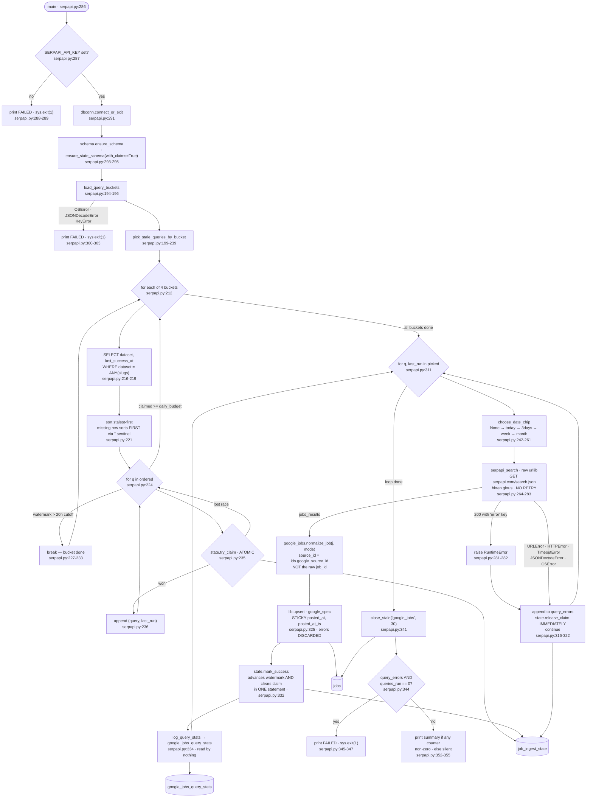

## Purpose

Runs a rotating subset of the 32 queries in `config/google-queries.json`
against SerpApi's `google_jobs` engine and upserts the results into `jobs`
tagged `platform='google_jobs'`
(`backend/ingest/google-serpapi.py:264-283`, `backend/google_jobs.py:102`).

Which queries run is decided per bucket by least-recently-run order, and each
pick is taken with an **atomic claim** in `job_ingest_state` so several
machines can run this script against one database without duplicating work
(`:199-239`). Each call carries a `date_posted` chip sized to the gap since
that query last succeeded (`:242-261`).

This is the only ingest script that spends a metered budget: 8 searches/day on
SerpApi's free tier (`:20-21`). Rows not re-seen for 30 days are closed
(`:170`, `:341`).

Normalization is **not** in this file — it is `normalize_job` in
`backend/google_jobs.py`, shared with `ingest/google-apify.py` and
`backend/api/query_claims.py` (`:158`).

---

## Invocation

**Scheduled.** Fifth of the nine steps in `run-daily.py`
(`backend/run-daily.py:104-119`), and deliberately **before**
`ingest/google-apify.py` so the Apify script's least-recently-run pick lands
on different queries with no direct coordination (`:40-47`).

**Manual, and on other machines.** The script is designed to be copied to
several machines, each with its own SerpApi key, all pointed at one Postgres
instance (`:82-94`).

### CLI arguments

**None.** No `argparse` import, no `sys.argv` read; `main()` takes no
parameters (`backend/ingest/google-serpapi.py:286`).

### Environment variables

| Variable | Required | Default | Read at |
|---|---|---|---|
| `DATABASE_URL` | yes | none — raises `RuntimeError` | `backend/lib/dbconn.py:77-91` |
| `SERPAPI_API_KEY` | **yes** | none — hard exit if unset | `:163`, checked `:287-289` |
| `GOOGLE_JOBS_QUERIES_FILE` | no | `<repo>/backend/config/google-queries.json` | `:164-167` |
| `GOOGLE_JOBS_MIN_HOURS_BETWEEN_RUNS` | no | `20` | `:177` |
| `DEBUG_PRINT_KEYS` | no | unset | `:168` |

`CLAIM_TTL_MINUTES` is documented in `backend/README.md` but this script does
**not** read it — it calls `state.try_claim(conn, dataset,
table=...)` (`:235`) without a `ttl_minutes` argument, so the
`DEFAULT_CLAIM_TTL_MINUTES = 15` constant applies
(`backend/lib/state.py:90`, `:93`). See Open Questions.

`SERPAPI_API_KEY` is read into a module constant at import (`:163`), so it
cannot be changed per call within a process. The docstring notes it is a
billing-linked secret with no fallback default, unlike `DATABASE_URL`'s
historical one (`:124-127`).

### Expected runtime

Not separately measured. Bounded by the number of queries claimed, which is at
most the sum of the four bucket budgets — **8** — and is frequently **0** when
every query ran within the last 20 hours (`:227-233`).

One HTTP request per claimed query (`:279`), 30-second timeout
(`http.DEFAULT_TIMEOUT`, `backend/lib/http.py:28`), **no delay between
queries**. Journal entries show runs claiming 1 and 4 queries
(`journalctl --user -u jobs-ingest.service`: `3/4 queries succeeded`,
`1/1 queries succeeded`).

### Concurrent runs

**This is the one ingest script explicitly designed for concurrency**, and the
mechanism is real rather than best-effort. Picking a query and claiming it are
the same statement (`backend/lib/state.py:111-123`):

```sql
INSERT INTO job_ingest_state (dataset, last_success_at, claimed_at)
VALUES (%(dataset)s, '', %(now)s)
ON CONFLICT (dataset) DO UPDATE SET claimed_at = %(now)s
  WHERE job_ingest_state.claimed_at IS NULL
     OR job_ingest_state.claimed_at < %(cutoff)s
RETURNING dataset
```

Postgres row-level locking makes "only one caller wins" a guarantee
(`:85-94`). A loser skips to the next-stalest candidate rather than blocking
(`:238`).

`RETURNING` is used rather than `rowcount` because an `ON CONFLICT DO UPDATE`
whose `WHERE` fails reports zero affected rows ambiguously
(`backend/lib/state.py:105-110`).

The `flock` in the systemd unit still wraps `run-daily.py`, and its comment
names this script's metered budget as one of two reasons a hand-run
overlapping the nightly one is expensive
(`~/.config/systemd/user/jobs-ingest.service`).

---

## Data Flow



---

## Field Mapping

Performed by `normalize_job(job, mode)` in `backend/google_jobs.py:45-123` —
one copy, called by this script (`:158`, `:324`), by
`ingest/google-apify.py` and by `api/query_claims.py`. The docstring records
why: three drifted copies produced different `content_hash` values for the
same posting, so the two sides rewrote each other's rows on alternating runs
(`backend/google_jobs.py:3-19`).

| raw field | canonical field | transformation | nullable? | notes |
|---|---|---|---|---|
| `job_id` → `htidocid`, else fingerprint | **`source_id`** | `ids.google_source_id(job, company_token)` (`backend/google_jobs.py:105`) | NOT NULL | feeds the primary key. **Not** the raw `job_id` — see below |
| `company_name` | `company_name` | `or "Unknown"` (`:92`) | NOT NULL | |
| — | `company_token` | `text.slugify(company_name)` (`:96`) | NOT NULL | feeds the primary key |
| — | `platform` | literal `"google_jobs"` (`:102`) | NOT NULL | feeds the primary key |
| `title` | `title` | none (`:91`, `:106`) | nullable | feeds `content_hash` |
| `location` | `location_raw` | none (`:93`, `:107`) | nullable | feeds `content_hash` |
| `detected_extensions.schedule_type` | `department` | none (`:108`) | nullable | **not** hashed — `HASH_FIELDS_SHORT` omits `department` |
| `apply_options[0].link`, else `share_link` | `job_url` | `:109` | nullable | feeds `content_hash` |
| `detected_extensions.posted_at` | `posted_at` | `text.parse_relative_posted_at(...)` — resolves `"23 days ago"` to `now − delta` (`:110`) | nullable | feeds `content_hash`. **STICKY** — see below |
| same | `posted_at_ts` | same call, computed twice (`:110-111`) | nullable | **STICKY** |
| `detected_extensions.salary` | `salary_text` | `or None` (`:112`) | nullable | not hashed |
| `description` | `description_text` | `text.strip_html(...)`, 20,000-char cap (`:118`) | nullable | feeds `content_hash` via `blank_if_falsy` |
| — | `seniority_guess` | `text.guess_seniority(title)` (`:113`) | nullable | |
| `location` + query `mode` | `location_is_remote` | regex on location **or** `mode == "remote"` (`:99`) | nullable | the query bank's `mode` field feeds this |
| `location` | `location_is_nyc` | `NYC_PATTERN` (`:98`) | nullable | |
| — | `company_is_nyc_hq`, `company_is_ai_focused` | hardcoded `None` (`:116-117`) | nullable | |
| *(whole object)* | `raw_json` | `text.bounded_json(job, 20000)` (`:122`) | nullable | **not** `json.dumps(job)[:limit]` — that sliced serialized JSON mid-string and stored 10 unparseable stumps (`:119-121`) |

Fields SerpApi emits that are read only indirectly or dropped:
`detected_extensions` is read for three sub-keys (`:94`); `apply_options`
beyond `[0]` is dropped (`:109`); `thumbnail`, `via`, `extensions`,
`job_highlights` are not read. `raw_json` preserves the whole payload
(subject to the bound), so these remain recoverable.

### `source_id` is not the raw `job_id`

Google's `job_id` is a base64 JSON blob carrying per-search context — an `fc`
token that rotates on every fresh fetch (`backend/lib/ids.py:75-100`). Hashing
it minted a new primary key for an already-stored posting on every run:
**837 rows holding 632 real postings, 32% inflation**, one listing stored four
times.

`ids.google_source_id` (`backend/lib/ids.py:138-160`) instead:

1. base64-decodes `job_id` and returns `htidocid` if present (`:149-151`);
2. otherwise builds `"fp:" + sha256(company_token | lowercased title |
   tracking-stripped apply URL)[:16]` (`:153-160`).

The fingerprint **deliberately excludes location**, because that is the field
Google reports inconsistently for the same posting ("United States" vs
"Anywhere"). Live data: 136 of 839 `google_jobs` rows use the `fp:` fallback.

### Sticky columns

`google_spec()` marks `posted_at` and `posted_at_ts` sticky
(`backend/schema.py:219-236`), and `upsert` replaces the incoming values with
the stored ones **before** hashing (`backend/lib/upsert.py:200-211`).

Without it, `posted_at` re-derives from a relative string on every ingest, so
a re-seen posting could never hash as unchanged. This is the only spec in the
pipeline that uses the mechanism.

---

## Dedupe & Idempotency

### The key

```
id = sha256(f"google_jobs:{slugify(company_name)}:{google_source_id}")[:24]
```

`schema.make_job_id` (`backend/schema.py:239-248`).

Deduplicates within `platform='google_jobs'` only. A posting reachable through
both a company's Greenhouse board and a Google query is two rows
(`backend/schema.py:243-247`).

### Full re-run

A re-run within 20 hours claims **nothing** — `pick_stale_queries_by_bucket`
breaks out of each bucket as soon as the next-stalest query's watermark is
newer than the cutoff (`:227-233`), and the comment explains that stalest-first
ordering makes this safe: every remaining candidate ran even more recently.
The run exits 0 having spent no budget.

A re-run after 20 hours re-queries and takes the ordinary three-branch upsert
path. Because `posted_at` is sticky, an unchanged posting hashes unchanged.

The docstring at `backend/google_jobs.py:66-89` records that this was **not**
true before sticky was added: "a serpapi run reports `0 unchanged` where
ats.py reports thousands." Measured 2026-07-26: 706 of 835 rows are derived
this way, 6 had actually drifted — "a slow leak, not present damage."

### Watermarks are the incremental mechanism

Unlike the other four ingest scripts, `job_ingest_state` here **decides what
work happens**:

- `last_success_at` orders candidates stalest-first (`:221`).
- A query with no row sorts first, because `try_claim` writes `''` on first
  insert and `''` string-sorts before every timestamp
  (`backend/lib/state.py:105-110`). Adding a query to a bucket therefore needs
  no migration (`:45-47`).
- The same value picks the date chip (`:242-261`), so a failed run loses
  nothing: `last_success_at` advances only on success, and the next run sees
  the true gap and widens the window (`today` → `3days` → `week` → `month`).

`state.mark_success` advances the watermark and clears the claim in **one**
statement (`backend/lib/state.py:132-148`), called at `:332`.

### Partial re-run after a mid-batch crash

Per query, the write sequence is: `upsert` commits
(`backend/lib/upsert.py:235`) → `mark_success` commits
(`backend/lib/state.py:147`) → `log_query_stats` commits (`:191`).

| Crash point | Effect |
|---|---|
| During fetch | claim released explicitly (`:319`); another machine can retry at once |
| Process killed mid-fetch | claim persists until the 15-minute TTL expires, then becomes claimable (`backend/lib/state.py:93-124`) |
| Between `upsert` and `mark_success` | rows written, watermark **not** advanced, claim still held. After the TTL the query is re-run and re-fetches a window already covered — costing one credit, writing nothing new |
| Between `mark_success` and `log_query_stats` | stats row missing; nothing reads that table |

The TTL is what bounds a dead machine's blast radius: without it a crashed
claim would block the query forever (`:96-103`).

---

## Failure Modes

### Retry policy and backoff

**There is none.** `serpapi_search` calls `urllib.request.urlopen` directly
(`:279`), not `lib.http.get_text`. The module imports `http` (`:159`) and uses
only `http.DEFAULT_TIMEOUT`.

So: 1 attempt, no backoff, no `Retry-After`, 30-second timeout. A transient
5xx from SerpApi loses that query for the run — though not the credit, since
`last_success_at` does not advance and the claim is released immediately
(`:319`).

### Rate limits

**SerpApi signals errors with HTTP 200 and an `error` key in the body**, not a
status code. `serpapi_search` checks for it explicitly and raises
`RuntimeError` (`:281-282`), which the caller catches alongside the network
exceptions (`:317`). A quota-exhausted response therefore looks like any other
query failure.

The real throttle is the budget, enforced in three places:

1. `daily_budget` per bucket, summing to 8 (`config/google-queries.json`).
2. `MIN_HOURS_BETWEEN_RUNS` = 20, which stops a second machine from re-running
   the same queries the same day (`:171-177`).
3. The claim, which stops two machines picking the same query at the same
   instant (`:235`).

The docstring is explicit that the daily budget is **shared across machines,
not multiplied by them** (`:171-176`), because claims clear on success.

### Auth and token refresh

A single static API key passed as a query parameter (`:273`, `:277`). No
refresh, no rotation, no expiry handling. The key is read once at import
(`:163`).

Note the key is embedded in the request URL. `lib.http`'s retry logger strips
query strings from its `tag` for exactly this reason
(`backend/lib/http.py:59`) — but this script does not use `lib.http`, and its
own error path prints `{e}` (`:318`), whose text for a `urllib` error does not
include the URL. See Open Questions.

### Malformed or empty payloads

| Input | Behavior |
|---|---|
| Body with an `error` key | `RuntimeError` → query error, claim released (`:281-282`, `:316-319`) |
| Body without `jobs_results` | `data.get("jobs_results", [])` → empty list (`:283`); counts as a **success**, watermark advances, stats logged with `total_fetched=0` |
| Non-JSON body | `json.JSONDecodeError` caught (`:317`) |
| `config/google-queries.json` missing, malformed, or lacking `buckets` | exit 1 — `KeyError` is caught alongside `OSError`/`JSONDecodeError` (`:300`) |
| Bucket lacking `queries` or `daily_budget` | `KeyError` at `:213-214`, **uncaught** — the load-time guard does not cover per-bucket structure |
| Unparseable `last_success_at` | `choose_date_chip` returns `None` → no chip → full backfill (`:250-253`) |

### Does a single bad record fail the batch?

**No.** Normalization happens in a list comprehension at `:324`, inside the
per-query loop but **outside** the `try` at `:314-322` — so an exception in
`normalize_job` would propagate and kill the run. In practice
`normalize_job` uses `.get()` throughout (`backend/google_jobs.py:91-95`).

Upsert isolates per record with a SAVEPOINT
(`backend/lib/upsert.py:198`).

### Logged vs. swallowed

| Event | Where it goes |
|---|---|
| Query fetch failure | `query_errors` (`:318`); claim released (`:319`); stderr **only** if `DEBUG_PRINT_KEYS` (`:320-321`, `:349-350`); count in the summary (`:355`) |
| Lost claim race | **nothing** (`:238`). No counter distinguishes "another machine has it" from "nothing was stale" |
| Bucket skipped for recency | **nothing** (`:227-233`) |
| **Per-record upsert failure** | **discarded.** `:325` unpacks the three-tuple and never reads `.errors` (`backend/lib/upsert.py:157-162`). Same defect as `ingest/ats.py:337` |
| Per-query result counts | stderr **only** if `DEBUG_PRINT_KEYS` (`:336-339`) |
| Query stats | written to `google_jobs_query_stats` (`:334`), which **nothing reads** (`:181-183`) |
| Quiet run | silent — guarded by `if total_new or total_updated or closed_count or query_errors` (`:352`) |

A run that claimed nothing prints nothing and exits 0. The `backend/README.md`
troubleshooting section names this as expected.

### Exit codes

| Condition | Exit | Line |
|---|---|---|
| `SERPAPI_API_KEY` unset | 1 | `:287-289` |
| `DATABASE_URL` unset or Postgres unreachable | 1 | `backend/lib/dbconn.py:203` |
| Query config unreadable | 1 | `:300-303` |
| Every claimed query failed | 1 | `:344-347` |
| No queries claimed | 0 | `picked` empty; the `:344` gate needs `query_errors` |
| Some queries failed, at least one succeeded | 0 | |

`run-daily.py` collects the non-zero code but runs all remaining steps
(`backend/run-daily.py:153-170`). `backend/README.md` notes
`SERPAPI_API_KEY not set` is expected on machines that do not run this step.

---

## External Dependencies

| Endpoint | Auth | Called at | Response shape assumed |
|---|---|---|---|
| `https://serpapi.com/search.json?engine=google_jobs&...` | `api_key` query param | `:277-279` | JSON with `jobs_results` array; each job has `title`, `company_name`, `location`, `detected_extensions`, `apply_options`, `share_link`, `description`, `job_id` |

Parameters sent (`:265-276`): `engine=google_jobs`, `q`, `location`, `hl=en`,
`gl=us`, `api_key`, and `chips=date_posted:{chip}` when a chip applies.

### Undocumented assumptions about response shape

- **`hl=en` and `gl=us` are load-bearing.** Without them Google intermittently
  returns non-English relative timestamps ("há 2 dias"), which
  `text.parse_relative_posted_at`'s English-only regex silently fails to
  parse, losing `posted_at` with no visible error (`:62-66`, `:269-272`).
- **Page 1 only.** There is no `next_page_token` handling and no pagination
  loop — one request per query, `data.get("jobs_results", [])` (`:283`).
  `backend/docs/DEVELOPER.md` records that paginate-until-seen was considered
  and rejected because Google's results are relevance-ranked, not
  chronological, so "last seen posting" is not a frontier.
- **`chips=date_posted:X` is a structured, dependable parameter.** Verified
  live 2026-07-24 against an alternative that appended "posted last 3 days" to
  the query text, which "partly worked by accident" via keyword matching
  (`:49-60`).
- **Errors arrive as HTTP 200 with an `error` key** (`:281-282`).
- **SerpApi, not this machine, talks to Google.** The docstring notes there is
  no bot-detection surface on the calling machine's IP, since Google never
  sees it (`:105-112`). It also records that Google's SearchGuard blocked a
  Playwright-driven Apify actor with CAPTCHAs twice in a row, "burning real
  spend for zero results" (`:10-18`).

### Config file

`config/google-queries.json` — `{"buckets": {name: {"daily_budget": int,
"queries": [{"slug", "query", "location", "mode"}]}}}`.

| Bucket | `daily_budget` | Queries |
|---|---|---|
| `core_swe` | 2 | 8 |
| `ai_integration` | 3 | 10 |
| `bridge_solutions` | 2 | 8 |
| `reentry_growth` | 1 | 6 |
| **total** | **8** | **32** |

`mode` is `"nyc"` or `"remote"` and feeds `location_is_remote`
(`backend/google_jobs.py:99`). Budgets are plain constants, not derived from
API introspection — the docstring says to bump them directly on a plan upgrade
with no other code change (`:76-80`).

### Python dependencies

`psycopg` via `lib/dbconn.py` is the only third-party import; there is no
SerpApi SDK, "it's a plain HTTPS GET returning JSON" (`:114-115`).
Repo-local: `schema` (`:157`), `google_jobs.normalize_job` (`:158`), and from
`lib` — `dbconn`, `http`, `state`, `text`, `timeparse.utc_now_str`,
`upsert.upsert` (`:159-161`).

Unlike the other four ingest scripts, this one does **not** import `ids`
directly — `google_source_id` is reached through `google_jobs.py`. No unused
imports were found.

---

## Open Questions

**Runtime is not separately measured**, for the same reason as every other
step: `run-daily.py` captures and re-emits output after completion
(`backend/run-daily.py:126-133`).

**22 orphaned watermark rows exist.** `job_ingest_state` holds 54 rows keyed
`google_jobs:query:*` against 32 slugs in `config/google-queries.json` —
orphans include `ai-engineer-nyc`, `backend-engineer-remote`,
`data-engineer-nyc` and 19 others, evidently from an earlier query bank.
Nothing prunes them: `pick_stale_queries_by_bucket` only ever selects
`WHERE dataset = ANY(current_slugs)` (`:216-219`), so they are inert but
permanent. No code comment addresses cleanup.

**`CLAIM_TTL_MINUTES` is documented but not read by this script.**
`backend/README.md` lists it as a configuration variable with a default of 15.
`state.try_claim` is called without a `ttl_minutes` argument (`:235`), so the
library default applies (`backend/lib/state.py:90`). I found no `os.environ`
read of that name anywhere in `backend/ingest/` or `backend/lib/state.py`, so
the variable appears to have no effect on this script. I did not check
`backend/api/`.

**`claimed_by` and `claim_granted_at` exist in the table but are never set
here.** Live `job_ingest_state` has five columns; this script writes only
`dataset`, `last_success_at` and `claimed_at`. `backend/docs/DEVELOPER.md`
describes the resulting asymmetry as the cause of a real bug on the API side —
this pipeline taking over an expired claim leaves `claimed_by` stale, so an
ownership check there passed for a contributor whose claim had already been
taken over. It records the fix as API-side only. I did not verify the current
API code.

**Whether the SerpApi key can leak into logs is not fully determined.** The
key is a query parameter (`:277`). The error path prints `str(e)` for the
caught exception (`:318`); for `urllib.error.HTTPError` that string is
typically `HTTP Error 429: Too Many Requests` without the URL, but I did not
enumerate every exception type in the `except` clause at `:316-317` to confirm
none stringifies to include the URL. `lib.http`'s deliberate query-string
stripping (`backend/lib/http.py:59`) suggests the concern is real; this script
does not use `lib.http`.

**A malformed bucket crashes uncaught.** `load_query_buckets` catches
`KeyError` for a missing top-level `buckets` key (`:300`), but
`bucket["queries"]` and `bucket["daily_budget"]` at `:213-214` run after that
guard, inside `pick_stale_queries_by_bucket`, with no handler. A bucket
missing either key would produce a traceback rather than the standard
`FAILED:` line.

**`google_jobs_query_stats` accumulates and is read by nothing.** 32 rows
currently. The docstring states the adaptive-cadence logic it exists for has
not been built (`:68-74`), and `backend/docs/DEVELOPER.md` lists it under open
questions. Nothing prunes it.

**The sliding-`posted_at` measurement is dated 2026-07-26 and predates
nothing I could verify.** `backend/google_jobs.py:79-81` reports 706 of 835
rows derived from a relative string with 6 drifted. The live table now holds
839 `google_jobs` rows. Whether the sticky mechanism was in place for all of
them, and whether the drifted count has changed, would require comparing
`raw_json`'s original string against `first_seen` per row — which the
docstring names as the backfill path but which I did not run.
