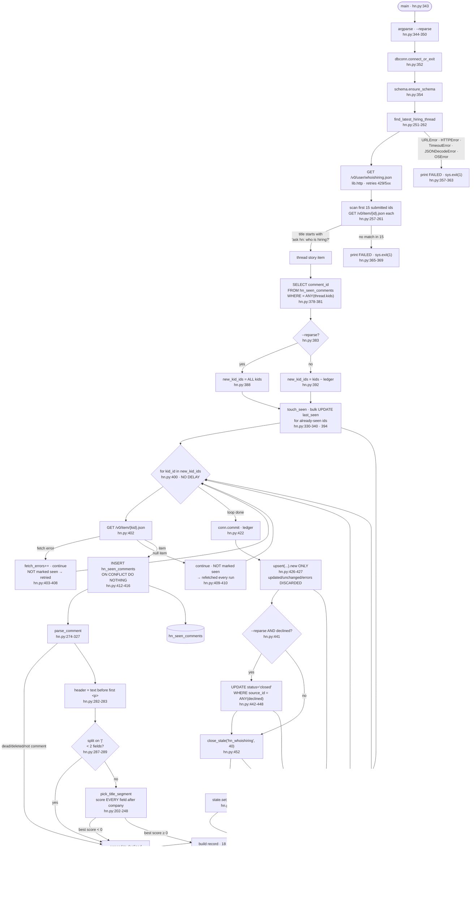

> **Provenance.** `generator: none` is literal: nothing in this repo produces
> `docs/ingest/*.md`. Earlier versions carried `generated:` frontmatter naming a
> tool that was never written, which made `.claude/CLAUDE.md`'s *"never hand-edit"*
> instruction unfollowable — the only way to fix a wrong line was to break the rule.
> The claim was dropped across all fourteen files on 2026-07-31; see
> [`34-documentation-cleanup.md`](../tasks/refactor/34-documentation-cleanup.md) §A2.
> These files are hand-written and are maintained by hand.

## Purpose

Finds the current month's "Ask HN: Who is hiring?" thread through HN's
official Firebase API, fetches its top-level comments, and parses each into a
job record by splitting the comment's pipe-delimited header
(`backend/ingest/hn-hiring.py:251-262`, `:274-327`). Records land in `jobs`
tagged `platform='hn_whoishiring'` (`:308`).

A separate ledger table, `hn_seen_comments`, records every comment id already
fetched — including ones that produced no row — so subsequent daily runs cost
one request instead of several hundred (`:34-41`, `:371-382`).

Rows not re-seen for 40 days are closed (`:100`, `:452`). A watermark keyed
`hn_whoishiring` is written to `job_ingest_state` (`:453`) and read by
nothing.

---

## Invocation

**Scheduled.** Fourth of the nine steps in `run-daily.py`
(`backend/run-daily.py:104-119`). See `docs/ingest/ats.md` for the shared
timer and unit configuration.

**Manual.** `python3 ingest/hn-hiring.py`, or with `DEBUG_PRINT_KEYS=1`
(`backend/ingest/hn-hiring.py:64-66`).

### CLI arguments

This is the **only** ingest script with an argument parser (`:344-350`).

| Flag | Type | Default | Effect |
|---|---|---|---|
| `--reparse` | `store_true` | `False` | Re-fetch and re-parse every comment in the current thread, ignoring the ledger (`:383-390`). Additionally enables the retirement step at `:441-450` |

The help text states why it exists: "the ledger is what makes the daily run
cheap, and it also makes a fix invisible to existing rows" (`:347-349`).

### Environment variables

| Variable | Required | Default | Read at |
|---|---|---|---|
| `DATABASE_URL` | yes | none — raises `RuntimeError` | `backend/lib/dbconn.py:77-91` |
| `DEBUG_PRINT_KEYS` | no | unset | `backend/ingest/hn-hiring.py:96` |

No API key — the HN Firebase API is public and unauthenticated
(`:11-12`). One **config file dependency**: `config/relevance.json`, read via
`relevance.load()` for its `title_include` patterns (`:152`). That read
happens at **import time**, into the module-level `ROLE_PATTERN` (`:164`).

### Expected runtime

Not separately measured (see Open Questions). Request count varies by an order
of magnitude depending on state:

| State | Requests |
|---|---|
| Steady state, thread fully ingested | 1 (`/user/whoishiring.json`) + up to 15 (`/item/{id}.json` for thread discovery) = **2–16** |
| First run of a new month | the above + one per new comment — the docstring estimates ~300–900 (`:34-36`) |
| `--reparse` | the above + one per comment in the current thread |

There is **no delay between comment fetches** — the loop at `:400-421` issues
requests back to back.

### Concurrent runs

No lock or claim. The docstring asserts `run-daily.py`'s sequential execution
makes one unnecessary (`:68-69`). The `flock` wraps `run-daily.py`
(`~/.config/systemd/user/jobs-ingest.service`).

The ledger insert uses `ON CONFLICT (comment_id) DO NOTHING` (`:412-416`), so
two concurrent runs would not error on the ledger — but both would fetch the
same comments, since the `SELECT` at `:378-381` and the `INSERT` at `:412` are
separated by a network round trip.

---

## Data Flow



---

## Field Mapping

The source is one HN comment. Its `text` field is HTML; the header is
everything before the first `<p>` (`:282`), tag-stripped by
`strip_html_keep_text` (`:265-271`) — a local reimplementation, not
`text.strip_html`.

| raw source | canonical field | transformation | nullable? | notes |
|---|---|---|---|---|
| `id` | `source_id` | `str(comment["id"])` (`:311`) | NOT NULL | feeds the primary key |
| header field 0 | `company_name` | `parts[0]` after `.strip()` (`:287`, `:291`) | NOT NULL | comment **skipped** if empty (`:288-289`) |
| — | `company_token` | `text.slugify(company_name)` (`:309`) | NOT NULL | feeds the primary key. Derived from the display name — same caveat as `ingest/weworkremotely.py` |
| best-scoring header field | `title` | `pick_title_segment(parts)` (`:292`) — see below | nullable | feeds `content_hash`. Comment **skipped** if no field qualifies (`:293-294`) |
| remaining header fields | `location_raw` | non-winning fields rejoined `" | "` in original order (`:247-248`) | nullable | feeds `content_hash` |
| first URL in the comment | `job_url` | `URL_PATTERN` over `raw_text.replace("&#x2F;", "/")`; falls back to `https://news.ycombinator.com/item?id={id}` (`:300-301`) | nullable | feeds `content_hash`. 35 of 247 live rows use the fallback |
| `time` | `posted_at` | `datetime.fromtimestamp(time, tz=utc).isoformat()` (`:303-305`) | nullable | feeds `content_hash` |
| `time` | `posted_at_ts` | `text.posted_at_timestamp(posted_at)` (`:317`) | nullable | not hashed |
| `text` (whole comment) | `description_text` | `strip_html_keep_text(raw_text)[:20000]` (`:296`, `:324`) | nullable | feeds `content_hash` via `blank_if_falsy` |
| — | `platform` | literal `"hn_whoishiring"` (`:308`) | NOT NULL | feeds the primary key |
| — | `seniority_guess` | `text.guess_seniority(title)` (`:319`) | nullable | |
| — | `location_is_nyc` | `NYC_PATTERN` over `location_raw` **or** `title` (`:297`) | nullable | checks both fields, unlike other sources |
| — | `location_is_remote` | `REMOTE_PATTERN` over `location_raw` **or** `title` (`:298`) | nullable | |
| — | `department`, `salary_text`, `company_is_nyc_hq`, `company_is_ai_focused`, `raw_json` | hardcoded `None` (`:314`, `:318`, `:322-323`, `:325`) | nullable | the comment JSON is **not** preserved |
| `thread_id` | *(none)* | passed through as an extra dict key (`:326`) | | not in `schema.COLUMNS`; `upsert` binds by name so it is ignored |

`HASH_FIELDS_SHORT` (`:355`) is `title, location_raw, job_url, posted_at,
description_text` (`backend/schema.py:134`) — no `department`, which this
source never sets.

### Fields the HN API emits that are dropped

From HN's documented item shape: `by`, `parent`, `kids`, `score`, `descendants`,
`url`, `title`, `dead`, `deleted`. `dead`/`deleted`/`type` are read only as a
filter (`:275`); `id` and `time` and `text` are the only fields mapped. `by`
(the poster's username) is not stored. `raw_json` is `None` (`:325`), so no
stored payload exists to audit against.

### `pick_title_segment` — the scoring parser

HN's header convention is `Company | Role | Location | Type | URL`, but
posters do not agree on the order. Rather than take `parts[1]`, every field
after the company is scored and the best wins (`:202-248`).

`_segment_score` (`:167-199`):

| Signal | Delta | Pattern |
|---|---|---|
| matches `title_include` from `config/relevance.json` | **+3** | `ROLE_PATTERN` (`:164`) |
| looks remote or NYC | −2 | `text.REMOTE_PATTERN`, `text.NYC_PATTERN` (`:181`) |
| looks like a place or work mode | −2 | `PLACE_PATTERN`, `CITY_STATE_PATTERN` (`:183`) |
| looks like compensation | −3 | `COMP_PATTERN` (`:185`) |
| looks like an employment type | −2 | `EMPLOYMENT_PATTERN` (`:187`) |
| contains a URL or bare domain | −4 | `URL_PATTERN`, `BARE_DOMAIN_PATTERN` (`:189`) |
| longer than `MAX_TITLE_CHARS` (100) | −3 | `:197-198` |

Ties go to the earliest field (`:242` uses strict `>`), and the bar is
`best_score >= 0` (`:244`) — "nothing marks this as a place, a salary, an
employment type or a URL", **not** "matches the role vocabulary". The
docstring gives the reason: `title_include` is a persona's relevance
vocabulary, so real titles it omits ("Chief Technology Officer", "Technical
Co-Founder") score a neutral 0 and must stay eligible (`:170-176`).

Measurements recorded in the docstring (`:205-234`), against 247 stored rows:
the previous unconditional `parts[1]` gave 52 rows a wrong title, including
`"150-250k+ + equity + benefits"` and `"REMOTE (US-Based Preferred)"`.
Requiring a *positive* score skipped 72 rows including real titles; the
`>= 0` bar "skips 30 and fixes 24, with no row made worse."

**The length penalty is a score adjustment, not a cap.** A 400-character
segment matching the role vocabulary scores `+3 − 3 = 0` and passes the bar.
Live data shows 10 rows with `length(title) > 100`, the longest 415
characters, beginning `"Member of Technical Staff Adyen is a publicly traded
fintech powering e2e payments…"` — the swallowed-comment-body shape the
comment at `:191-198` describes. See Open Questions.

### `_python_role_pattern` — dialect translation

`config/relevance.json` holds **Postgres** regexes, where a word boundary is
`\y`. Python's `re` rejects `\y` outright, so each pattern is rewritten to
`\b` before compiling (`:146-150`, `:156`). On `re.error` the function returns
`None` and scoring degrades to the negative signals alone rather than taking
the ingest down (`:158-161`).

---

## Dedupe & Idempotency

### The key

```
id = sha256(f"hn_whoishiring:{slugify(company_name)}:{comment_id}")[:24]
```

`schema.make_job_id` (`backend/schema.py:239-248`) over `:308-311`.

One comment produces at most one row. A comment advertising several roles
yields one row for whichever field wins the title slot.

### The ledger is the dedupe mechanism, not the jobs table

`hn_seen_comments` — `comment_id TEXT PRIMARY KEY, fetched_at TEXT NOT NULL`
(`backend/schema.py:469-474`) — is the source of truth for "already
processed". The comment at `:371-376` states why it is not the jobs table: the
ledger covers **both** successfully-parsed comments (which got a row) and
unparseable ones (which never did). Without it, unparseable comments would be
re-fetched every day forever.

Live state: 311 ledger rows against 247 `jobs` rows, so 64 fetched comments
produced no row.

### Full re-run

Without `--reparse`: `new_kid_ids` is empty, the comment loop does nothing,
`upsert` is called with `[]`, and the only writes are `touch_seen`'s bulk
`last_seen` bump (`:394`), `close_stale` and the watermark. The run costs
2–16 requests.

With `--reparse`: every comment is re-fetched and re-parsed. Rows whose parse
result is unchanged take the `unchanged` branch; rows whose title changed take
`updated`; comments that now decline are **closed** by the retirement step
(`:441-448`).

That retirement step exists because `upsert` cannot see a declined comment —
it produces no record, so nothing touches the stale row. The comment at
`:429-439` names the consequence of omitting it: "fixing the parser leaves
exactly the rows it was meant to fix — 19 titles reading 'REMOTE (US)' or a
swallowed comment body — sitting there open forever." It is scoped to
`declined`, so a fetch failure can never close anything.

### Partial re-run after a mid-batch crash

Two write scopes with different commit points:

| Scope | Commit | Crash behavior |
|---|---|---|
| Ledger inserts | once, after the whole comment loop (`:422`) | **every ledger insert is lost** — those comments are re-fetched next run |
| `jobs` upsert | once, end of batch (`backend/lib/upsert.py:235`) | all row writes lost |

Because the ledger commit at `:422` happens **after** the loop but **before**
the upsert at `:426`, a crash between them leaves comments marked seen with no
`jobs` row — and since the ledger is what gates re-fetching, those comments
would never be re-read without `--reparse`. See Open Questions.

A fetch failure inside the loop is handled correctly for retry: it `continue`s
**before** the ledger insert (`:405-408`), with the comment "transient failure
-- don't mark seen, retry next run."

---

## Failure Modes

### Retry policy and backoff

This script **does** use `lib.http.get_json` — at `:256`, `:258` and `:402` —
so the shared policy applies: 5 attempts, `min(60, 2**attempt + jitter)`
backoff, `Retry-After` honored, 429 and 5xx retried, every other status raised
immediately, 30-second timeout (`backend/lib/http.py:28-30`, `:62-93`).

It is one of three ingest scripts that do (with `ingest/ats.py` and
`ingest/google-apify.py`).

### Rate limits

Not detected beyond `lib.http`'s 429 handling. There is **no delay between
comment fetches** (`:400-421`), so the first run of a new month issues
~300–900 back-to-back requests against HN's API. No comment addresses this.

### Auth and token refresh

None. The Firebase API is public and unauthenticated (`:11-12`).

### Malformed or empty payloads

| Input | Behavior |
|---|---|
| `/user/whoishiring.json` unreachable | caught at `:359-360` → exit 1 |
| No matching thread in the 15 most recent submissions | exit 1 (`:365-369`) |
| Comment item is `null` | `continue` **without** marking seen (`:409-410`) |
| Comment `dead`, `deleted`, or not type `comment` | `parse_comment` returns `None` → declined (`:275-276`) |
| Comment with empty `text` | `None` → declined (`:279-280`) |
| Header with no `|`, or fewer than 2 non-empty fields | `None` → declined (`:288-289`) |
| Every header field scores below 0 | `None` → declined (`:293-294`) |
| `config/relevance.json` pattern Python cannot compile | `ROLE_PATTERN = None`, scoring degrades (`:158-161`) |
| Thread with no `kids` | `kid_ids = []` (`:377`); nothing to do, exits 0 |

The docstring sets the expectation that 20–30% of comments are skipped by
design, "an accepted precision-over-recall tradeoff, not a bug" (`:30-32`).

### Does a single bad record fail the batch?

**No, at any stage.** `parse_comment` returns `None` rather than raising for
every malformed shape it anticipates (`:275`, `:280`, `:285`, `:289`, `:294`).
Fetch failures are caught per comment (`:403-408`). Upsert isolates per record
with a SAVEPOINT (`backend/lib/upsert.py:198`).

An exception inside `parse_comment` that is not anticipated — the call at
`:417` is outside any `try` — would propagate and kill the run.

### Logged vs. swallowed

| Event | Where it goes |
|---|---|
| Comment fetch failure | `fetch_errors` counter, reported in the summary (`:467`); the specific error to stderr **only** if `DEBUG_PRINT_KEYS` (`:406-407`) |
| Comment declined by the parser | counted indirectly as `skipped = len(new_kid_ids) - len(records) - fetch_errors` (`:457`), reported in the summary (`:466`). **Which** comments and **why** is never logged at any verbosity |
| Null comment item | silently `continue`s (`:409-410`) — counted in `skipped`, indistinguishable from a parse decline |
| Retirement under `--reparse` | printed unconditionally (`:449-450`) |
| **`updated` and `unchanged` counts** | **discarded.** `:426-427` reads `.new` only, on the stated grounds that the source is insert-only (`:424-425`) |
| **Per-record upsert failure** | **discarded.** Reading `.new` never touches `.errors` (`backend/lib/upsert.py:157-162`) |
| Thread/ledger diagnostics | stderr **only** if `DEBUG_PRINT_KEYS` (`:458-462`) |
| Quiet run | silent — guarded by `if new_count or closed_count or fetch_errors` (`:464`) |

Note the guard at `:464` omits `skipped`, so a run where every new comment
failed to parse prints nothing.

### Exit codes

| Condition | Exit | Line |
|---|---|---|
| `DATABASE_URL` unset or Postgres unreachable | 1 | `backend/lib/dbconn.py:203` |
| HN API unreachable during thread discovery | 1 | `:357-363` |
| No hiring thread in the 15 most recent submissions | 1 | `:365-369` |
| Individual comment fetches failed | 0 | counted only |
| Every comment declined | 0 | no gate |

---

## External Dependencies

| Endpoint | Auth | Called at | Response shape assumed |
|---|---|---|---|
| `https://hacker-news.firebaseio.com/v0/user/whoishiring.json` | none | `:256` | object with a `submitted` array of item ids, **newest first** |
| `https://hacker-news.firebaseio.com/v0/item/{id}.json` | none | `:258`, `:402` | item object with `type`, `title`, `kids`, `text`, `time`, `id`, `dead`, `deleted` |

### Undocumented assumptions about response shape

- **`submitted` is newest-first, and the hiring thread is within the first
  15.** The slice is hardcoded (`:257`). The `whoishiring` account posts three
  threads per month (hiring, wants-to-be-hired, freelancer), so 15 covers
  roughly five months — but nothing validates the ordering assumption, and if
  the account ever posted more frequently the scan would silently miss the
  current thread and exit 1.
- **Title matching is prefix-based and lowercased**: `"ask hn: who is
  hiring?"` (`:99`, `:260`). A month where the title is punctuated differently
  would not match.
- **The header is everything before the first `<p>`** (`:282`). A poster who
  writes no paragraph break leaves the whole comment in the last pipe field —
  documented at `:191-196` as the reason the length penalty exists.
- **URLs in comment text are escaped as `&#x2F;`.** Handled by an explicit
  `.replace("&#x2F;", "/")` before URL matching (`:300`).
- **Comments are never edited when a role is filled.** Stated at `:43-48` as
  the reason closing is staleness-based with a 40-day window — "comfortably
  longer than one month", so a thread's rows close once it stops being
  current.

### Python dependencies

`psycopg` via `lib/dbconn.py` is the only third-party import; everything else
is stdlib (`:50-51`). Repo-local: `relevance` (`:90`), `schema` (`:91`), and
from `lib` — `dbconn`, `http`, `ids`, `state`, `text`,
`timeparse.utc_now_str`, `upsert.upsert` (`:92-94`).

Three imports are unused: `hashlib` (`:77`), `timedelta` (`:81`) and `ids`
(`:92`) — `grep -n "ids\."` returns no call sites.

**`relevance` is a hard import dependency at module scope** (`:90`, `:164`).
A `config/relevance.json` that cannot be loaded would raise during import,
before `main()` runs — `_python_role_pattern` guards only `re.error`
(`:158`), not the file read at `:152`.

---

## Open Questions

**Runtime is not separately measured.** `run-daily.py` captures and re-emits
each step's output after completion (`backend/run-daily.py:126-133`), so no
per-step duration exists. The request-count ranges above are derived from the
code and the docstring's own estimate (`:34-36`), not measured.

**Ten live rows have titles longer than `MAX_TITLE_CHARS`.** `SELECT count(*)
... WHERE length(title) > 100` returns 10, the longest 415 characters, and the
samples are comment bodies rather than titles — exactly what `:191-198`
describes. Two explanations are consistent with the code and I could not
distinguish them: either the `+3` role match offsets the `−3` length penalty
to reach the `>= 0` bar (`:244`), or these rows predate the current parser and
have never been re-read, which is precisely the blindness `--reparse` exists
to fix (`:384-387`, `:429-433`). Determining which would require re-running
the parser against those comments.

**Whether `--reparse` has ever been run is not determinable from the repo.**
It leaves no marker — no watermark, no ledger column, no log line persisted.
`hn_seen_comments` has `fetched_at` (`backend/schema.py:471`) but the insert
uses `ON CONFLICT DO NOTHING` (`:414`), so a re-parse does **not** update the
timestamp and the column cannot distinguish a first fetch from a re-read.

**A crash between the ledger commit and the upsert would strand comments.**
The ledger commits at `:422`; the `jobs` upsert commits at
`backend/lib/upsert.py:235`. A crash in between marks comments as seen with no
row written, and because the ledger gates re-fetching (`:392`), a subsequent
normal run would skip them permanently — only `--reparse` would recover them.
I found no test covering this and no evidence it has occurred. Whether the
ordering is deliberate is not recorded.

**Null comment items are re-fetched forever.** `if not comment: continue`
(`:409-410`) returns before the ledger insert at `:412`, so an id that HN
answers with `null` is never marked seen. HN returns `null` for some deleted
items. The comment at `:405-408` documents this deliberate choice for *fetch
errors*; nothing explains it for null bodies, and I could not determine
whether the two were intended to behave the same. Live data shows 311 ledger
rows against thread sizes the docstring puts at 250–350, so if this is
occurring it is at low volume.

**Why 64 ledger entries produced no `jobs` row is not recorded.** 311 ledger
rows against 247 `jobs` rows. The declined ids are held only in a local list
(`:397`) and never persisted, so the reason for each decline — no pipes, fewer
than 2 fields, or every field scoring below 0 — cannot be recovered after the
run.

**The 20–30% skip estimate is undated and from manual sampling** (`:30-32`),
as are the parser measurements at `:205-234` ("52 of 247", "skips 30 and fixes
24"). Neither states when it was taken, and 247 matches the current row count
exactly, which suggests the measurement is recent but does not confirm it.
