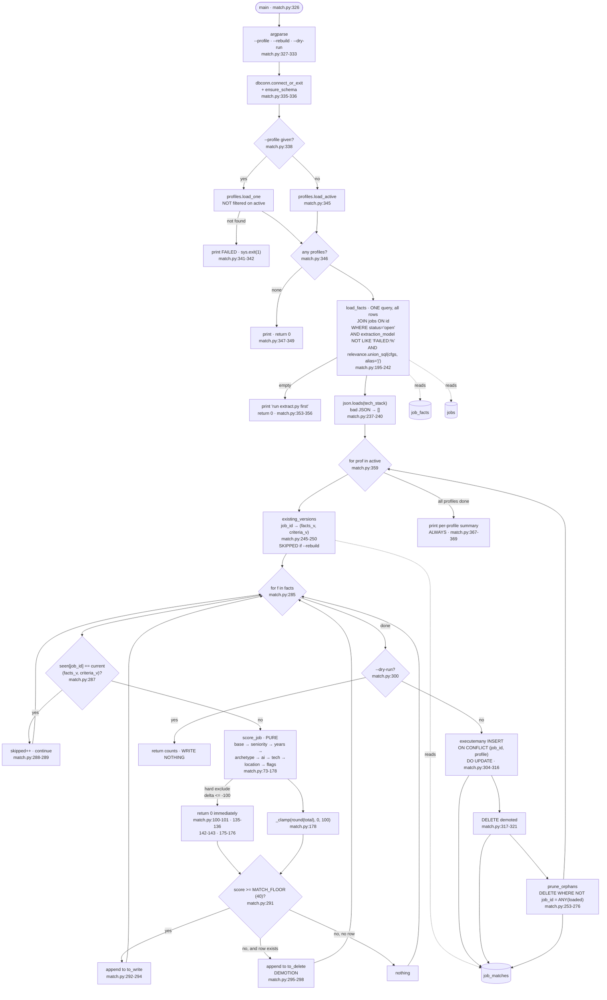

> Stage 3 of 4 — the stage that ranks. For what `match_score` means, why two
> profiles' scores are not comparable, and the provenance of every weight in
> `criteria.json`, see [`../scoring.md`](../scoring.md).

## Purpose

Reads every usable `job_facts` row, scores it against each active profile's
weights with plain arithmetic, and writes rows scoring at or above
`MATCH_FLOOR` into `job_matches` (`backend/match.py:73-178`, `:303-316`).

**No LLM call, no network, no clock inside the scoring function.** This is the
stage that turns shared facts into a per-profile ranking, and it is what the
`jobs_app` view inner-joins on — so a posting with no `job_matches` row is
invisible to the application regardless of its facts
(`backend/schema.py:512-560`).

Rows that fall below the floor, or whose posting left the fact set entirely,
are **deleted** (`:295-298`, `:253-276`).

---

## Invocation

**Scheduled.** Eighth of the nine steps in `run-daily.py`
(`backend/run-daily.py:104-119`), between `extract.py` and `score.py`. The
ordering comment states the invariant: "Running score before match would write
narratives for yesterday's ordering" (`backend/run-daily.py:99-103`).

### CLI arguments

| Flag | Type | Default | Effect |
|---|---|---|---|
| `--profile` | string | all active | Score only this profile; exits 1 if it does not exist (`:329`, `:338-342`) |
| `--rebuild` | `store_true` | `False` | Recompute every row, ignoring version bookkeeping (`:330-331`, `:281`) |
| `--dry-run` | `store_true` | `False` | Report counts, write nothing (`:332`, `:300-301`, `:266-270`) |

`--profile` uses `profiles.load_one`, which is deliberately **not** filtered on
`active` (`backend/profiles.py:109-115`), so an inactive profile can be scored
by name.

### Environment variables

| Variable | Default | Read at |
|---|---|---|
| `DATABASE_URL` | none — raises | `backend/lib/dbconn.py:77-91` |
| `JOBS_MATCH_FLOOR` | `40` | `backend/schema.py:165` |

**No LLM variables at all** — this stage never calls one. `llm` is imported
only for the `FAILED_PREFIX` constant (`:49`, `:227`).

### Expected runtime

Not separately measured, but this is the cheapest of the three enrichment
stages: one `SELECT` (`:225`), then pure Python arithmetic over
facts × profiles, then one `executemany` per profile (`:304-316`).

`load_facts` deliberately loads **all rows into memory**: "11k rows is a few
MB, and holding them lets every profile be scored in one pass over the data
instead of one query per profile. The cross product is computed in Python
precisely because the arithmetic is trivial and the round trips are not"
(`:198-201`).

Live scale: 5,288 `job_facts` rows, 2 active profiles, 3,622 `job_matches`
rows.

### Concurrent runs

No lock, no claim. Writes are `INSERT ... ON CONFLICT (job_id, profile) DO
UPDATE` (`:310`), so two concurrent runs would not error — but the two
`DELETE` paths (`:272-274`, `:318-321`) are computed from a snapshot taken at
`:352`, so overlapping runs with different fact sets could delete each other's
rows.

---

## Data Flow

---

## Field Mapping

Input is a `job_facts` row joined to two columns of `jobs`; output is a
`job_matches` row. There is no external source and no transformation of
posting text.

### Read (`_SELECT_FACTS`, `:181-192`)

| Column | From | Used by |
|---|---|---|
| `job_id`, `facts_version` | `job_facts` | keying and staleness |
| `seniority_level` | `job_facts` | seniority section (`:97-119`) |
| `years_experience_min` | `job_facts` | years section (`:122-129`) |
| `role_archetype` | `job_facts` | archetype section (`:132-136`) |
| `tech_stack` | `job_facts` | parsed from JSON text (`:238`), tech section (`:149-157`) |
| `ai_involvement` | `job_facts` | AI section (`:139-143`) |
| `ml_research_required`, `advanced_degree_required`, `customer_facing`, `gap_friendly_language` | `job_facts` | flags section (`:173-176`) |
| `remote_policy` | `job_facts` | location fallback (`:166`) |
| **`location_is_nyc`, `location_is_remote`** | **`jobs`**, not `job_facts` | location section (`:164-165`) |

Those last two come from the `jobs` table because `lib.text` computes them at
ingest for free — "re-deriving them from an LLM would be paying for something
we have" (`:81-83`).

`job_facts` columns **not** read: `years_experience_max`, `comp_min`,
`comp_max`, `comp_currency`, `employment_type`, `visa_sponsorship`, `summary`,
`extracted_at`. They are extracted and stored but play no part in ranking;
`summary`, comp and visa surface through the `jobs_app` view instead
(`backend/schema.py:518-524`).

### Written (`:304-316`)

| Column | Value |
|---|---|
| `job_id`, `profile` | composite primary key (`backend/schema.py:381`) |
| `match_score` | `_clamp(round(total), 0, 100)` (`:178`) |
| `match_reasons` | `json.dumps(reasons)` — a list of `{"rule", "delta"}` (`:293`) |
| `facts_version` | copied from the fact row (`:293`) |
| `criteria_version` | from the profile (`:294`) |
| `matched_at` | one `utc_now_str()` for the whole profile pass (`:282`) |

### The scoring algorithm

`score_job(facts, criteria)` (`:73-178`) is **pure** — "no database, no clock,
no config lookup" — which is what makes it unit-testable and lets
`tools/calibrate-match.py` sweep weights without touching the pipeline
(`:76-79`).

Sections run in fixed order, each appending `{"rule": ..., "delta": ...}`:

| Section | Behavior | Lines |
|---|---|---|
| base | `criteria["base"]`, always recorded | `:86-87` |
| seniority | `hard_exclude` → immediate 0; `target` → **no delta and no reason** ("silence is the signal"); `tolerate` → named delta; otherwise distance along `SENIORITY_ORDER` × `penalty_per_level` | `:97-119` |
| years | only if `years_experience_min > max_required`; penalty capped by `over_penalty_cap` | `:122-129` |
| archetype | delta from `criteria["archetypes"]`; can hard-exclude | `:132-136` |
| AI involvement | delta from `criteria["ai_involvement"]`; can hard-exclude | `:139-143` |
| tech | **substring** match, summed then capped by `tech.cap` | `:149-157` |
| location | if neither accepted-NYC nor accepted-remote applies: `onsite_elsewhere_penalty` when `remote_policy == "onsite"`, else `neither_penalty` | `:163-170` |
| flags | delta per truthy boolean; can hard-exclude | `:173-176` |

`HARD_EXCLUDE_AT = -100` is "a magnitude rather than a separate config key",
so "never show me research roles" is expressed in the same units as every
other weight "instead of as a second parallel mechanism" (`:56-60`).

Tech matching is substring rather than equality because "postings write
'node.js', 'Node', and 'nodejs' for one thing, and the alternative is a
synonym table nobody maintains"; the cap exists so "breadth of stack is not
itself a signal" (`:146-148`).

The location section reads the ingest booleans first and falls back to
`remote_policy` "only to distinguish 'onsite somewhere else' (a real no) from
'we could not classify this' (a data gap, penalised less)" (`:160-162`).

---

## Dedupe & Idempotency

### The key

`job_matches` primary key is `(job_id, profile)`
(`backend/schema.py:381`), with `job_id REFERENCES jobs(id) ON DELETE CASCADE
ON UPDATE CASCADE` (`:374-375`).

### Staleness is by version, not timestamp

A row is recomputed only if its stored `(facts_version, criteria_version)`
differs from the current pair (`:286-289`). `existing_versions` loads that map
per profile (`:245-250`).

Two ways a row becomes stale:

- `extract.py` re-extracted the posting, bumping `facts_version`.
- The profile's weights were edited **and** `criteria_version` was bumped.
  `profiles.upsert` takes `bump_criteria` as an explicit keyword
  (`backend/profiles.py:169`, `:192-193`) so "editing weights without bumping
  can't happen by accident", and `backend/profiles.py:30-36` calls
  `criteria_version` "a cache key, not a changelog."

`--rebuild` sets `seen = {}` (`:281`), forcing every row.

### Full re-run

Idempotent. A second run with no upstream change reports everything as
`skipped` and writes nothing — the `to_write` and `to_delete` lists stay
empty, so neither the `executemany` nor the `DELETE` fires (`:303`, `:317`).

`prune_orphans` still runs and still commits (`:275`), but deletes nothing
when the fact set is unchanged.

### The two delete paths

They are distinct, and the distinction is documented at `:254-263`:

| Path | Fires when | Line |
|---|---|---|
| **demotion** | the job is still in `facts`, but its new score fell below `MATCH_FLOOR` and it had a row | `:295-298`, `:317-321` |
| **orphan prune** | the job left `facts` entirely — closed upstream, tombstoned, or newly excluded by `config/relevance.json` | `:253-276` |

An orphaned job "never enters that loop, so without this its stale row
survives every subsequent run and keeps being shown." `prune_orphans` is
"deliberately keyed on the loaded fact set rather than on a fresh query, so
'what match.py just considered' and 'what match.py keeps' cannot disagree"
(`:262-263`).

### Partial re-run after a mid-batch crash

Per profile, three writes each committing at `:322` (upsert + demotion
together) and `:275` (orphan prune). A crash between profiles leaves earlier
profiles fully updated and later ones untouched — consistent, because the
`(job_id, profile)` key makes profiles independent.

There is no resume pointer; the version comparison **is** the state, so a
re-run picks up exactly what was left.

---

## Failure Modes

### Rate limits, auth, retries

**None apply.** No network calls, no credentials, no retry policy. The only
external dependency is Postgres.

### Malformed or empty inputs

| Input | Behavior |
|---|---|
| `--profile` naming a nonexistent profile | print + exit 1 (`:340-342`) |
| No active profiles | print, `return`, exit 0 (`:346-349`) |
| `job_facts` empty | print "run extract.py first", exit 0 (`:353-356`) |
| `tech_stack` not valid JSON | caught, coerced to `[]` (`:237-240`) |
| Fact column NULL | each section guards with `.get()` and `or {}` defaults |
| `criteria` missing a section | `criteria.get("seniority") or {}` etc. — every lookup defaults (`:97`, `:122`, `:133`, `:139`, `:149`, `:163`, `:173`) |
| A `criteria` weight that is not a number | **unguarded** — `total += delta` at `:92` would raise `TypeError` |

### Tombstone exclusion

`load_facts` filters `f.extraction_model NOT LIKE 'FAILED:%'` (`:190`, `:227`)
**in the query, not the caller**, because "a FAILED row has NULL in every fact
column and would otherwise be scored as though the posting genuinely had no
seniority, no archetype and no stack" (`:203-205`).

### The relevance union is re-applied here

`load_facts` applies `relevance.union_sql(cfgs, table_alias="j")` (`:224`) even
though `extract.py` already filtered on it. The reason at `:207-218` is the
sharpest measurement in the module:

> Facts outlive the config that produced them. A posting extracted last week
> keeps its `job_facts` row forever, so filtering only at extraction time
> means a row that config later rejects still gets scored, still clears
> `MATCH_FLOOR`, and still sits at the top of the ranking.
>
> That was not hypothetical: **113 Google Jobs rows naming a relist site as
> the employer had already been extracted, and 19 of them held `match_score
> >= 90` — one at match 99 against an LLM fit of 15.**

The union rather than one profile's config, "because facts are shared: a
posting one profile rejects may be exactly what another wants."

### Does a single bad record fail the batch?

**Yes.** There is no per-record isolation anywhere in this stage:

- `score_job` is called unguarded at `:290`. Any exception — a non-numeric
  weight, an unexpected fact type — propagates out of `match_profile` and
  kills the run for **all** profiles, including ones already computed but
  whose commit had not yet happened.
- The `executemany` at `:304-316` is a single statement; one bad tuple aborts
  the whole batch, and unlike `lib.upsert` there is no SAVEPOINT per row
  (contrast `backend/lib/upsert.py:191-198`).

This is the only stage documented here with no per-record isolation. It is
also the only one that makes no external call, so the class of failure that
isolation protects against is narrower.

### Logged vs. swallowed

| Event | Where it goes |
|---|---|
| Per-profile written / demoted / orphaned / skipped counts | printed **unconditionally**, with zero-valued parts omitted (`:363-369`) |
| Which jobs were demoted or orphaned | **nothing** — only counts (`:298`, `:274`) |
| Per-job score and reasons | stored in `match_reasons` (`:293`), never printed |
| `tech_stack` JSON parse failure | **silently** coerced to `[]` (`:237-240`) |
| Hard exclusions | recorded in `match_reasons` for rows that are written; a hard-excluded job scores 0, falls below the floor, and its reasons are discarded |

`DEBUG_PRINT_KEYS` is not read by this module at all.

### Exit codes

| Condition | Exit | Line |
|---|---|---|
| `DATABASE_URL` unset or Postgres unreachable | 1 | `backend/lib/dbconn.py:203` |
| `--profile` names a nonexistent profile | 1 | `:341-342` |
| No active profiles | 0 | `:347-349` |
| No facts | 0 | `:354-356` |
| Normal completion | 0 | falls off the end |

---

## External Dependencies

**None.** No HTTP, no files read at runtime beyond what `profiles` and
`relevance` load from the database and `config/`.

| Dependency | Purpose |
|---|---|
| Postgres — `job_facts`, `jobs`, `job_matches`, `profiles` | all input and output |
| `config/relevance.json` (via a profile's `relevance_json`, else the shared default) | the union filter (`backend/relevance.py:66-110`) |
| `criteria_json` per profile | the weights (`backend/profiles.py:15-28`) |

### Undocumented assumptions

- **`criteria_json` structure is not validated at scoring time.** Every lookup
  defaults (`:97`, `:122`, …), so a typo in a section name silently disables
  that section rather than erroring. `profiles.validate()` runs before every
  write (`backend/profiles.py:123`), but nothing re-checks at read time.
- **`tech_stack` is a JSON array of lowercase strings**, which is
  `extract.py`'s contract (`backend/extract.py:258-261`, `:283`), not a
  database constraint — the column is TEXT (`backend/schema.py:350`).
- **`SENIORITY_ORDER` (`:65-66`) must stay a superset of `extract.py`'s
  `SENIORITY` vocabulary** (`backend/extract.py:82-83`) for the
  distance fallback to work. Nothing asserts this; a level present in one and
  absent from the other silently scores as free (`:116`).
- **`MATCH_FLOOR` is read once at import** (`backend/schema.py:165`), so
  changing `JOBS_MATCH_FLOOR` between runs changes which rows are written but
  does **not** retroactively demote rows written under the old floor unless
  their versions also changed.

### Python dependencies

`psycopg` via `lib/dbconn.py`; `argparse` and `json` from stdlib. Repo-local:
`llm` (constant only), `profiles`, `relevance`, `schema`, `lib.dbconn`,
`lib.timeparse.utc_now_str` (`:45-54`). No unused imports were found.

---

## Open Questions

**Runtime is not separately measured**, for the same reason as every other
step (`backend/run-daily.py:126-133`).

**Live match counts cannot be reconciled with the fact count from the code
alone.** 5,288 `job_facts` rows and 2 active profiles would give at most
10,576 candidate scores, yet `job_matches` holds 3,622 rows — the same number
as `jobs_app`, which is expected since the view inner-joins matches. How that
3,622 splits between the `tech` and `frontend` profiles, and how much is floor
rejection versus relevance-union exclusion versus tombstone exclusion, I did
not query.

**The two profiles are at different `criteria_version`s** — `tech` at 4,
`frontend` at 1 (`SELECT profile, criteria_version FROM profiles`). Since
staleness is `(facts_version, criteria_version)` per row (`:286`), the two
profiles' rows were last computed under different config generations. Whether
`frontend` has ever had its weights edited, or was created at version 1 and
left, is not determinable from the schema — `criteria_version` is explicitly
"a cache key, not a changelog" (`backend/profiles.py:30-36`).

**A single bad record kills the whole run, and nothing tests that.** `score_job`
at `:290` and the `executemany` at `:304` both lack isolation. Every other
write path in this pipeline uses `lib.upsert`'s per-record SAVEPOINT. Whether
this is a deliberate trade (the arithmetic cannot fail on well-formed config)
or an oversight is not recorded anywhere.

**Demoted and orphaned job ids are not logged.** Only counts reach stdout
(`:363-366`). A weight edit that demotes hundreds of rows reports a number
with no way to see which — and the rows are already deleted by then, so it is
not recoverable after the fact.

**`prune_orphans` runs even under `--profile`.** It deletes any
`job_matches` row for that profile whose `job_id` is not in the loaded fact
set (`:271-274`). Since `load_facts` applies the relevance union of the
**selected** profiles only (`:351-352`), running `match.py --profile frontend`
loads facts filtered by `frontend`'s config alone — so any `frontend` match
row for a job that only `tech`'s config admits would be pruned. Whether that
is intended I could not determine; the docstring at `:220-222` argues for the
union precisely to avoid this class of problem, but the union is over `active`
or the single `--profile`, not over all profiles.

**The 113-relist-rows measurement is undated** (`:213-215`), like the other
in-code measurements. It names `company_exclude` in
`config/relevance.json` as the fix; I did not verify that key is still present
or still matching.
