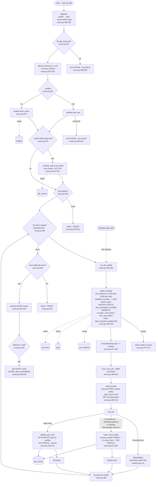

> Stage 4 of 4. For why `fit_score` annotates but never orders a list, and
> what a tombstoned narrative does to the ranking, see
> [`../scoring.md`](../scoring.md).

## Purpose

For each active profile, takes the top-ranked postings that have no narrative
yet, sends the posting's **facts** plus that profile's persona to an LLM, and
writes six narrative fields into `job_scores`
(`backend/score.py:206-246`, `:334-371`).

**It does not rank.** `match_score` orders the list; `fit_score` annotates it.
The docstring states the rule and the reason: "The moment ordering depends on
it, every job a user might see needs an LLM call before it can be placed —
which is the property this split exists to remove" (`:23-27`).

Cost is bounded by what gets **shown**, not by corpus size: "Adding a profile
costs `daily_narrative_budget` calls a day that they are active, and nothing
at all while they are not" (`:19-21`).

---

## Invocation

**Scheduled.** Ninth and last step of `run-daily.py`, and the only step
invoked with arguments — `["score.py", "--active-within-days", "7"]`
(`backend/run-daily.py:119`). The comment there calls it "the warm pass:
prepare narratives for profiles that have been active in the last week, so a
returning user finds them already written" (`backend/run-daily.py:114-118`).

**Called in-process by the login path.** `run_for_profile` is importable
"because the login path calls it directly: a user signing in is exactly the
moment their top 20 should get narratives, and it is the trigger that makes
cost track engagement rather than registration" (`:458-462`).

**Manual.** `backend/scripts/backfill-scores.py` drives it in a loop for a
one-time backlog burn-down.

### CLI arguments

| Flag | Type | Default | Effect |
|---|---|---|---|
| `--profile` | string | all active | Score one profile; exits 1 if absent (`:489`, `:505-511`) |
| `--limit` | int | the profile's `daily_narrative_budget` | Override the per-profile call budget (`:490-491`, `:468`) |
| `--active-within-days` | int | `None` | Skip profiles with no `job_events` in the window (`:492-494`, `:515-517`) |

### Environment variables

| Variable | Default | Read at |
|---|---|---|
| `DATABASE_URL` | none — raises | `backend/lib/dbconn.py:77-91` |
| `JOB_SCORING_API_KEY` / `GLM_API_KEY` | none — hard exit | `:497-500` |
| `JOB_SCORING_BASE_URL` | `https://api.z.ai/api/paas/v4` | `backend/llm.py:29` |
| `JOB_SCORING_MODEL` | `glm-4.5-flash` | `backend/llm.py:30` |
| `SCORE_BATCH_SIZE` | `30` | `:184` |
| `SCORE_MAX_WORKERS` | `5` | `:185` |
| `JOB_SCORING_PERSONA_FILE` | `config/persona.json` | `:180-183` |
| `LLM_BACKEND`, `LLM_MAX_RPM`, `LLM_MAX_RPD`, `LLM_QUOTA_*` | see `backend/llm.py`, `backend/ratelimit.py` | |

**`SCORE_BATCH_SIZE` is nearly dead.** The per-profile cap is
`profile.daily_narrative_budget` (`:468`), which defaults to 20
(`backend/schema.py:334`). `SCORE_BATCH_SIZE` survives only where nothing else
supplies a limit.

`load_persona()` reads `config/persona.json` (`:194-203`), but the pipeline
does **not** use it — personas come from the `profiles` table. It is "retained
for tools/cost-test.py and tools/compare-models.py, which measure a prompt
without needing a database profile… a file cannot describe more than one user"
(`:196-200`).

### Expected runtime

Not separately measured. Per profile: up to `daily_narrative_budget` (20) LLM
calls at `SCORE_MAX_WORKERS` (5) concurrency, each with a 120-second timeout
(`backend/llm.py:41`).

Profiles run **sequentially**, "One profile at a time, deliberately. The
persona is the bulk of the prompt and it caches as a prefix; interleaving
profiles would evict it between every call" (`:464-466`).

With `score.py` and `extract.py`, this is why the unit's
`TimeoutStartSec=10800` is set — "Two of the nine steps make LLM calls and
dominate the wall clock"
(`~/.config/systemd/user/jobs-ingest.service`).

### Concurrent runs

No lock. Within a run, a `ThreadPoolExecutor` of `SCORE_MAX_WORKERS`
(`:477-481`), each worker opening **its own connection** (`:419`) — the
comment at `:415-418` notes `search_path` is per-connection and
`dbconn.connect(schema=...)` sets it for every connection it hands out, "which
is what makes the threaded case correct by construction instead of by
remembering."

The nightly run and a login-triggered `run_for_profile` **can overlap** by
design. Both select via the same `NOT EXISTS` anti-join (`:234-235`) with no
locking, so both could pick the same job and pay twice; `ON CONFLICT DO
UPDATE` (`:348`) means the second write wins rather than errors.

---

## Data Flow

---

## Field Mapping

### Prompt input

The persona comes from `profiles.persona_json` (`backend/profiles.py:59`) and
is emitted **first**, as five labelled blocks (`:303-318`):
`background_summary`, `strengths`, `honest_gaps`, `buckets` (name, description,
fit_signal), `scoring_instructions`.

The posting comes **last**, as `_facts_block(job)` (`:249-279`), not as
description text:

| Facts-block line | Source column | Note |
|---|---|---|
| `Title:` / `Company:` | `jobs.title`, `jobs.company_name` | |
| `Location:` | `jobs.location_raw` + `job_facts.remote_policy` | combined in one line (`:270`) |
| `Level:` | `job_facts.seniority_level` | |
| `Years required:` | `job_facts.years_experience_min` | **omitted entirely** when NULL (`:265-266`) |
| `Role type:` | `job_facts.role_archetype` | |
| `AI involvement:` | `job_facts.ai_involvement` | |
| `Technologies:` | `job_facts.tech_stack` | JSON-parsed, first 20 joined; `"not stated"` when empty (`:257-261`, `:274`) |
| `Compensation:` | `job_facts.comp_min`/`comp_max` | **omitted entirely** when both are falsy (`:262-264`) |
| `Explicitly welcomes career breaks:` | `job_facts.gap_friendly_language` | `"yes"` / `"not stated"` (`:276-277`) |
| `Summary:` | `job_facts.summary` | |

Only present fields are emitted, because "a wall of 'unknown' lines invites a
model to treat absence as a negative signal, when it usually just means the
posting did not say" (`:252-255`).

`build_prompt` also accepts a **raw `jobs` row** with `description_text`,
detected by the absence of a `summary` key (`:296-301`), so
`tools/cost-test.py` and `tools/compare-models.py` "did not need rewriting
alongside the pipeline" (`:285-288`).

### Model output → `job_scores`

`REQUIRED_FIELDS` (`:188-191`) are all six; `llm.has_fields` gates the write.

| JSON key | Column | Coercion |
|---|---|---|
| `fit_score` | `fit_score` | `result.get(...)` — **no range clamp** (`:361`) |
| `primary_track` | `primary_track` | raw string, **no vocabulary coercion** (`:362`) |
| `gap_friendly_signal` | `gap_friendly_signal` | `bool(...)` (`:363`) |
| `key_technologies` | `key_technologies` | `json.dumps(... or [])` (`:364`) |
| `gap_bridging_angle` | `gap_bridging_angle` | raw string (`:365`) |
| `risk_factors` | `risk_factors` | `json.dumps(... or [])` (`:366`) |
| — | `scored_at` | `utc_now_str()` (`:367`) |
| — | `scoring_model` | `f"{llm.model()}@{host}"` (`:523-524`) |

The schema asks for `primary_track` to be one of five values (`:326`), but
unlike `extract.py`'s `_enum` coercion (`backend/extract.py:217-237`) nothing
normalises it on the way in. See Open Questions.

---

## Dedupe & Idempotency

### The key

`job_scores` primary key is `(job_id, profile)`
(`backend/schema.py:315`). Scores are per persona, not per posting:
`backend/schema.py` records that "A score isn't a property of a posting; it's
one persona's opinion of it."

### What makes a job eligible

`select_shortlist` (`:206-246`) inner-joins `job_matches`, `jobs` and
`job_facts`, filters `m.profile`, `status='open'`, and anti-joins
`job_scores` on `(job_id, profile)` — then orders by `match_score DESC,
first_seen DESC` and takes the budget.

**No relevance tier is applied here**, deliberately: "A row only reaches
`job_matches` if it cleared the profile's own relevance gate in `extract.py`
AND scored above `MATCH_FLOOR`, so the filtering has already happened twice by
this point" (`:218-220`).

Ordering by `match_score` is the cost argument: "choosing what to spend a call
on costs nothing, so the calls go to the jobs a person is actually about to
see" (`:209-211`).

### Full re-run

A second run the same day selects only jobs still lacking a
`(job_id, profile)` row, so a completed shortlist yields an empty Counter and
the script returns silently (`:470-471`, `:540-541`).

**Editing a persona without renaming the profile does not re-score.** The
anti-join is on row existence, not on any version column — unlike
`match.py`'s `(facts_version, criteria_version)` check. Re-scoring in place
requires deleting rows, which is what
`backend/scripts/backfill-scores.py --redo` does (its only DB write).

Renaming the profile starts a fresh, empty score set and leaves the old one
intact, because `profile` is half the key.

### Partial re-run after a mid-batch crash

**Per-job durability.** Each worker commits its own write (`:371`, `:391`) on
its own connection (`:419`). A crash loses only in-flight calls.

Profiles are independent by key, so a crash between profiles leaves earlier
ones complete.

### Tombstones are per profile

`mark_score_failed` writes `scoring_model='FAILED:...'` with a NULL
`fit_score` (`:374-391`). It is keyed `(job_id, profile)` so "a job that one
persona failed to score is still worth attempting for another" (`:380-381`).

The docstring names the precedent: "Same lesson as `ingest/hn-hiring.py`'s
`hn_seen_comments` tombstone table" (`:377-378`).

---

## Failure Modes

### The three-way split

Identical in shape to `extract.py`'s, and this is where it was first
articulated (`:394-413`):

| Outcome | Trigger | Written | Retried? |
|---|---|---|---|
| **DEFERRED** | `llm.TransientError` — 429, 5xx, timeout, quota exhausted | **nothing** | yes |
| **REJECTED** | `RuntimeError`, `JSONDecodeError`, or a result missing any of the six `REQUIRED_FIELDS` | tombstone, `fit_score` NULL | no |
| **SCORED** | valid result | full row | n/a |

The reasoning, verbatim: "Tombstoning is right for a model that cannot produce
parseable JSON for a given posting: retrying forever would burn a call a night
on the same failure. It is badly wrong for an HTTP 429, which says nothing
about the posting — and the current default model rate-limits hard enough that
a batch can be mostly 429s. Recording those as failures silently and
permanently discards jobs that were never actually evaluated" (`:407-413`).

### Rate limits

Same client-side enforcement as `extract.py`: `ratelimit.acquire(model)` runs
**before** each request (`backend/ratelimit.py:156`, `backend/llm.py:139-142`),
raising `QuotaExhausted` → `TransientError` → DEFERRED when the daily budget
is spent.

An explicit health check fires when more than half the calls deferred, naming
the variable to lower (`:545-549`).

### Auth

A single bearer token, `JOB_SCORING_API_KEY` falling back to `GLM_API_KEY`
(`:498-499`). Checked once at startup via `llm.api_key()` (`:497`). No
refresh or rotation.

Under `LLM_BACKEND=claude` the key is the sentinel `"claude-cli-oauth"`
(`backend/llm.py:104`), which exists purely so callers' `if not
llm.api_key()` guards pass — billing goes through the CLI's own OAuth store.

### Malformed or empty payloads

| Input | Behavior |
|---|---|
| Response missing any of the six required fields | REJECTED → tombstone (`:188-191`) |
| Response with markdown fences or extra prose | tolerated — `llm.parse_json` strips fences and takes the outermost `{...}` (`backend/llm.py:243-260`) |
| `tech_stack` not valid JSON | caught, becomes `""` (`:258-261`) |
| Empty shortlist | empty Counter, profile skipped in the summary (`:470-471`, `:530-531`) |
| `--profile` naming a nonexistent profile | exit 1 (`:507-510`) |
| No targets after the active filter | silent exit 0 (`:519-521`) |

### Does a single bad record fail the batch?

**No.** `score_one_job` catches per job and returns an outcome string
(`:398-452`), collected by `pool.map`. An exception type not caught inside
would propagate through `pool.map` and kill the run.

### Logged vs. swallowed

| Event | Where it goes |
|---|---|
| Per-profile scored / unparseable / deferred | printed, with zero parts omitted (`:533-537`, `:543-544`) |
| Which job scored what | stderr **only** if `DEBUG_PRINT_KEYS` (`:440-443`) |
| Which job was tombstoned | stderr **only** if `DEBUG_PRINT_KEYS` (`:447-449`) |
| Endpoint throttling | explicit NOTE above 50% deferred (`:545-549`) |
| A profile skipped by `--active-within-days` | **nothing** — filtered silently at `:516-517` |
| A profile with an empty shortlist | **nothing** — `continue` at `:530-531` |
| Every profile already complete | **silent** exit (`:540-541`) |

### Exit codes

| Condition | Exit | Line |
|---|---|---|
| No LLM API key | 1 | `:497-500` |
| `DATABASE_URL` unset or Postgres unreachable | 1 | `backend/lib/dbconn.py:203` |
| `--profile` names a nonexistent profile | 1 | `:507-510` |
| No targets, or every shortlist complete | 0 | `:520-521`, `:540-541` |
| Every call deferred | **0** | deferral is not failure |

---

## External Dependencies

| Endpoint | Auth | Called at | Response shape assumed |
|---|---|---|---|
| `POST {JOB_SCORING_BASE_URL}/chat/completions` | `Authorization: Bearer` | `backend/llm.py:210-241` | OpenAI-compatible: `choices[0].message.content` |
| `claude -p … --output-format json --max-turns 1` | the CLI's OAuth store | `backend/llm.py:159` | only when `LLM_BACKEND=claude` |

The docstring records that this "used to shell out to `hermes -z`" and was
changed so the script "can run standalone on other (SerpApi/Apify worker)
machines, which shouldn't need a full Hermes install" (`:36-40`).

### Undocumented assumptions

- **Persona-prefix caching.** The whole one-profile-at-a-time design
  (`:464-466`) assumes the provider caches the prompt prefix. Nothing verifies
  a hit.
- **`temperature=0`** (`backend/llm.py:59`), with the measurement quoted in
  `docs/ingest/extract.md`.
- **The model returns one of five `primary_track` values** (`:326`). Not
  enforced — see Open Questions.
- **`fit_score` is an integer 0–100** (`:325`). Not clamped or type-checked on
  the way in (`:361`).
- **`job_events` is written by something.** `_recently_active` (`:552-570`)
  reads it to gate the warm pass. See Open Questions.

### Python dependencies

`psycopg` via `lib/dbconn.py`; `argparse`, `json`, `concurrent.futures`,
`urllib.parse`, `datetime` from stdlib. Repo-local: `llm`, `profiles`,
`schema`, `lib.dbconn`, `lib.timeparse.utc_now_str`.

---

## Open Questions

**`--active-within-days 7` currently skips nothing, because `job_events` is
empty.** `SELECT count(*) FROM job_events` returns **0**. `_recently_active`
treats a profile with zero events as active (`:563-564`), so both profiles
pass the filter on every nightly run. The gate the flag exists for has
therefore never actually fired. That is consistent with `backend/webapp/`
never having been driven by a browser — see
`docs/ingest/engagement-events.md`.

**The live scoring model is not the documented default.** `job_facts` rows
show `deepseek-v4-flash@api.deepseek.com`; `backend/llm.py:29-30` and
`backend/README.md` both name `glm-4.5-flash` at `api.z.ai`. I did not query
`job_scores.scoring_model` to confirm the same is true there, so whether
`job_scores` and `job_facts` were written by the same model — which matters,
since `backend/scripts/backfill-scores.py` "pins the model for the whole run…
because a fit_score is only comparable to one produced the same way" — is
unverified.

**`primary_track` is not coerced to its vocabulary.** The prompt names five
values (`:326`) and `update_job_score` stores whatever came back (`:362`).
`extract.py` treats exactly this risk as serious enough to warrant `_enum`
("'Mid-Level' is a landmine", `backend/extract.py:34-40`), and `match.py`
never reads `primary_track`, so a drifted value would be invisible until
something rendered it. Whether any stored value falls outside the five I did
not query.

**`fit_score` is stored unvalidated.** `result.get("fit_score")` goes straight
into an `INTEGER` column (`:361`, `backend/schema.py:305`). A model returning
`"85"` as a string, or 850, would either error at insert or store a nonsense
value. No clamp exists, unlike `match.py`'s `_clamp` (`backend/match.py:69`).

**A login-triggered run and the nightly run can double-spend.** Both use the
same unlocked `NOT EXISTS` anti-join (`:234-235`). `ON CONFLICT DO UPDATE`
prevents an error but not the duplicate call. How likely that is depends on
deployment, which has not happened.

**Runtime is not separately measured**, as for every step
(`backend/run-daily.py:126-133`).

**Whether editing a persona ever re-scores in place is not observable.** The
anti-join has no version column, so a revised persona under the same profile
name silently applies only to newly-shortlisted jobs. `backend/README.md`
describes editing the persona as re-scoring in place, which the code does not
do on its own — it requires `backfill-scores.py --redo`, whose deletion is
documented as its only write. I did not read that script to confirm the flag's
current behavior.

**1,254 `job_scores` rows against 3,622 `job_matches` rows.** Roughly a third
of matched jobs have a narrative. Whether that reflects the 20/profile/day
budget still catching up, or a steady state where the rest are never shown, is
not determinable from the code.
