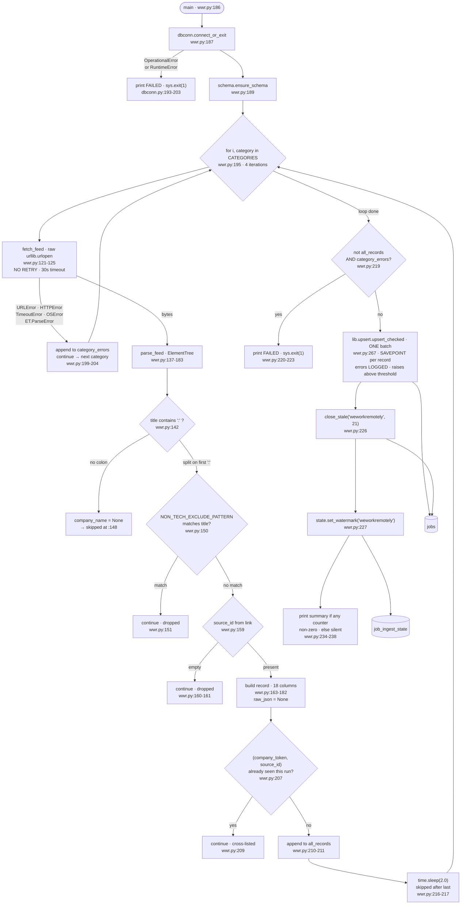

> **Provenance.** `generator: none` is literal: nothing in this repo produces
> `docs/ingest/*.md`. Earlier versions carried `generated:` frontmatter naming a
> tool that was never written, which made `.claude/CLAUDE.md`'s *"never hand-edit"*
> instruction unfollowable — the only way to fix a wrong line was to break the rule.
> The claim was dropped across all fourteen files on 2026-07-31; see
> [`34-documentation-cleanup.md`](../tasks/refactor/34-documentation-cleanup.md) §A2.
> These files are hand-written and are maintained by hand.

## Purpose

Fetches four category RSS feeds from `weworkremotely.com`
(`backend/ingest/weworkremotely.py:99-105`), parses each `<item>` into the 18
columns of `schema.COLUMNS`, and upserts into the same `jobs` table
`ingest/ats.py` writes to, tagged `platform='weworkremotely'`
(`backend/ingest/weworkremotely.py:164`).

Rows not re-seen for 21 days are set to `status='closed'`
(`:107`, `:226`). A single watermark row keyed `weworkremotely` is written to
`job_ingest_state` (`:227-228`) and read by nothing.

Unlike `ingest/ats.py`, this source stores no `raw_json` — the field is
hardcoded `None` (`:181`), so the original feed item is not preserved.

---

## Invocation

**Scheduled.** Third of the nine steps in `run-daily.py`
(`backend/run-daily.py:104-119`), run as a subprocess with `cwd` set to
`backend/` and the parent's environment copied
(`backend/run-daily.py:122-133`). See `docs/ingest/ats.md` for the timer and
unit configuration, which are shared by every step.

**Manual.** `python3 ingest/weworkremotely.py`, or with `DEBUG_PRINT_KEYS=1`
(`backend/ingest/weworkremotely.py:65-67`).

### CLI arguments

**None.** No `argparse` import, no `sys.argv` read; `main()` takes no
parameters (`backend/ingest/weworkremotely.py:186`).

### Environment variables

| Variable | Required | Default | Read at |
|---|---|---|---|
| `DATABASE_URL` | yes | none — raises `RuntimeError` | `backend/lib/dbconn.py:77-91` |
| `DEBUG_PRINT_KEYS` | no | unset; `"1"` enables stderr diagnostics | `backend/ingest/weworkremotely.py:97` |

No API key, token or other secret. The feeds are unauthenticated
(`backend/ingest/weworkremotely.py:121-125`). There is no config file — the
category list, delay and staleness window are module constants
(`:99-108`).

### Expected runtime

Not separately measured (see Open Questions). Lower bound from the code: 4
requests at a 30-second timeout each (`http.DEFAULT_TIMEOUT`,
`backend/lib/http.py:28`, passed at `backend/ingest/weworkremotely.py:124`),
plus three `time.sleep(2.0)` pauses — the delay is skipped after the last
category (`:216-217`). So ≥6 seconds of deliberate sleep per run.

### Concurrent runs

No lock, claim or advisory lock in this script. The docstring asserts
coordination is unnecessary because `run-daily.py` runs ingest scripts
sequentially (`backend/ingest/weworkremotely.py:69-70`). The `flock` guarding
the nightly run wraps `run-daily.py`, not this script
(`~/.config/systemd/user/jobs-ingest.service`). The same non-atomic
read-then-write in `lib/upsert.py` applies here as in
`docs/ingest/ats.md` — see that document's Open Questions.

---

## Data Flow



Note the batching difference from `ingest/ats.py`: all four categories
accumulate into one `all_records` list and are upserted in a **single** call
(`:225`), so there is one commit for the whole run rather than one per source
unit.

---

## Field Mapping

RSS item elements are read with `item.findtext(...)`
(`backend/ingest/weworkremotely.py:141-157`). Canonical nullability is from
the `jobs` DDL (`backend/schema.py:270-294`, `:436-439`).

| raw field | canonical field | transformation | nullable? | notes |
|---|---|---|---|---|
| `<title>` (before first `:`) | `company_name` | `raw_title.split(":", 1)[0].strip()` (`:143-144`) | NOT NULL | an item with no `:` yields `None` and the item is **dropped** (`:146-149`) |
| `<title>` (after first `:`) | `title` | `.split(":", 1)[1].strip()` (`:143-144`) | nullable | feeds `content_hash` |
| — | `company_token` | `text.slugify(company_name)` (`:165`) | NOT NULL | feeds the primary key. **Derived from the display name**, not a stable id — see Failure Modes |
| `<link>` (last path segment) | `source_id` | `link.rsplit("/", 1)[-1]`; falls back to `<guid>` for the link (`:153`, `:159`) | NOT NULL | feeds the primary key; item dropped if empty (`:160-161`) |
| `<link>` | `job_url` | `link or None` (`:171`) | nullable | feeds `content_hash` |
| `<region>` | `location_raw` | `region or None` (`:169`) | nullable | feeds `content_hash` |
| `<category>` | `department` | `rss_category or None`; falls back to the **requested** category slug if the element is absent (`:155`, `:170`) | nullable | feeds `content_hash`. Per-item, so it may disagree with the feed it arrived in |
| `<pubDate>` | `posted_at` | `parsedate_to_datetime(...).astimezone(utc).isoformat()`; `None` on `TypeError`/`ValueError` (`:128-134`, `:172`) | nullable | feeds `content_hash`. RFC-2822 in, ISO-8601 out |
| `<pubDate>` | `posted_at_ts` | `text.posted_at_timestamp(parse_posted_at(pub_date))` (`:173`) | nullable | `parse_posted_at` is called **twice** on the same value (`:172`, `:173`) |
| `<description>` | `description_text` | `text.strip_html(...)`, default `unescape=True` (`:157`) | nullable | feeds `content_hash` via `blank_if_falsy`. Truncated at 20,000 chars (`backend/lib/text.py:62`, `:121`) |
| — | `platform` | literal `"weworkremotely"` (`:164`) | NOT NULL | feeds the primary key |
| — | `seniority_guess` | `text.guess_seniority(title)` (`:175`) | nullable | |
| — | `location_is_nyc` | `bool(text.NYC_PATTERN.search(region))` (`:176`) | nullable | calls the pattern **directly**, not `text.classify_location` as `ingest/ats.py:199` does |
| — | `location_is_remote` | hardcoded `True` (`:177`) | nullable | docstring `:44-49` gives the reason: region text reads "Anywhere in the World", "US Timezones Only" etc. and would not match a literal `remote` regex |
| — | `salary_text` | hardcoded `None` (`:174`) | nullable | |
| — | `company_is_nyc_hq`, `company_is_ai_focused` | hardcoded `None` (`:178-179`) | nullable | no config file backs this source |
| — | `raw_json` | hardcoded `None` (`:181`) | nullable | **the feed item is not preserved** |
| `<guid>` | *(fallback only)* | used as `link` if `<link>` is absent (`:153`) | | |

`HASH_FIELDS_WWR` is defined as `HASH_FIELDS_ATS` — literally the same tuple
object (`backend/schema.py:133`) — so `department` is hashed here. Since
`department` comes from the per-item `<category>` element (`:155`), a posting
that WWR recategorizes registers as `updated`.

### Fields dropped

RSS 2.0's standard `<item>` children not read by `parse_feed`: `author`,
`comments`, `enclosure`, `source`. `<guid>` is read only as a fallback for
`<link>` (`:153`). I did not enumerate what WWR actually emits — `raw_json` is
`None` for every row (`:181`), so unlike the ATS sources there is no stored
payload to sample. See Open Questions.

---

## Dedupe & Idempotency

### The key

```
id = sha256(f"weworkremotely:{slugify(company_name)}:{source_id}")[:24]
```

`schema.make_job_id` (`backend/schema.py:239-248`) over the three fields set
at `backend/ingest/weworkremotely.py:164-167`.

**`company_token` is derived from the company's display name**, via
`text.slugify` (`:165`), which lowercases and replaces every non-alphanumeric
run with `-` (`backend/lib/text.py:124-127`). This differs from
`ingest/ats.py`, where the token is a config constant. A company that changes
how it writes its name in the RSS title produces a different token, hence a
different primary key, hence a second row for the same posting. Nothing
detects this.

### In-run dedup

A `seen_ids` set of `(company_token, source_id)` tuples drops repeats across
the four feeds before they reach `upsert`
(`backend/ingest/weworkremotely.py:194`, `:206-211`). The docstring reason is
cross-listing: the same posting appears under more than one category. **First
category wins** — since categories are iterated in the fixed order at `:99-104`
and the record is appended on first sight, the `department` stored is the one
from the earliest feed that carried it.

This set lives for one run only; it is not persisted.

### Full re-run

Same three-branch behavior as every other source
(`backend/lib/upsert.py:216-226`); see `docs/ingest/ats.md` for the decision
table. Because `posted_at` comes from an absolute `<pubDate>` rather than a
relative string, `sticky` is empty for this spec
(`schema.spec()` default, `backend/schema.py:194`) and re-parsing the same
item reproduces the same hash — so a re-run takes the `unchanged` branch.

`close_stale` and `set_watermark` run unconditionally on every invocation
(`:226-227`), each committing (`backend/schema.py:683`,
`backend/lib/state.py:87`).

### Partial re-run after a mid-batch crash

All four categories accumulate into one list and are written by a **single**
`upsert` call (`:225`), which commits once at the end
(`backend/lib/upsert.py:235`). So a crash anywhere before that commit loses
**the entire run's writes**, not one category's — the failure granularity is
coarser here than in `ingest/ats.py`, where each of 68 companies commits
separately.

A crash between the `upsert` commit (`:225`) and `close_stale` (`:226`) leaves
rows written but nothing closed; the next run closes them on the same
21-day rule, since `close_stale` compares `last_seen` against a cutoff and
carries no per-run state (`backend/schema.py:665-683`).

There is no resume pointer. The watermark at `:227` is written after the fact
and read by nothing in this script.

---

## Failure Modes

### Retry policy and backoff

**There is none.** `fetch_feed` calls `urllib.request.urlopen` directly
(`backend/ingest/weworkremotely.py:124`), not `lib.http.get_text`. The module
imports `http` (`:93`) but uses it only for the constant
`http.DEFAULT_TIMEOUT` (`:124`).

Consequences, contrasted with `ingest/ats.py`, which does go through
`lib.http`:

| | `ingest/ats.py` | this script |
|---|---|---|
| attempts | 5 (`backend/lib/http.py:29`) | **1** |
| backoff | exponential + jitter (`backend/lib/http.py:37-44`) | none |
| `Retry-After` honored | yes (`backend/lib/http.py:78`) | no |
| 429/5xx retried | yes (`backend/lib/http.py:76`) | no |
| User-Agent | `hermes-ingest/1.0` (`backend/lib/http.py:27`) | `Mozilla/5.0 (compatible; hermes-jobs-ingest/1.0; personal job-search automation)` (`:108`) |

A single transient 503 from one feed therefore loses that category for the
run. The `lib/http.py` docstring cites exactly this scenario as the reason
that module exists — "a single transient 503 from one ATS board failed that
company for the day" (`backend/lib/http.py:3-5`) — and this script does not
use it.

### Rate limits

Not detected as such. There is no 429 branch, no `Retry-After` read and no
quota tracking. A 429 arrives as `urllib.error.HTTPError`, is caught by the
per-category handler (`:199-200`) and recorded as a plain error.

The only pacing is `time.sleep(REQUEST_DELAY_SECONDS)` — 2.0 seconds between
categories, skipped after the last (`:106`, `:216-217`).

### Auth and token refresh

None. The feeds are public and unauthenticated (`:121-125`).

### Malformed or empty payloads

| Input | Behavior |
|---|---|
| Non-XML body | `ET.fromstring` raises `ET.ParseError`, caught per category (`:200`) |
| Valid XML with no `<item>` | `root.iter("item")` yields nothing; `records == []`, no error |
| `<title>` with no `:` | `company_name = None` → item skipped (`:146-149`) |
| `<title>` matching the non-tech blocklist | skipped (`:150-151`) |
| `<link>` and `<guid>` both absent | `source_id` empty → item skipped (`:159-161`) |
| Unparseable `<pubDate>` | `posted_at = None` (`:133-134`); the item is kept |
| All four feeds return zero items, **no errors** | `all_records` empty, `category_errors` empty → the `:219` gate does **not** fire → `upsert` writes nothing and the script exits 0 silently |

That last row is the notable one: the failure gate is
`if not all_records and category_errors` (`:219`), so a run where every feed
answered 200 with an empty or fully-filtered body is indistinguishable from a
quiet day. It is not a mass-close risk — `close_stale` is time-based, not
diff-based (`backend/schema.py:665-683`), unlike `close_missing`.

### Does a single bad record fail the batch?

**No, at both stages, but for different reasons.**

- **Parsing**: `parse_feed` skips unusable items with `continue`
  (`:149`, `:151`, `:161`) rather than raising. An exception raised inside
  `parse_feed` that is not one of the five caught types would propagate — the
  call is inside the `try` at `:196-198`, but the `except` clause lists only
  `URLError`, `HTTPError`, `TimeoutError`, `OSError` and `ET.ParseError`
  (`:199-200`).
- **Upserting**: each record runs in its own SAVEPOINT
  (`backend/lib/upsert.py:198`), and failures are collected rather than raised
  (`:228-233`).

Note this differs from `ingest/ats.py`, where normalization happens *outside*
the try block; here parsing is inside it.

### Logged vs. swallowed

| Event | Where it goes |
|---|---|
| Per-category fetch/parse failure | appended to `category_errors` (`:201`); printed to stderr **only** if `DEBUG_PRINT_KEYS` (`:202-203`, `:231-232`); the count reaches stdout in the summary (`:237-238`) |
| Item skipped — no colon, blocklisted, or no `source_id` | three named counters, `no_company_or_title` / `non_tech_excluded` / `no_source_id` (`:150`, `:175`, `:178`, `:189`), summed and broken out in the summary **at every verbosity** (`:284-291`). ~~*Was:* **nothing.** No counter, no log, at any verbosity — D05, fixed 2026-08-01~~ |
| Cross-listed duplicate dropped | counted as `cross_listed` (`:246`) and reported **apart from** the drops (`:292`) — it is a correct outcome and normally nonzero, so folding it into a dropped total would give that total a noisy floor a regression could hide in (`:143-149`). ~~*Was:* **nothing** (`:209`)~~ |
| **Per-record upsert failure** | **no longer discarded.** `upsert_checked` (`:267`) logs `upsert-summary: … errors=N` on every call and raises above the rate threshold. ~~*Was:* discarded — `:225` unpacked the three-tuple via `UpsertResult.__iter__` and never read `.errors`; fixed 2026-07-28, `e353e3e`, defect D01~~ |
| Per-category parsed count | stderr **only** if `DEBUG_PRINT_KEYS` (`:213-214`) |
| Quiet run | silent — the summary is guarded by `if new_count or updated_count or closed_count or category_errors` (`:234`) |

~~The silent-drop path is the widest here: three separate `continue` statements
discard items with no record anywhere. A regex change to
`NON_TECH_EXCLUDE_PATTERN` (`:110-118`) that started matching legitimate
engineering titles would produce no signal at all.~~ **Fixed 2026-08-01 (defect
D05, task 42, `2a94f3d`).** Each drop reason is now a named counter in
`DROP_REASONS` (`:150`) and the breakdown prints at every verbosity, so that
regex change now moves `non_tech_excluded` in the summary line.

### Exit codes

| Condition | Exit | Line |
|---|---|---|
| `DATABASE_URL` unset or Postgres unreachable | 1 | `backend/lib/dbconn.py:203` |
| Zero records parsed **and** at least one category errored | 1 | `:219-223` |
| Zero records parsed, no category errored | **0** | no gate fires |
| Some categories failed, at least one record parsed | 0 | no exit path |

---

## External Dependencies

| Endpoint | Auth | Called at | Response shape assumed |
|---|---|---|---|
| `https://weworkremotely.com/categories/{category}.rss` × 4 | none | `:105`, `:122` | RSS 2.0; `<item>` children `title`, `link`, `guid`, `region`, `category`, `pubDate`, `description` |

The four categories are hardcoded (`:99-104`):
`remote-back-end-programming-jobs`, `remote-front-end-programming-jobs`,
`remote-full-stack-programming-jobs`, `remote-devops-sysadmin-jobs`.

### Undocumented assumptions about response shape

- **`<region>` is not a standard RSS 2.0 element.** It is read at `:154` and
  mapped to `location_raw`. Nothing validates its presence; an absent element
  yields `""` → `None` (`:169`).
- **`<title>` encodes two fields joined by `": "`.** The split at `:143` takes
  the first colon, so a company name containing a colon would be truncated and
  a title containing one is unaffected. The docstring does not state this
  format is guaranteed by WWR.
- **Category tags are self-selected by the posting company, not enforced by
  WWR.** The docstring records this as verified against live output: the
  back-end feed's top items were "(Native Finnish) Customer Support
  Consultant" postings tagged under Full-Stack Programming
  (`:25-34`). `NON_TECH_EXCLUDE_PATTERN` (`:110-118`) is the mitigation and
  the docstring calls it "necessarily imperfect".
- **The feed is a sample, not an exhaustive listing.** Stated at `:36-42`,
  with observed volumes of ~14-160 items per category. This is why closing is
  staleness-based.
- **Every posting is remote.** Asserted at `:44-49` and hardcoded at `:177`.

### Python dependencies

`psycopg` via `lib/dbconn.py` is the only third-party import; the RSS parse
uses stdlib `xml.etree.ElementTree` (`:81`) and the date parse uses
`email.utils.parsedate_to_datetime` (`:82`). Repo-local: `schema`, and from
`lib` — `dbconn`, `http`, `ids`, `state`, `text`, `timeparse.utc_now_str`,
`upsert.upsert` (`:92-95`).

Five imports are unused: `hashlib` (`:77`), `html as html_module` (`:76`),
`datetime` and `timedelta` (`:83`), and `ids` (`:93`). `http` is imported for
a single constant (`:124`), not for its retry logic.

---

## Open Questions

**Runtime is not separately measured.** `run-daily.py` captures each step's
output and re-emits it after completion (`backend/run-daily.py:126-133`,
`:156-163`), so all nine steps share one journal timestamp. The ≥6 seconds of
`time.sleep` is a floor derived from the code, not a measurement. Timing this
would require running it, which writes to the database.

**Why this script bypasses `lib.http` is not recorded anywhere.** It imports
the module and uses only `DEFAULT_TIMEOUT` (`:124`). `ingest/ats.py`,
`ingest/hn-hiring.py` and `ingest/google-apify.py` all call `lib.http`;
`ingest/builtin-nyc.py` and `ingest/google-serpapi.py` also use raw `urllib`.
No comment in any of the six explains the split, and `lib/http.py:3-5`
describes retry as the reason the module was written. I could not determine
whether this is deliberate or an incomplete migration.

**The full set of elements WWR emits is unknown.** `raw_json` is `None` for
every row (`:181`), so unlike the ATS sources there is no stored payload to
sample, and the code names only the seven elements it reads. Determining what
is discarded would require fetching a live feed, which I did not do.

~~**How many items are dropped per run is unmeasurable from the output.** Three
`continue` paths (`:149`, `:151`, `:161`) plus the cross-category dedup
(`:209`) discard items with no counter. The summary reports only
`len(all_records)` (`:237`).~~ **Answered 2026-08-01 (D05):** the summary now
prints the drop total, the per-reason breakdown and the cross-listed count
(`:284-292`). Whether `NON_TECH_EXCLUDE_PATTERN` currently drops any legitimate
engineering title is still not answered — the counter says how many, not which.

**Whether `slugify`-derived tokens have already produced duplicate rows was
not checked.** Live counts show 249 rows across 88 distinct `company_token`
values (`SELECT count(DISTINCT company_token) FROM jobs WHERE
platform='weworkremotely'`), but confirming a split identity would require
comparing normalized company names against `job_url` paths, which I did not
do.

**The `department` values stored reflect cross-listing order, not WWR's
canonical categorization.** Live distribution is Full-Stack Programming 146,
DevOps and Sysadmin 57, Back-End Programming 32, Front-End Programming 14
(`GROUP BY department`), against a fetch order that puts back-end first
(`:99-104`). Because `<category>` is per-item (`:155`) and the first sighting
wins (`:206-211`), I could not determine from the code whether this
distribution reflects WWR's tagging or the dedup order.

**`parse_posted_at` is called twice on the same input** (`:172`, `:173`). The
second call is nested inside `text.posted_at_timestamp`. Both produce the same
value, so this is duplicated work rather than a defect, but no comment
explains why the already-computed value at `:172` is not reused.
