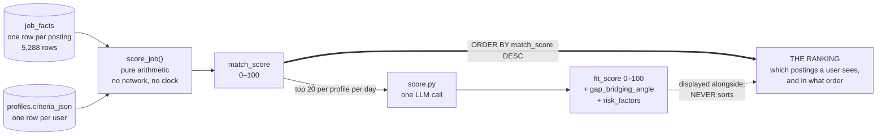
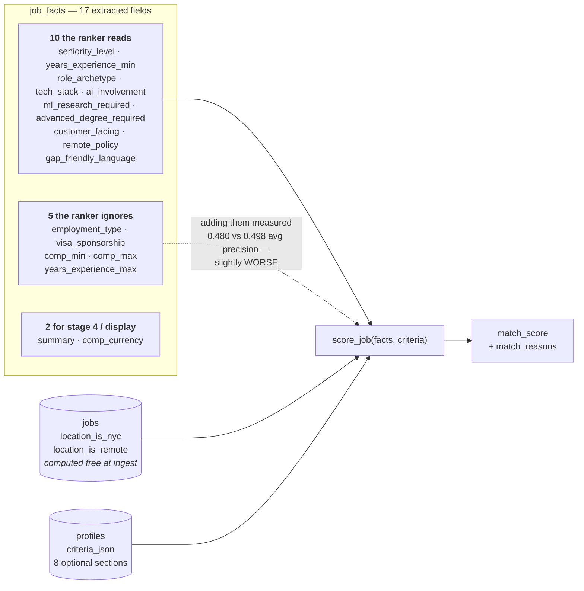
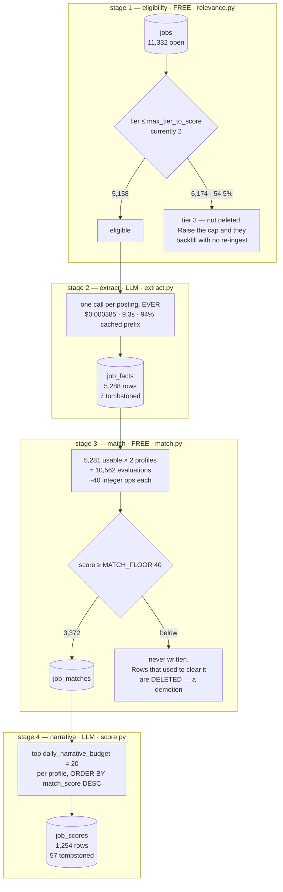
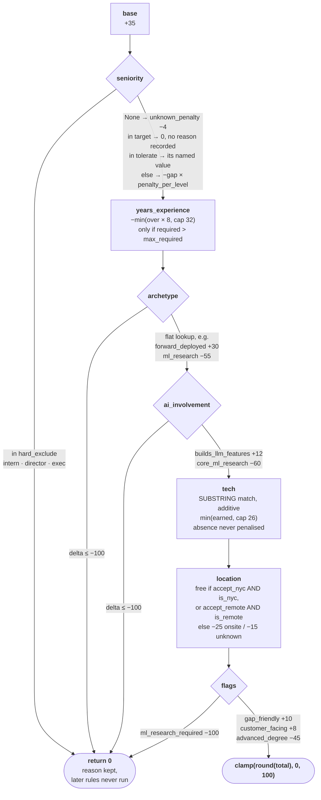
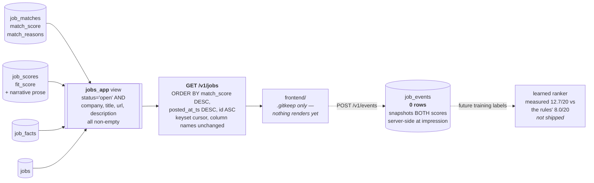
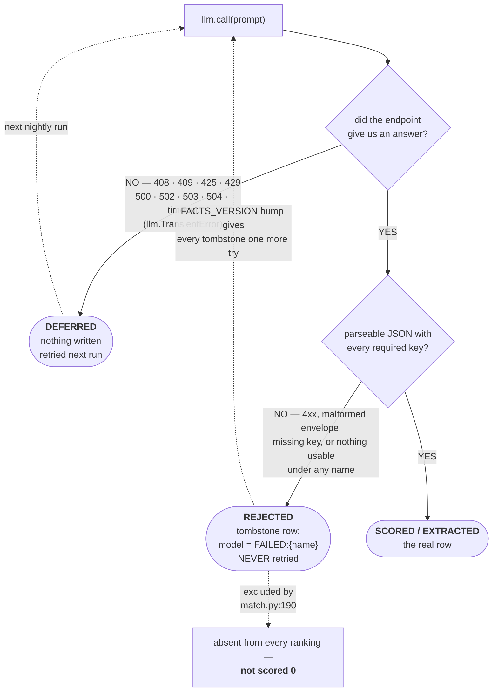

# The jobs scoring system — contract, components, and failure behavior

Covers all four stages: `relevance.py` → `extract.py` → `match.py` →
`score.py`. Every figure below was measured against the live database on
2026-07-27 (11,517 job rows, 2 active profiles) or cited to a line of source.

**Scope.** This document is the cross-cutting contract: what a score means,
whether two of them are comparable, where every weight came from, and what
happens when a stage fails. For running an individual stage — arguments,
runtime, what it reads and writes, exit codes — see the per-script references
[`ingest/extract.md`](ingest/extract.md), [`ingest/match.md`](ingest/match.md)
and [`ingest/score.md`](ingest/score.md). For the design argument — why the
work is split into four stages and what each one costs — see
[`backend/docs/SCORING.md`](../backend/docs/SCORING.md).

---

## Score Contract

There are **two** scores and they are not interchangeable. The invariant is
restated in three separate files (`schema.py:86-89`, `match.py:17-22`,
`score.py:23-27`):

> **`match_score` ranks. `job_scores.fit_score` only annotates.**



The dashed edge is the whole design. Sorting by `fit_score` would put an LLM
call on the critical path for every posting a user might see — the exact
property the four-stage split removes.

### `match_score`

| Property | Value | Where |
|---|---|---|
| Type | `INTEGER NOT NULL` | `schema.py:372-384` |
| Range | 0–100 | `_clamp(round(total))`, `match.py:69-70,178` |
| Direction | higher is better | — |
| Stored only if | `>= MATCH_FLOOR` (40) | `match.py:291` |
| Determinism | total — pure function of `(facts, criteria)`, no DB, no clock, no config lookup | `match.py:76-79` |

### `fit_score`

| Property | Value | Where |
|---|---|---|
| Type | `INTEGER` (nullable) | `schema.py:301-320` |
| Range | nominally 0–100, **unvalidated on write** | `score.py:361` |
| Direction | higher is better | `config/persona.json:34` |
| Determinism | none — LLM output, though `temperature=0` | `llm.py:59` |
| Observed | min 0, max 95, mean 48.2 over 1,200 non-null rows | live |

### Is a 70 for user A comparable to a 70 for user B?

**No. Not for either score.** The two are only meaningful *within one
profile's result set*, and the code makes that true rather than incidental.

Every term in `match_score` is read from that profile's own `criteria_json`
(`match.py:86, 97, 122, 133, 139, 149, 163, 173`). Nothing is shared across
profiles — not the base, not the archetype table, not even the *shape* of the
seniority rules. So the attainable range differs per profile:

| profile | `base` | best archetype | tech cap | best AI | positive flags | **theoretical max** | observed max |
|---|---|---|---|---|---|---|---|
| `tech` | 35 | +30 | +26 | +12 | +18 | **121 → clamps to 100** | 100 (16 rows) |
| `frontend` | 30 | +32 | +22 | 0 | 0 | **84** | 83 |

Three consequences, all live today:

1. **`frontend` can never score above 84.** It has no positive `flags` and no
   positive `ai_involvement` entry — its best AI value is the *absence* of one.
   A `frontend` 80 is a near-perfect match; a `tech` 80 is its 90th percentile.
2. **`tech` saturates.** Its terms sum to 121, so `_clamp` discards up to 21
   points and 16 rows sit at exactly 100 with no way to distinguish them.
3. **`MATCH_FLOOR` is a single global number applied to both scales.**
   `schema.py:165` — `int(os.environ.get("JOBS_MATCH_FLOOR", "40"))`. That is
   40% of `tech`'s usable range and 48% of `frontend`'s. It is part of why
   `frontend` has 295 stored matches against `tech`'s 3,077 — a 10×
   difference across the same 5,288 extracted postings.

| profile | stored matches | min | median | mean | max |
|---|---|---|---|---|---|
| `tech` | 3,077 | 40 | 62 | 62.5 | 100 |
| `frontend` | 295 | 40 | 54 | 55.5 | 83 |

The two scales drawn against the one cutoff they share:

```
points    0         20        40        60        80        100       120
          ├─────────┼─────────┼─────────┼─────────┼─────────┼─────────┤
                              ┊
        MATCH_FLOOR = 40 ─────┤  one global number, both profiles
                              ┊
tech      ░░░░░░░░░░░░░░░░░░░░███████████████████████████████▒▒▒▒▒▒▒▒▒▒
          never stored        stored · 3,077 rows · med 62   ↑ clamp discards
                              ┊                                21 points
                              ┊
frontend  ░░░░░░░░░░░░░░░░░░░░██████████████████████┤ 84
          never stored        stored · 295 rows      ↑ unreachable ceiling
                              ┊   med 54
                              ┊
                    40 = 40% of tech's usable range
                       = 48% of frontend's
```

`fit_score` is not comparable across profiles either, for a different reason:
the prompt is built from that profile's persona (`score.py:282-331`), so the
model is answering a different question each time.

### What the scores are *not*

- **Not a probability or a percentage.** `match_score` is a sum of absolute
  point deltas that happens to be clamped to 0–100
  (`config/criteria.json:6`).
- **Not calibrated against each other.** Spearman between them is +0.619
  (`SCORING.md`) — related, not equivalent.
- **`fit_score` is not densely distributed.** 59 postings share the value 85,
  so any "top N" boundary drawn through it falls inside a tie block
  (`SCORING.md`, the top-50 measurement trap).

---

## Inputs



### User side — one row of `profiles` (`schema.py:326-339`)

| Field | Required | Missing / empty behavior |
|---|---|---|
| `criteria_json.base` | no | `criteria.get("base", 0)` → 0, and every score becomes the sum of deltas alone (`match.py:86`) |
| `criteria_json.seniority` | no | `or {}` → no seniority term at all (`match.py:97`) |
| `criteria_json.years_experience` | no | no penalty; `max_required` absent skips the whole rule (`match.py:122-125`) |
| `criteria_json.archetypes` | no | archetype contributes nothing (`match.py:133`) |
| `criteria_json.ai_involvement` | no | contributes nothing (`match.py:139`) |
| `criteria_json.tech.boost` / `.cap` | no | no boost; absent `cap` defaults to `10**6`, i.e. uncapped (`match.py:157`) |
| `criteria_json.location` | no | **no location term** — `accept_nyc`/`accept_remote` absent are falsy, so the penalty branch runs and applies `.get(..., 0)` = 0 (`match.py:163-170`) |
| `criteria_json.flags` | no | contributes nothing (`match.py:173`) |
| `persona_json` | **yes** — 4 keys | `validate` raises `ValueError` naming the key, at save time (`profiles.py:139-143`) |
| `relevance_json` | no | `NULL` means "use `config/relevance.json`" (`relevance.py:96-98`) |
| `criteria_version` | yes, default 1 | drives staleness; see Degradation |
| `daily_narrative_budget` | yes, default 20 | caps stage 4 |
| `active` | yes, default true | inactive profiles are excluded from the extraction union entirely |

**Every criteria section is optional.** A profile consisting of `{"base": 50}`
is valid, passes `validate`, and scores every posting in the corpus exactly 50.
Nothing warns about this.

Required persona keys are `background_summary`, `strengths`, `honest_gaps`,
`scoring_instructions` (`profiles.py:139-143`). They are checked for
*presence*, not type or content.

### Job side — 10 fact fields + 2 `jobs` booleans

`load_facts` selects 14 columns (`match.py:229-233`): 10 fact fields, the two
location booleans, plus `job_id` and `facts_version` as bookkeeping.

| Field | Source | Required | Missing / empty behavior |
|---|---|---|---|
| `seniority_level` | `job_facts` | no | `None` → `unknown_penalty` (−4 for both live profiles), `match.py:102-103` |
| `years_experience_min` | `job_facts` | no | `None` → rule skipped entirely, no penalty (`match.py:125`) |
| `role_archetype` | `job_facts` | no | not in the table → no delta. Coerced to `"other"` at extraction, never `NULL` (`extract.py:267`) |
| `tech_stack` | `job_facts` (JSON) | no | unparseable → `[]` (`match.py:238-241`); empty → no boost, **never a penalty** (`config/criteria.json:42`) |
| `ai_involvement` | `job_facts` | no | coerced to `"none"` at extraction (`extract.py:284-285`) |
| `remote_policy` | `job_facts` | no | coerced to `"unknown"` (`extract.py:289-290`); only `"onsite"` is distinguished (`match.py:166`) |
| `ml_research_required` | `job_facts` | no | `bool()` at extraction — never `NULL` |
| `advanced_degree_required` | `job_facts` | no | same |
| `customer_facing` | `job_facts` | no | same |
| `gap_friendly_language` | `job_facts` | no | same |
| `facts_version` | `job_facts` | yes | staleness key |
| `location_is_nyc` | `jobs` | no | `NULL` is falsy → falls to the unmatched branch (`match.py:164`) |
| `location_is_remote` | `jobs` | no | same |

**A posting with no `job_facts` row does not score 0 — it does not appear at
all.** `load_facts` selects *from* `job_facts` (`match.py:187-188`), so an
unextracted posting is absent from every ranking. Same for tombstones, which
are excluded by `extraction_model NOT LIKE 'FAILED:%'` (`match.py:190`)
precisely because a `FAILED` row is NULL in every fact column and would
otherwise be scored as a genuine posting with no seniority and no stack.

### Extracted but never read

Five `job_facts` columns are populated and unused by the ranker:
`employment_type`, `visa_sponsorship`, `comp_min`, `comp_max`,
`years_experience_max`. Not an oversight — `tools/learned-ranker-probe.py`
measured adding them and the model got *worse* (0.480 vs 0.498 avg precision):
`visa_sponsorship` is 96% `unknown` and `comp_*` is 13% populated, so they are
mostly noise with a missingness indicator attached (`SCORING.md`).

---

## Stages



**Both expensive stages are gated by a free one.** That is the entire
architecture: a regex decides what earns an extraction, and free arithmetic
decides what earns a narrative.

Live funnel, 2026-07-27:

| # | Stage | Candidates in | Candidates out | Cost per candidate | Cutoff |
|---|---|---|---|---|---|
| 1 | **Eligibility** `relevance.py` | 11,332 open | 5,158 tier ≤ 2 | free (SQL, in the same query) | `max_tier_to_score = 2` |
| 2 | **Extract** `extract.py` | 5,158 eligible | 5,288 `job_facts` (7 tombstoned) | ~$0.000385, 9.3s | `FACTS_VERSION = 2` — never re-run |
| 3 | **Match** `match.py` | 5,281 × 2 profiles = 10,562 | 3,372 `job_matches` | ~40 integer ops, no network | `MATCH_FLOOR = 40` |
| 4 | **Narrative** `score.py` | top of each profile's ranking | 1,254 `job_scores` (57 tombstoned) | ~$0.000288, 6.5s | `daily_narrative_budget = 20` |

`job_facts` (5,288) slightly exceeds current eligibility (5,158) because facts
are never deleted when config later narrows — that is the gap `load_facts`
closes by re-applying the union at read time.

### Where each cutoff lives

**Stage 1 gates stage 2.** A regex in Postgres decides what earns an LLM call.
The cutoff is `max_tier_to_score` in `config/relevance.json:113`, currently
`2`, read by `relevance.max_tier()` (`relevance.py:195`) and applied by
`union_sql` (`relevance.py:223`). It removes 6,174 of 11,332 open postings —
**55% of the corpus never reaches a model.** Tier distribution:

```
tier 1  2,866  (25.3%)  title matches AND location acceptable   SCORED
tier 2  2,292  (20.2%)  title matches, location unknown         SCORED
tier 3  6,174  (54.5%)  everything else                         SKIPPED
```

The gate is a **union across all active profiles**, not one profile's filter,
because extraction is shared (`relevance.py:202-210`). An empty profile list
returns `"FALSE"`, not `TRUE` (`relevance.py:216-217`).

**Stage 3 gates stage 4.** Free arithmetic decides which postings are worth a
narrative. `select_shortlist` orders by `match_score DESC` and takes
`daily_narrative_budget` rows (`score.py:206-240`) — *"choosing what to spend a
call on costs nothing, so the calls go to the jobs a person is actually about
to see."*

**`MATCH_FLOOR` is a storage cutoff, not a quality one** (`schema.py:159-165`).
Rows below 40 are never written; rows that *used* to clear it and no longer do
are deleted (`match.py:294-298`). Lowering it costs storage, not correctness,
because `match.py` recomputes from `job_facts`, which is never discarded.

### Recomputation is keyed on versions, not timestamps

`match.py:284-288` — a row is stale when `(facts_version, criteria_version)`
changes. Re-extracting a posting re-ranks it for everyone; editing one
profile's weights re-ranks only that profile. A timestamp comparison would
also fire on unrelated writes (`match.py:30-36`).

---

## Components & Weights

`match_score = clamp(round(base + Σ deltas), 0, 100)`, with hard excludes
short-circuiting to 0 (`config/criteria.json:6`).

Rules are evaluated in the order below and **a hard exclude stops later rules
being credited** (`match.py:100-101, 135-136, 142-143, 175-176`) — so a
research role that happens to name Python cannot climb back over the floor.



Three of the eight rules can exit early, and all three land on the same node.
`HARD_EXCLUDE_AT = −100` is a *magnitude*, not a flag — "never show me
research roles" is expressed in the same units as every other weight rather
than as a second parallel mechanism (`match.py:56-59`).

Provenance tags below apply to the **values shown for the `tech` profile**.
`config/criteria.json` is a template; `profiles.criteria_json` is
authoritative after first import (`config/criteria.json:2`).

### Structural constants

| Constant | Value | Where | Provenance |
|---|---|---|---|
| `HARD_EXCLUDE_AT` | −100 | `match.py:60` | **[guessed]** — a magnitude convention so "never show me X" is expressed in the same units as every other weight, not a second mechanism (`match.py:56-59`) |
| `SENIORITY_ORDER` | 9 levels, intern→exec | `match.py:65-66` | **[derived]** — the closed vocabulary `extract.py:82` emits; distance along it is what `penalty_per_level` multiplies |
| `MATCH_FLOOR` | 40 | `schema.py:165` | **[guessed]** — justified by storage size (~8% of the cross product), not by quality. The weight sweep explored 0–40 and recall moved 0.468–0.484 (`SCORING.md`) |
| `FACTS_VERSION` | 2 | `schema.py:158` | **[derived]** — bumped when `migrate_ats_descriptions.py` changed `description_text`, measured to move `tech_stack` −13.1 jaccard beyond noise (`schema.py:155-157`) |
| clamp bounds | 0, 100 | `match.py:69` | **[guessed]** — readability: "deltas are absolute points, not multipliers, so they are readable next to the 0-100 result" (`config/criteria.json:6`) |

### 1. Base

| Component | Formula | Value | Provenance |
|---|---|---|---|
| `base` | `total = criteria["base"]` (`match.py:86`) | 35 (`tech`), 30 (`frontend`) | **[guessed]** — `config/criteria.json:4` states the whole file is "a starting point derived from `config/persona.json`, NOT a tuned model" |

### 2. Seniority — `match.py:96-119`

Four branches, in order: `hard_exclude` → return 0; `None` → `unknown_penalty`;
in `target` → **no delta and no reason recorded** ("silence is the signal",
`match.py:105`); in `tolerate` → its named value; otherwise distance fallback
`-gap × penalty_per_level`.

| Weight | Value (`tech`) | Provenance |
|---|---|---|
| `target: ["mid"]` | 0 | **[derived]** — `persona.json:19` says "mid-level (not senior/staff/principal, not new-grad/intern)" |
| `tolerate.senior` | −5 | **[guessed]** — reasoned, not measured: "titles are inconsistent across companies and a 5-YOE candidate is a real senior at some of them" (`criteria.json:26`) |
| `tolerate.junior` | −12 | **[guessed]** |
| `tolerate.new_grad` | −40 | **[tuned]** — *was* a hard exclude; demoted 2026-07-26 because `compare-extract.py` measured `seniority_level` self-agreeing 95% of the time, so −100 turned a 1-in-20 extraction slip into a deleted posting (`criteria.json:27`). The **decision** is measured; the **magnitude 40** is [guessed] |
| `tolerate.principal` | −35 | **[tuned]** — same change, same caveat |
| `hard_exclude` | intern, director, exec | **[derived]** — the reliability constraint above: only fields "BOTH reliably extracted and genuinely disqualifying"; these three are "unambiguous in a title and never a fit" (`criteria.json:27`) |
| `tolerate.staff` | −20 | **[guessed]** — added 2026-07-27, see below. Interpolated between `senior` (1 level off, −5) and `principal` (3 levels off, −35), both themselves [guessed] |
| `unknown_penalty` | −4 | **[guessed]** |
| `penalty_per_level` | 10 | **[guessed]** — added 2026-07-27 as a safety net, see below. `frontend` already set 10 |

> **Fixed 2026-07-27 — `staff` used to be free for the `tech` profile.**
> `staff` was the one level of the nine named in neither `target`,
> `tolerate`, nor `hard_exclude`, so it fell to the distance branch
> (`match.py:110-119`) — where `penalty_per_level` was *also* absent and
> `.get(..., 0)` made the penalty exactly zero. `add()` skips a falsy delta
> (`match.py:91`), so the posting scored as on-target **and recorded no
> reason for it.** Measured against otherwise-identical facts:
>
> ```
>                  before          after
>   new_grad         21              21
>   junior           49              49
>   mid  (target)    61              61
>   senior           56              56
>   staff          → 61  ← free    → 41    seniority:staff  -20
>   principal        26              26
> ```
>
> A Staff posting scored identically to a Mid one while Senior — a *closer*
> level — cost 5 points. Non-monotonic, and contradicting `persona.json:19`
> ("not senior/staff/principal"). 783 of 5,146 eligible postings (15.2%)
> are `staff`; 452 of them were in the ranking, and **250 dropped below
> `MATCH_FLOOR` and were deleted** when the fix was applied. The top 20 did
> not change — the effect was entirely in the middle of the list.
>
> The general trap is the wider lesson: **any level a profile does not name
> is silently free** unless `penalty_per_level` is set. That is why the fix
> is two keys rather than one — `tolerate.staff` for the case at hand, and
> `penalty_per_level` so the *next* unnamed level cannot repeat it.

### 3. Years of experience — `match.py:121-129`

```
over    = years_experience_min − max_required
penalty = min(over × over_penalty_per_year, over_penalty_cap)
```
Only applies when the posting demands *more* than the ceiling. Fewer years is
never penalised.

| Weight | Value (`tech`) | Provenance |
|---|---|---|
| `max_required` | 6 | **[guessed]** — `persona.json:5` says 5 years; the +1 of slack is unexplained (`criteria.json:35`) |
| `over_penalty_per_year` | 8 | **[guessed]** |
| `over_penalty_cap` | 32 | **[guessed]** — binds at 10 years required (35 + 30 − 32 saturates); the cap is reached 4 years over |

### 4. Archetype — `match.py:131-136`

Flat lookup. A value `<= −100` short-circuits to 0.

| Archetype | `tech` | Provenance |
|---|---|---|
| `forward_deployed` | +30 | **[derived]** from `persona.json:27` — "the strongest-fit bucket for this exact background" |
| `solutions` | +28 | **[derived]** same bucket |
| `ai_integration` | +26 | **[derived]** from `persona.json:22` |
| `fullstack` / `backend` | +26 | **[tuned]** — raised from +15 on 2026-07-26. Evidence: "every one of the worst rules-vs-LLM disagreements was a backend/fullstack role the LLM scored 85 and the rules put near the floor", surfaced by `tools/calibrate-match.py --disagreements` (`criteria.json:10`) |
| `frontend` | +20 | **[guessed]** |
| `data` | +12 | **[guessed]** |
| `devops` | +8 | **[guessed]** |
| `security` | −10 | **[guessed]** |
| `pm` | −30 | **[guessed]** |
| `ml_research` | −55 | **[tuned]** — *was* a hard exclude at −100; softened 2026-07-26 because `compare-extract.py` measured `role_archetype` self-agreeing only **90%** of the time, so "Senior Software Engineer" read as `ml_research` was being annihilated 1 time in 10 (`criteria.json:27`). Magnitude [guessed] |
| `other` | 0 | **[derived]** — the coercion default (`extract.py:263`), so it must be neutral |

### 5. AI involvement — `match.py:138-143`

Flat lookup, same short-circuit rule.

| Value | `tech` | Provenance |
|---|---|---|
| `builds_llm_features` | +12 | **[derived]** — `criteria.json:62`: "the current 5-month program is agent/LLM integration work" |
| `uses_ai_tools` | +6 | **[guessed]** |
| `none` | 0 | **[guessed]** |
| `core_ml_research` | −60 | **[derived]** direction (`persona.json:13` names it as a hard gap), **[guessed]** magnitude. Note −60 does **not** short-circuit; only ≤ −100 does |

### 6. Tech stack — `match.py:145-157`

**Substring match, additive, capped:**
```python
for term, delta in boosts.items():
    if any(term in item for item in stack):
        earned += delta
if earned:
    add("tech", min(earned, tech_cfg.get("cap", 10 ** 6)))
```

Substring rather than equality because postings write "node.js", "Node" and
"nodejs" for one thing, *"and the alternative is a synonym table nobody
maintains"* (`match.py:146-148`). Capped so breadth of stack is not itself a
signal. Absence is never penalised (`criteria.json:42`).

| Term | `tech` | Provenance |
|---|---|---|
| `llm`, `agents` | +7 | **[guessed]** — mirror `persona.json`'s program description |
| `python` | +6 | **[guessed]** |
| `rag` | +6 | **[guessed]** |
| `typescript`, `langchain` | +5 | **[guessed]** |
| `javascript`, `react`, `openai`, `anthropic` | +4 | **[guessed]** |
| `node`, `postgres` | +3 | **[guessed]** |
| `sql` | +2 | **[guessed]** |
| `cap` | 26 | **[guessed]** — sum of all boosts is 60, so the cap binds hard. The sweep explored 18–34 with recall moving 0.468–0.484 (`SCORING.md`) |

> Substring matching is unguarded in both directions: `"sql"` matches
> `"postgresql"` and `"nosql"`; `"node"` matches `"nodejs"` as intended but
> also any stack entry containing those letters. No test pins this.

### 7. Location — `match.py:159-170`

Accepted **for free** (no delta, no reason) if
`accept_nyc AND location_is_nyc` or `accept_remote AND location_is_remote`.
Otherwise one of two penalties, distinguished only by `remote_policy ==
"onsite"`.

| Weight | `tech` | Provenance |
|---|---|---|
| `neither_penalty` | −15 | **[tuned]** — softened from −45 on 2026-07-26: "the LLM largely ignores location when judging fit, so a heavy penalty here pushed genuinely good postings out of the shortlist for a reason the persona never asked to be decisive" (`criteria.json:70`) |
| `onsite_elsewhere_penalty` | −25 | **[tuned]** — softened from −55, same reasoning |
| `accept_nyc` / `accept_remote` | true | **[derived]** — `location_columns` in `config/relevance.json:109` |

Reads the two booleans `lib.text` already computes at ingest rather than
re-deriving them from an LLM (`match.py:81-83`). `frontend` keeps the
un-softened values (−50 / −60), which is the single largest reason its scores
sit ~7 points below `tech`'s.

### 8. Boolean flags — `match.py:172-176`

Any truthy fact column named in `criteria.flags` adds its delta. `<= −100`
short-circuits.

| Flag | `tech` | Provenance |
|---|---|---|
| `gap_friendly_language` | +10 | **[derived]** — the `reentry_growth` bucket, `persona.json:29-31` |
| `customer_facing` | +8 | **[derived]** — `bridge_solutions` is the strongest bucket, `criteria.json:78` |
| `advanced_degree_required` | −45 | **[derived]** direction (`persona.json:13`), **[guessed]** magnitude |
| `ml_research_required` | −100 | **[derived]** — the only true hard exclude left in the file; equals `HARD_EXCLUDE_AT` exactly, which is what makes it short-circuit |

### 9. Narrative fields — `score.py`

`fit_score` and the four prose fields have **no formula**. They are whatever
the model returns, subject only to a key-presence check
(`llm.has_fields`, `llm.py:262-263`).

| Constant | Value | Provenance |
|---|---|---|
| `daily_narrative_budget` | 20 | **[guessed]** — `schema.py:326-339` default. `SCORING.md` notes 40% precision@20 is what stops it being trimmed to 10 |
| `temperature` | 0 | **[tuned]** — measured: two runs of the same model agreed at Spearman 0.666 under default sampling vs 1.000 at 0 (`llm.py:44-58`) |
| `MAX_DESCRIPTION_CHARS` | 3000 | **[guessed]** — `extract.py:73` |
| reasoning tokens | on | **[tuned]** — disabling is 4.9× cheaper and measurably worse on the four highest-weight fields against a self-consistency floor (`SCORING.md`) |

### 10. Quality gates — `tools/`

| Constant | Value | Provenance |
|---|---|---|
| `MIN_SPEARMAN` | 0.6 | **[guessed]** — `SCORING.md` says so in as many words: "set during design, before any measurement" |
| `MIN_RECALL` | 0.8 | **[guessed]** — same sentence; "turned out to be aspirational rather than informative". Currently 0.433, i.e. failing |
| `GOOD` (positive label) | 80 | **[derived]** — a score *threshold* replaced a top-50 cut because `fit_score` is heavily tied and the top-50 boundary fell inside a block of 59 rows sharing the value 85 (`SCORING.md`) |
| `RANDOM_DRAWS` | 500 | **[tuned]** — a single seed drew 5/20 against a 500-seed mean of 3.1, which flattered the published result until 2026-07-26 (`SCORING.md`) |

### Tally

Of 56 tagged values: **16 [derived]**, **9 [tuned]**, **31 [guessed]**.

Two qualifications on that count. Most [derived] tags derive from
`config/persona.json` — a hand-written description of one person — so they are
traceable to a stated intent, not to data. And every [tuned] tag dates to the
same 2026-07-26 calibration pass, where what was measured is the *direction*
of the change; the magnitude that replaced it was still chosen by hand. Read
strictly, **no weight in this system was fit to data.**

---

## Consumption



### Ranking — the only consumer that matters

`match_score` is the primary sort key on the single read surface
(`backend/webapp/jobs.py:76-77`):

```sql
ORDER BY v.match_score DESC,
         coalesce(v.posted_at_ts,'-infinity') DESC,
         v.id ASC
```

Pagination is **keyset, not offset** — the cursor is a base64 of that exact
sort tuple (`jobs.py:84-95`) — because `match.py` re-ranks the whole corpus
nightly and an offset would skip or repeat rows across a re-rank.

### Hard filters

| Filter | Effect | Where |
|---|---|---|
| `match_score >= MATCH_FLOOR` | never written; existing rows deleted on demotion | `match.py:291-298` |
| `min_score` query param | caller-supplied floor on top | `jobs.py:145` |
| `jobs_app` view | requires `status='open'` and non-empty company/title/url/description | `schema.py:512-560` |

### Display

`fit_score` and the narrative fields are shown as annotation, never as an
order. The API returns `jobs_app`'s column names **unchanged**, with no
translation layer (`jobs.py:52-54`), so `match_score`, `match_reasons`,
`fit_score`, `gap_bridging_angle` and `risk_factors` all appear verbatim in
the JSON response of `GET /v1/jobs` and `GET /v1/jobs/{id}`.

**Does the user see the raw score? Today, technically yes and practically no.**
The raw integers are in the API payload. `frontend/` contains one file,
`.gitkeep` — nothing renders a job to a human yet, so no decision has been made
about whether to surface 62/100 or hide it.

`match_reasons` is stored as JSON alongside every row (`match.py:292`), so
"why is this ranked 8th" is answerable per row without recomputation — which is
what makes tuning an informed edit rather than a guess (`match.py:24-28`).

### Feeding another calculation

`POST /v1/events` snapshots **both** scores as of the impression, looked up
server-side and never accepted from the client (`jobs.py:299-311`). That is the
load-bearing part: without them you cannot reconstruct what the user was
reacting to once weights change (`SCORING.md`).

`job_events` currently holds **0 rows** — the writer landed 2026-07-26 and
nothing has driven traffic through it yet. It is the training-label store for
the learned ranker that `tools/learned-ranker-probe.py` measures at 12.7/20
precision@20 against the hand-tuned rules' 8.0.

---

## Degradation

### LLM failure — a deliberate three-way split



Both LLM stages classify every attempt as one of three outcomes
(`extract.py:365`, `score.py:403-413`):

| Outcome | Trigger | What is written | Retried? |
|---|---|---|---|
| **SCORED / EXTRACTED** | usable JSON with all required keys | the real row | — |
| **REJECTED** | model answered, answer unusable (4xx, malformed envelope, missing keys) | **tombstone**: `extraction_model` / `scoring_model` = `FAILED:{model}` | **never** |
| **DEFERRED** | endpoint never answered — 408/409/425/429/500/502/503/504 or timeout (`llm.py:120`) | **nothing** | next run |

> **A failed score is neither 0 nor NULL — it is a tombstone row.** That
> distinction is the point (`score.py:403-413`): tombstoning is right for a
> posting the model cannot parse, because retrying burns a call a night on the
> same failure. It is *badly wrong* for an HTTP 429, which says nothing about
> the posting — and the default model rate-limits hard enough that a batch can
> be mostly 429s.

Live: 7 of 5,288 fact rows and 57 of 1,254 score rows are tombstones.

Tombstones are stored at the **current** `FACTS_VERSION`, not a sentinel, so a
future version bump gives every tombstoned posting one more attempt under the
new prompt — usually exactly what a prompt change is for
(`extract.py:341-345`).

**A tombstoned posting disappears from ranking entirely**, excluded by
`match.py:190`, rather than ranking as a posting with no seniority and no
stack.

### Malformed or unusable model output

`normalize()` returns `None` — which the caller turns into a tombstone — in two
cases (`extract.py:249-271`):

1. `llm.has_fields` finds any of the five required keys missing
   (`extract.py:79-80`: `seniority_level`, `role_archetype`, `remote_policy`,
   `tech_stack`, `summary`).
2. **Nothing usable came back under any name**: seniority `None` *and*
   archetype coerced to `"other"` *and* empty stack *and* no summary
   (`extract.py:268-271`). Rather than write a row that is NULL in every
   column that matters.

Otherwise the coercions absorb the damage silently:

| Input | Handling | Where |
|---|---|---|
| `"Mid-Level"` for an enum | lowercase, `-`/space → `_`, prefix-match → `"mid"` | `extract.py:217-235` |
| unrecognised enum value | `None`, or the section default (`"other"`, `"none"`, `"unknown"`) — **never stored verbatim** | `extract.py:217-235` |
| `"5+"` or `"competitive"` for a number | `None` | `extract.py:236-246` |
| years outside 0–50 | `None` | `extract.py:246, 273-274` |
| `years_max < years_min` | swapped | `extract.py:275-276` |
| `tech_stack` not a list | `[]` | `extract.py:258-260` |
| the four boolean fields | `bool()` — never NULL | `extract.py:286-288, 298` |

The reasoning is recorded at `SCORING.md`: a model answering `"Mid-Level"`
instead of `"mid"` does not error, *"it would silently score as unknown for
every profile forever. Anything unrecognised becomes NULL, which the matcher
can reason about; `"Mid-Level"` is a landmine."*

### Truncated job posts

Descriptions are cut at `MAX_DESCRIPTION_CHARS = 3000` before the prompt is
built (`extract.py:73`). No marker is added and nothing records that truncation
occurred. A posting whose requirements sit past 3,000 characters is extracted
from a partial view, indistinguishably from one that fit.

The narrative stage never sees the description at all — it is given the
extracted facts plus the two-sentence summary (`score.py:249-279`).

### Sparse or minimal profiles

No degradation path, because **every criteria section is optional and absent
sections contribute nothing** (the `or {}` / `.get(..., 0)` pattern throughout
`match.py:96-176`). Consequences:

- `{"base": 50}` scores every posting 50. Valid, silent, and every row clears
  `MATCH_FLOOR`.
- A `criteria` with no `location` block applies no location term at all —
  `accept_nyc` absent is falsy, so the penalty branch runs and then adds 0.
- An unlisted seniority level with no `penalty_per_level` is **free**, which is
  the live `staff` defect above.

`profiles.validate` (`profiles.py:122`) checks persona keys and that every
weight is a *number*. It does not check that the criteria are complete,
internally consistent, monotonic, or that the resulting range is comparable to
any other profile's.

### `fit_score` is written unvalidated

`result.get("fit_score")` goes straight into an `INTEGER` column
(`score.py:361`); `has_fields` checks presence only (`llm.py:262-263`). A model
returning `150` would be stored as 150; a model returning `"high"` would raise
a psycopg error inside the worker thread. Observed range across 1,200 rows is
0–95, so neither has occurred.

### Operational failure

| Condition | Behavior |
|---|---|
| No active profiles | `union_sql` returns `"FALSE"` — extraction selects nothing rather than everything (`relevance.py:216-217`) |
| `config/relevance.json` missing | falls back to `DISABLED`: everything is tier 1 and eligible. **Fails open** (`relevance.py:56-63, 84-85`) |
| `DATABASE_URL` unset | raises; no default, deliberately (`dbconn.database_url`, `lib/dbconn.py:77`) |
| Daily LLM quota exhausted | `ratelimit.py` refuses *before* the request; surfaces as DEFERRED |
| One step of `run-daily.py` fails | remaining steps still run; process exits non-zero (`run-daily.py:44-47`) |
| Weights edited without `--bump` | **the one genuinely wrong combination** — stale `match_score`s that look current, because staleness is keyed on `criteria_version` (`match.py:284-288`) |

---

## Open defects

1. **`MATCH_FLOOR` is one global number over per-profile scales.** 40 is 40% of
   `tech`'s range and 48% of `frontend`'s, and `frontend` cannot exceed 84.
   A floor expressed as a fraction of each profile's attainable range would
   be comparable; an absolute one is not.
2. **`tech` saturates the clamp** — 121 points of headroom into a 100-point
   ceiling, 16 rows tied at exactly 100 with no way to order them.
3. **The login trigger is documented but not wired.** `score.py:455` and
   `SCORING.md` both describe `run_for_profile` being called on sign-in — the
   property that makes narrative cost track engagement rather than
   registration. `webapp/auth.py` never calls it, so narratives arrive only
   via the nightly `--active-within-days 7` pass.
4. **`job_events` has no rows.** The writer landed 2026-07-26 and nothing has
   driven traffic through it. Engagement labels cannot be collected
   retroactively, so every day without a frontend is training data for the
   learned ranker that is permanently lost.
5. **No weight in the system was fit to data.** See the Tally above. The
   learned-ranker probe measures 12.7/20 precision@20 against the hand-tuned
   rules' 8.0/20 using *exactly* the features that already exist — the
   measured business case for replacing the weighting function, not the
   feature set.

### Closed

- **`staff` scored as on-target for `tech`** — fixed 2026-07-27, see the
  Seniority section. 250 rows demoted below the floor; top 20 unchanged.
- **Four measurement tools could not run** — fixed 2026-07-27.
  `tools/calibrate-match.py` and `tools/learned-ranker-probe.py` called
  `match.load_facts(conn)`, which has taken `(conn, cfgs)` since the relevance
  union moved into it (`match.py:195`); both now pass
  `[relevance.for_profile(profile_obj)]`. `tools/cost-test.py` and
  `tools/claude-bench.py` called `score.select_unscored_jobs(...)`, which no
  longer exists; both now call `score.select_shortlist(conn, n, profile)`,
  which is the selection the pipeline itself uses.
